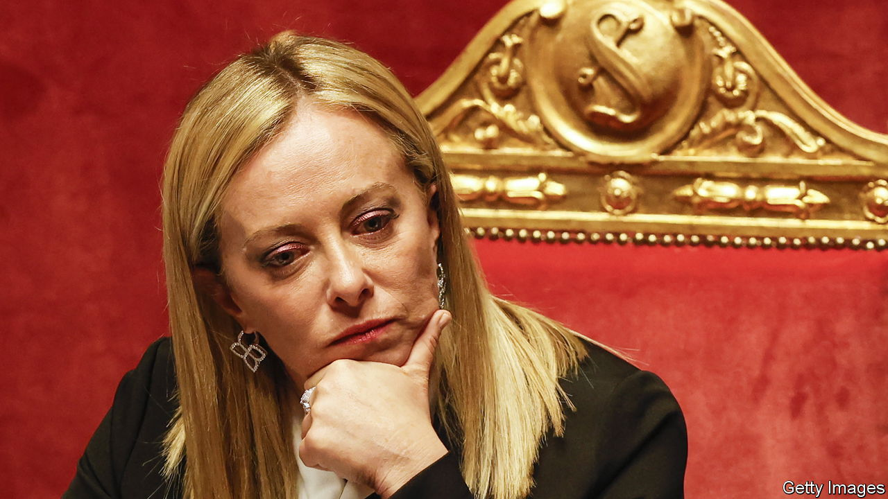

###### An untried skipper

# Storm clouds loom for Giorgia Meloni, Italy’s new prime minister 

##### She has reassured markets for now, but trouble lies ahead 

 

> Oct 27th 2022 

Britain was not the only G7 country to gain a new prime minister in the past week. On October 22nd  was sworn in as the head of Italy’s most right-wing government since the second world war. She has moved fast. Less than a month after her  won more seats than any other party in a general election, Ms Meloni strode into the Quirinal Palace, an opulent former residence of popes, for her swearing-in ceremony. She has deftly put together a coalition government that looks as though it may last longer than Italians, and these days Britons, are used to. Liberals will not cheer. Many recoil at her party’s opposition to abortion and gay unions (though she has promised not to change the status quo on either) and her unwelcoming attitude to irregular immigration. However, she offers three main . 

She seems to be solid on Ukraine. She sees Vladimir Putin as the predator he is, not the defender of traditional values that some on the hard right imagine him to be. She went out of her way, in her first speech as prime minister to parliament, to stress Italy’s support for Ukraine “not only because we cannot accept…the violation of the territorial integrity of a sovereign nation, but because it is the best way to defend our national interests as well”. Granted, her coalition partners, Matteo Salvini of the Northern League and Silvio Berlusconi of Forza Italia, have a history of sucking up to Mr Putin. But so dominant is her party within the coalition that they will find it hard to shift her on this essential question. Also, thanks to her predecessor, Mario Draghi, Italy has done a good job of diversifying its energy supply. If a cold winter comes, this year or next, and Mr Putin tries to freeze Europe into giving up its support for Ukraine, Italy looks unlikely to prove a weak link. 

Many have seen in Ms Meloni a female version of Viktor Orban, Hungary’s prime minister, who is constantly at loggerheads with the European Union over his regime’s corruption and autocratic tendencies. But she does not seem to be spoiling for . As foreign minister she has chosen Antonio Tajani, a former president of the European Parliament. She looks likely to stick (with perhaps a little tweaking) to the economic reform plans agreed on between Mr Draghi and the EU—which come with a handy €200bn of EU cash, to be disbursed in tranches as the reforms progress. The markets seem to buy it. The spread between Italian and German government bonds is almost exactly where it was just before Mr Draghi resigned in July.

Ms Meloni’s choice of finance minister has been closely scrutinised. She had wanted a respected central-banker type; and she failed to get one, which is discouraging. But the outcome has still been reasonable; the new minister is Giancarlo Giorgetti, the deputy head of Mr Salvini’s League. Although the League is still viewed as a Eurosceptic party, Mr Giorgetti comes from its pro-business wing. Indeed, the installation of Mr Giorgetti might even turn out to be a way of limiting the influence of the more fiscally reckless Mr Salvini.

So far, so relatively reassuring. But as the euro zone heads into probable recession, Italy offers more cause for alarm than any other EU member. It stubbornly refuses to grow, and Ms Meloni has yet to present any interesting ideas for changing that. Many observers fret that the reform process, which Mr Draghi did so much to propel, will now slow or reverse into statism and protectionism. Italy’s huge debt burden (€2.7trn, around 150% of GDP) could grow unbearable if interest rates rise further. Just 45 years old, and with government experience limited to three years as youth minister over a decade ago, Ms Meloni has since then run what was until recently a fringe party that took only 4% in the election of 2018. She owes her current success to the fact that the other parties have had their turn and have disappointed voters. How she will weather the coming storm is unclear; and that should worry Italians and other Europeans alike. ■

