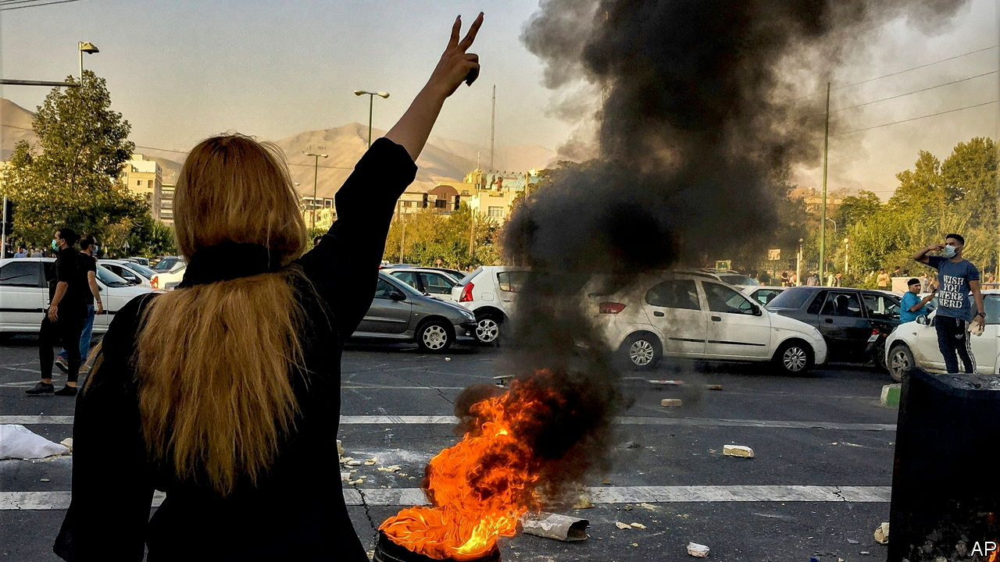

###### Ire at the ayatollahs

# Will Iran’s women win? 

##### Their uprising could be the beginning of the end of Iran’s theocracy 

 

> Oct 26th 2022 

Dictatorships tend to fall the way Ernest Hemingway said people go bankrupt: gradually, then suddenly. The omens can be obvious with hindsight. In 1978 Iran’s corrupt, brutal, unpopular regime was besieged by protesters and led by a sick old shah. The next year it was swept away. Today Iranian protesters are again calling for the overthrow of a corrupt, brutal regime; this time led by a sick old ayatollah, Ali Khamenei. As Ray Takeyh, a veteran Iran-watcher, put it, “History…is surely rhyming on the streets of Tehran.”

Pessimists caution that mass protests have rocked Iran’s theocracy before, notably in 2009 and 2019, and the regime has always snuffed them out by shooting, torturing and censoring. Yet there are reasons to think that this time may be different; that the foundations of the Islamic Republic really are .

Iranians have been raging in the streets since the death in custody of Mahsa Amini, a 22-year-old woman who was arrested by Mr Khamenei’s “morality police” for the crime of failing to cover every last strand of her hair. Such protests require courage, given the regime’s readiness to lock up and rape protesters. Yet they have lasted for weeks. And whereas the fury of 2009 was largely urban and middle-class, after an election was stolen from a somewhat reformist candidate, and that of 2019 was more working-class, sparked by a sudden leap in petrol prices, today’s protests have erupted all across the country, involving every ethnic group and people from all walks of life.

The protesters’ demands are not for more welfare or a loosening of this or that oppressive regulation; they want an end to the regime. “Death to the dictator!” is an unambiguous slogan. And they are led by women, which lends them an unusual strength. The regime enforces hijab-wearing with whippings. This rule, part of a broader apparatus to subjugate women, is passionately resented. Thus, simply by doffing or burning their headscarves in public, women send a message of defiance that spreads rapidly on social media, inspiring all who chafe at clerical rule. Some also cut off their hair or walk into the men’s sections of segregated student canteens, and are welcomed by their modern-minded male peers.

That the regime feels threatened by such open displays of 21st-century morality is evident from alleged plots to kidnap or murder Masih Alinejad, a New Yorker who urges Iranian women to share hijabless photos of themselves. Yet however much the mullahs may want to crush these unruly women, they cannot be sure that the security forces would obey an order to shoot them in the street, or that the fury that would follow mass femicide could be contained.

Previously, when faced with protests, the regime has called on its supporters to stage counter-demonstrations. This time, hardly any have shown up. And several grandees who might in the past have condemned the protests or voiced support for the regime have conspicuously failed to do so. For now, Iran’s generals say they back Mr Khamenei. But it is unclear how far they will go to support an out-of-touch 83-year-old who wants to install his second-rate son as his successor. When protests in Egypt got out of hand in 2011, the top brass elbowed aside the unpopular president (who was also grooming his son as his heir) and allowed a brief flowering of democracy before eventually seizing power. In Iran, as in Egypt, the top brass have vast, grubby business interests to protect. If they sense the supreme leader is sinking, they have no incentive to go down with him.

Were Mr Khamenei’s regime to fall, few would mourn it. It is an unholy alliance of the pious and the pickpockets. At home, it frowns on fun and on fair elections, while the Iranian economy stagnates and the supposedly righteous ruling class rolls in rials. Abroad, its proxy militias dominate Lebanon, destabilise Iraq, fuel a war in Yemen and prop up a murderous despot in Syria. It is also supplying kamikaze drones to help Russia knock out Ukraine’s power grid.

If the next Iranian regime were more responsive to the wishes of its people, it would bully less at home and meddle less abroad. Both changes would be popular; with the price of bread soaring, Iranians resent the vast sums their rulers spend on terrorising the neighbours. An Iran that no longer exported revolution would make the Middle East less tense, and allow Gulf states to spend less on weapons. The threat of a nuclear arms race might recede. Trade might flourish, as it has between Israel and the Arab states that recently recognised it.

Far worse outcomes are possible, however. A nationalist military regime might ease up on compulsory piety but keep robbing Iranians and arming foreign militias, and dash for a bomb. Or Iran could end up like Syria, where a dictator burned the country to cinders rather than surrender power.

The world should want what the protesters want: an Iranian government that reflects the will of Iranians. Yet there is only so much outsiders can do to help. It is hard to tighten sanctions, for they are already tight. (America recently and rightly added penalties for Iranian firms that sell battle-drones to Russia.) Foreigners can help the protesters communicate with each other, by setting up proxy servers or letting them download vpn software to evade internet controls. The more Iranians see videos of schoolgirls mocking furious mullahs, the less inevitable clerical rule will seem.

For women, life, freedom

The protesters say they want “a normal life”. To win that, they will need not merely to shrug off the regime but also to avoid a civil war. So the counter-revolution, which is currently decentralised and leaderless, must be inclusive. Many pious Iranians fear revenge killings, as have happened after regime change in neighbouring countries. They need reassurance that today’s movement is for all Iranians, not just those who hate clerics.

The world should prepare for the possibility that Iran’s four-decade-long experiment with murderous, liberty-loathing, bedroom-snooping theocracy may not last much longer. And if, against the odds, Iran becomes the normal country its citizens crave, the rest of the world should embrace it. ■


