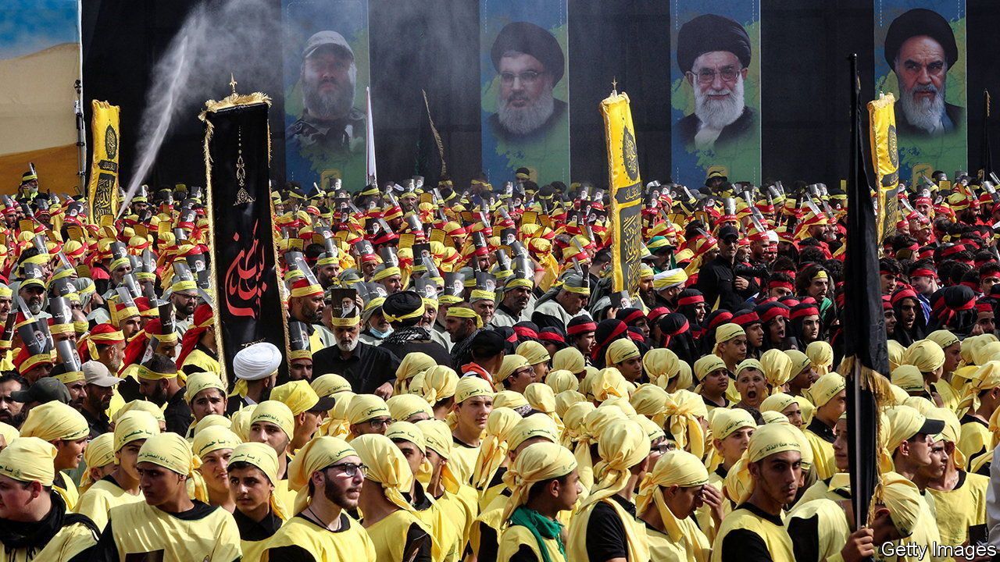
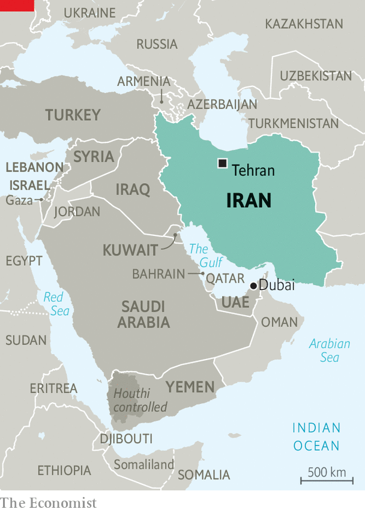

###### Proxy fight

# A change in Iran could reshape the Middle East 

##### It could weaken militant groups across the region, or unleash conflict and a wave of refugees 

 

> Oct 27th 2022 

IN 1985 a still young Lebanese group called Hizbullah set out its manifesto. The “Party of God”, as its name means in Arabic, promised to fight Israel and the West and urged its countrymen to establish an Islamic state. Many Lebanese thought it would be a passing fad. Almost 40 years later it is the country’s strongest militia, better equipped than even the army. It is a key to Lebanon’s politics. 

Hizbullah has been the most successful example of . Since 1979 the region has been shaped by its conflict with Saudi Arabia. Iran saw several reasons to befriend regimes and cultivate proxy militias. It hoped to spread its Islamic revolution and stride forth as a defender of its Shia Muslim co-religionists. It also sought a sort of strategic depth. Some of its leaders felt a degree of Persian chauvinism towards Arabs, particularly those in the Gulf.

The Gulf states, for their part, tried to push back. In the 1980s they supported Saddam Hussein’s war against Iran (he would thank them, not long after, by invading Kuwait). And they tried to boost their own allies in places like Lebanon, often with no great success.

 


The late King Abdullah of Saudi Arabia called Iran’s regime “the head of the snake”. The Gulf states certainly hope for a change of regime to reshape the region’s geopolitics. Saudi-funded news channels have covered the protests with élan: even small demonstrations in provincial towns merit excited coverage. On the other hand, Iran’s allies are nervous. Hassan Nasrallah, Hizbullah’s leader, has derided the recent protests in Iran as a foreign plot.

Yet it is hard to predict how a different Iran might look. The first question raised in Gulf circles is what kind of government would replace the clerical one. If a military regime took over, perhaps led by the Islamic Revolutionary Guard Corps, it would probably maintain support for regional proxies—if not for ideological reasons, then for strategic ones. A democratic government, by contrast, could trim Iran’s ambitions. Some Iranian protesters have chanted slogans like “No to Gaza, No to Lebanon”, signalling hostility to the wasteful spending of billions of dollars abroad on ruthless dictators and militias.

But if the ruling ayatollahs fell, their regional proxies would not collapse. Even cut off from its Iranian patrons, Hizbullah would still be Lebanon’s strongest force. Wealthy supporters and illicit businesses would still subsidise it, and the many Lebanese Shia who see it as a bulwark against Israel and a voice for a downtrodden sect would still back it.

The Houthis, a Shia rebel group that controls much of Yemen, have drawn closer to Iran during an almost eight-year war against a Saudi-led coalition. But they are not just a cat’s-paw: they emerged in the 1990s as a local insurgency. Though diminished, they would keep fighting. In Iraq, pro-Iranian factions often compete with other Shia groups, not over ideology but over access to the state’s oil wealth. They could wind up battling each other, whatever the nature of the regime in Tehran.

The biggest shift could come in Syria. Bashar al-Assad relied on Iranian support to survive a long civil war, but he has no ideological affinity with the ayatollahs. He has tried to balance Iran with Russia. The invasion of Ukraine has made that harder: Russia has withdrawn some of its troops from Syria, as they are needed elsewhere.

If he could not count on either Russian or Iranian support, Mr Assad would be forced to look for new friends. He is trying to restore ties with the Gulf states, which eagerly backed the rebels who tried to overthrow him. Earlier this year he visited the United Arab Emirates, his first trip to an Arab country in a decade. If he lost his Iranian patron, he would still more eagerly crave the friendship of fellow Arabs.

Gulf states had territorial and political disputes with Iran’s shah before his fall in 1979, but they found a  with a fellow oil-exporting monarch. A more normal regime in Tehran could allow for expanded trade and investment across the Persian Gulf and could nudge Arab monarchs to cut back their lavish military spending. But that would depend on Iran curtailing its support for groups like the Houthis and militias in Iraq. The same goes for Israel, which had friendly relations with the shah’s Iran. It could have them again—but only if Iran curbed its nuclear programme and stopped backing groups such as Islamic Jihad in Gaza.

Some Iranians fear an uprising in their country would end not in democracy, or even a stable military regime, but something like Syria: a failed state torn apart from within. If that happened, Iran’s role could ironically be reversed. Instead of directing proxies across the region, it could find itself a playground for foreign powers.

Turkey has occupied parts of Syria to push Kurdish fighters away from the border and periodically hits Kurdish targets there and in Iraq. It might do the same in an unstable Iran. The Gulf states, meanwhile, could finance and equip ethnic Arab separatists in Iran’s south-west. 

For now, the Gulf is revelling in the Iranian regime’s discomfort. A government that has caused so much chaos across the region now faces its own at home. But turmoil in Iran could bring unhappy consequences elsewhere. The Gulf states could look like an easy bolthole for fleeing Iranians, and the clerical regime could still urge its proxies to lash out: bring us down, and we bring down the neighbourhood. ■

