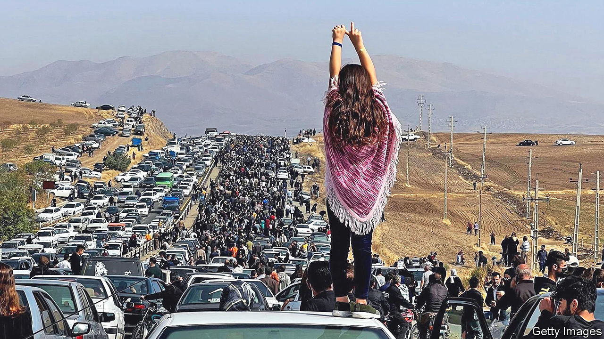
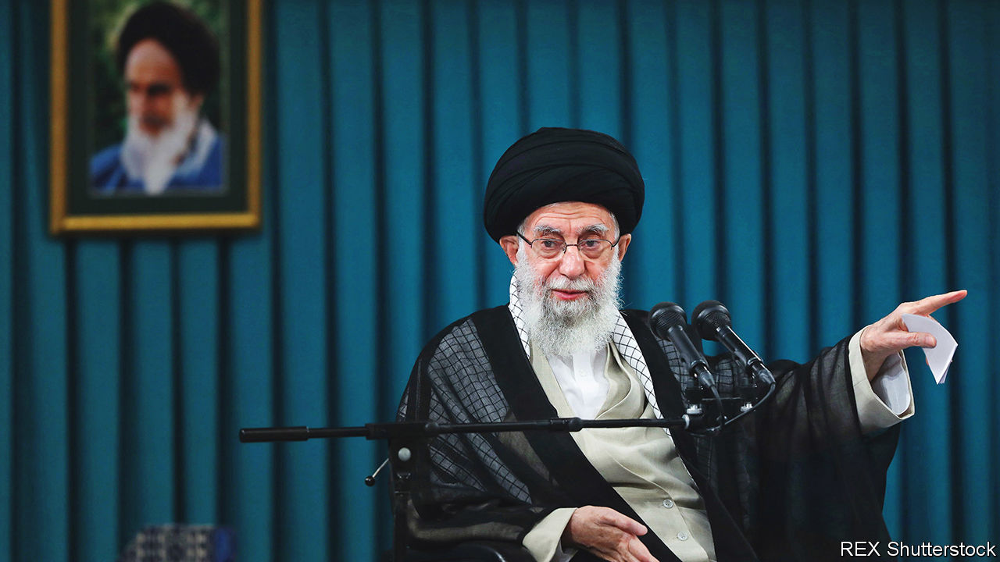

###### The ayatollahs are trembling

# Could Iran’s regime fall? 

伊朗政权会倒塌吗？

##### The protests are persisting, as the theocrats dither 

 

> Oct 27th 2022 

Sitting on a podium before an assembly of sportsmen on September 11th, Ayatollah Ali Khamenei, one of the world’s longest-reigning leaders, sounded surprisingly perky. Defying reports of his death, the 83-year-old celebrated the pious female athletes who had been competing abroad, shrouded in veils. One, he enthused, had refused to shake the hand of “a foreign man”. A victorious wrestler had prostrated himself before God, reciting the names of the imams deemed holy by Shia Muslims. The athletes, he said, had scored a “tremendous victory” (irrespective of trophies) against Western efforts to “export their culture and prevail over ours”.

The supreme guide had other reasons to feel jovial. With an eye to his succession, he had purged his regime of the reformists threatening to cast doubt on the Islamic Republic. A year earlier he had replaced President Hassan Rouhani, who earned a doctorate from a Scottish university, with , a little-travelled, blinkered yes-man. He had fended off Western efforts to curb Iran’s nuclear plans. Despite Western economic sanctions, Iran’s state coffers were being refilled with oil cash. And he had launched a new chastity drive bent on restoring the moral fibre of the .

Two days after the sporting event, Mr Khamenei’s morality police stopped Mahsa Amini, a 22-year-old Kurdish woman on a trip to Tehran, Iran’s capital, for not wearing her hijab “properly”. They bundled her into their van and took her away for re-education and a beating. Her death in custody unleashed a decade of pent-up frustration. At the funeral women ripped off their headscarves. Police shot back with tear-gas, sparking protests that quickly spread. In scores of cities across an array of provinces they chanted Amini’s name, crying “Death to the dictator!”—the same cry that had toppled the shah in 1979. Could it happen to the ayatollahs? 

Protests against the regime have erupted before. Big ones have occurred every decade or so, but of late have come faster and more furiously. This one has been on a very different scale. The protesters no longer demand bigger handouts or political reform within the system, but the overthrow of the theocracy. The outrage has lasted longer than before and has spread beyond the middle class. 

It has engulfed different religious sects and ethnicities. “From Zahedan to Kurdistan, may my life be sacrificed for Iran,” runs a countrywide cry, referring to a city near the eastern border with Pakistan and an Iranian province in the west. Celebrities, sporting heroes and film stars on government payrolls have cheered on the protesters. Despite hundreds of deaths and over 12,000 arrests, Mr Khamenei’s forces have failed to quell the revolt. “We’re not a movement any more,” says a protester at a university in Tehran. “We’re a revolution that’s giving birth to a nation.”

For the first time in the Middle East, women have been leading the protests. They have had enough of men in turbans controlling how they must dress, travel and even work. By law, they still need male guardians to go between provinces or stay in hotels. If they have no male relative, a local mullah may have them married off. 

But they have increasingly seen alternative ways of life on the internet and have read of the social changes sweeping across even conservative places such as Saudi Arabia. They hear their grandparents telling them of a time before the ayatollahs when women could be judges. Their mantra—, , (women, life, freedom)—encapsulates their demands. 

Six weeks on, the Islamic Republic is in retreat. Women walk the streets and ride the Tehran underground without headscarves. Some raise a finger at security forces when they pass. Others offer hugs to male strangers. At Tehran’s Sharif University, male students form a line of defence against the , the regime’s militia of vigilantes, as women enter the male canteen. 

Detractors and supporters alike speak of a sexual revolution. “For dancing in the alley. For being afraid of kissing one another,” run the lyrics of a song, “”, meaning “for”, which has become . “For changing brains which have got rotten. For being embarrassed. For yearning for a normal life.” “The future of Iran is a woman,” says Ali Karimi, a football star who fled to the United Arab Emirates and is emerging as a spokesman in exile. 

The protesters are mostly young; many are radical. Their vanguard is drawn from university and school students, who make up around a third of Iran’s 86m-odd people. They are fired by ideas racing across social media, including , or legitimate violence. They have chased Mr Khamenei’s officials out of their schools, thrown Molotov cocktails at the security forces, burned down billboards with images of the supreme leader, torn down signs of the morality police centres, and mugged lone policemen and clerics.

Some of the chants mock the regime’s hate-speech: “Death to the dictator!” rather than the official “Death to Israel!” The symbolic burning of hijabs has replaced the routine setting fire to the Stars and Stripes. When the shah was the butt of protests, the leader of the revolution, Ayatollah Ruhollah Khomeini, famously used to intone: “When the people do not want such a servant to serve them, he should step aside.” Now the protesters echo that saying, with Mr Khamenei as their target.

That message may be swaying pious Iranians, who have been the regime’s traditional base. Some of the biggest protests have been in conservative shrine cities, such as Mashhad and Qom, and in female universities, like al-Zahra in Tehran, where the regime once trained youthful Islamic ideologues. Few have answered Mr Khamenei’s calls to mobilise. “They’re just not showing up,” says an Iranian analyst in Dubai. Many religious Iranians are appalled by the corruption as well as the violence perpetrated in the name of their faith. They fume at the sight of ayatollahs’ sons driving Ferraris or Porsches. 

 

So far the protesters have perhaps intentionally eschewed programmes and leaders. Their diversity makes it hard for them to agree on either. They are wary of relying on a leader who could be killed, jailed or put under house arrest, as happened to the Green Movement’s leading lights after the mass protests of 2009.

Cunningly leaderless

Instead the organisation is horizontal, with hundreds of small and disparate social-media networks. They gather along main roads, not at junctions, where the riot police lie in wait. Experience has taught them that ambitious manifestos in so complex a country can be divisive. So their demands, circulated in slogans and on social-media platforms (particularly Telegram), tend be limited to calls for the release of students from jail, the trial of security men responsible for killing protesters, and the sacking of teachers who have snitched on them. 

The regime’s prisons may, however, be a font of revolt. “There’s more space to talk there than in cafés,” says an activist who spent five years in a communal cell with 90 other dissidents. “You spend all your time thrashing through ideas with people from across Iran. We were living together and became very close.” Fellow inmates included atheists, Shia reformists, Sunnis, Sufi mystics, Bahais, Christian converts and even jihadists loyal to Islamic State. Much as leftists and Islamists both did under the shah, they have honed their ideas and plans of action inside. They agree on equal rights and an end to discrimination against religious and ethnic minorities. In their separate jail blocks, women have done the same. On their release they have met and plotted. 

But this revolt has mostly been of Mr Khamenei’s own making. At its outset, the regime’s leadership was a hybrid of clergy chosen within their own councils and representatives elected by the people, albeit after being vetted for loyalty to Islamic rule. Parliament and a president were elected every four years. But during his reign of 33 years Mr Khamenei has ruled with an increasingly iron fist. His men on the Guardian Council excluded ever more candidates. Last year they fixed the presidential race so that Mr Raisi, an obedient hardliner, would win. The turnout was the republic’s lowest on record. The safety-valve of even controlled elections was discarded. Mr Khamenei purged his theocracy of reformists. The tightening of the morality code and the raising of fines for violations curbed what personal freedom Iranians still enjoyed. 

The regime is becoming bloodier, too. In 2009 it may have killed 70 people to suppress protests over a rigged presidential election. In 2019 it killed more than 1,500 in under a week of protests against cuts in subsidies, according to human-rights groups. The security forces have so far been loth to pour fuel on the fire by shooting schoolgirls. But the scale of repression has already exceeded that of 2009. Exhausted and overstretched, the security forces have sometimes failed to give warning shots. The regime is said to be offering the police double pay to enforce order. A massacre could turn the protests into a full-scale revolution. 

The regime is also ramping up its surveillance. Its thugs raid protesters’ homes to confiscate phones. “Don’t make a fuss or we’ll take you as well,” they say, ensuring compliance. Newly installed high-resolution cameras match pedestrians to their identity cards and mobile phones. Businessmen who have been caught flashing V-for-victory signs at protesters have been summoned for questioning in mosques. The authorities are also rolling out a countrywide intranet to seal Iran hermetically from the world wide web. VPNs that have been used to circumvent the intranet are being closed down. The authorities have reduced street lighting, plunging neighbourhoods into darkness. 

The regime’s most effective weapon may be economic. Few can afford to heed calls for an indefinite general strike. Inflation, at over 50%, is at its highest in a decade. The currency’s value has plummeted. Millions have fallen into poverty. 

So the protesters’ road is long and uncertain. The largest demonstrations have numbered tens of thousands, not the millions that toppled the shah. If the revolt is to succeed, more middle-class and middle-aged Iranians need to join the fray. The security forces, police and Islamic Revolutionary Guard Corps (IRGC), the regime’s praetorian body, have so far stood loyal. 

There have been no significant defections from the regime. But in its senior echelons a striking silence has prevailed. Despite Mr Khamenei’s call to denounce the protests, none of the former presidents has spoken up. Criticism of Mr Khamenei’s slow and rigid responses is growing in official circles. Seminarians and Islamist reformists have condemned the regime’s recourse to violence. A former long-serving speaker of parliament, Ali Larijani, has urged the regime to relax its enforcement of the hijab. The sports minister hosted a female climber who recently competed in Korea without a veil, wearing a hoodie and cap instead. There has been wrangling in the state media. 

Mr Khamenei has long feared concessions, seeing them as signs of weakness. “He never budges,” says Mohsen Kadivar, a senior theologian who now lives in America. He notes that regimes in the Middle East, such as Morocco and Jordan, that quickly amended their constitutions in the face of the Arab spring of 2011, emerged the least scathed. From Los Angeles, Reza Pahlavi, son of the last shah, has called for a referendum to decide whether Iran should be an Islamic republic, a secular one or a reconstituted monarchy.

Arguments over the succession may weaken the regime from within. Mr Khamenei, who is said to have cancer, may favour his 53-year-old son, Mojtaba, who runs the supreme guide’s office and has lately—on flimsy religious grounds—been named an ayatollah. Some clerics and generals are against a dynastic succession. In June Mr Khamenei sacked Hossein Tayeb, the Revolutionary Guards’ powerful head of intelligence, reportedly for opposing it. 

“The IRGC are seeing the ground shift and are holding back,” says Sadegh Zibakalam, a political scientist in Tehran. A former diplomat in Iran agrees. “Maybe some of the commanders are supporting the crackdown, but the rank and file sympathise with the protesters,” he says.

The IRGC is not monolithic, in any case. Many of its senior people are motivated more by money than religion; the irgc has huge business interests. Some analysts think it might sweep away the supreme guide’s establishment and impose a military rule of its own under a veneer of piety. 

What is certain is that Mr Khamenei and the Islamic regime are both in deeper trouble than at any time since the shah was toppled in 1979. They are dithering, unsure whether to repress more brutally or give ground. The protests could yet fizzle out, as they have before. But this time there is at least a chance that they will persist. The beginning of the end of the Islamic regime must surely be in sight. ■

