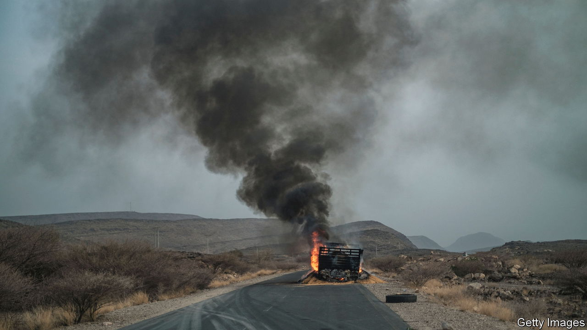
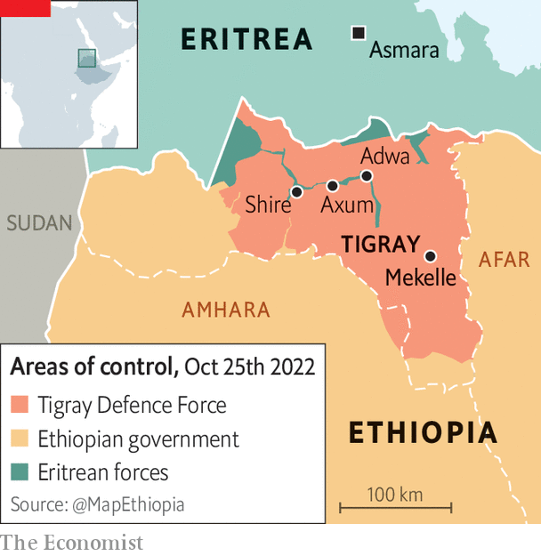

###### Slow-talking

# Ethiopia’s peace talks may be overtaken by battlefield advances 

##### Government forces on closing on Mekelle, Tigray’s capital 

 

> Oct 27th 2022 

It was an inauspicious start to ending a catastrophic war. The first official direct peace talks between the Ethiopian government and the leaders of Tigray, its rebellious northern region, were meant to have begun in early October in South Africa. When they at last opened on October 24th, the delegation sent from Addis Ababa, the Ethiopian capital, had still not arrived. Its chief negotiator, Ethiopia’s deputy prime minister, Demeke Mekonnen, failed to show up at all. Thus the first scheduled day of talks slipped by without progress. 

There ought to be no time to waste. Hundreds of thousands are believed to have died in the war, which is about to enter its third year, either in the fighting or from hunger and disease. Millions of civilians in Tigray, the focus of the conflict, are under blockade and running out of food and medicine. Almost no aid has entered the region since late August, when a five-month humanitarian truce ended. 

Since then tens of thousands of ill-trained recruits from Ethiopia and neighbouring Eritrea have been slung into battle against the self-styled Tigray Defence Force (TDF). The mounting devastation and risk of yet more in a conflict already deeply stained by the blood of murdered civilians are reasons why many Ethiopians and outsiders hope for a swiftly negotiated end to the war. 

 


They will probably be disappointed. Ethiopia seems to be in no rush to talk because its forces and their Eritrean allies have made rapid gains on the battlefield. On October 17th they captured the strategic town of Shire and soon after that the historic cities of Adwa and Axum (see map). Just days later Abiy Ahmed, Ethiopia’s prime minister, proclaimed that victory was nigh. Federal forces now appear to be closing on Mekelle, Tigray’s regional capital. This raises the prospect of Tigray’s leaders, the Tigrayan People’s Liberation Front (TPLF), being forced to evacuate the city for the mountains as they did in November 2020. Then, too, Abiy declared victory. Yet Tigrayan troops soon switched to guerrilla tactics and in July 2021  and other key towns.

The latest advance of Ethiopian and Eritrean troops into Tigray has sparked an exodus of hundreds of thousands of civilians into the countryside. Many remember the lootings, murder and rapes during the occupation by federal forces last year. “Massive displacement again,” says a UN official. “The numbers are staggering.” 

The prospect of an even greater humanitarian disaster is shaking outsiders. On October 17th the UN secretary-general, António Guterres, warned that the situation was “spiralling out of control”. Both the AU and the UN Security Council have since met to discuss the crisis.

In the talks Tigray’s leaders have demanded an immediate halt in fighting (as have the AU and Western countries). But Abiy and Issaias Afewerki, Eritrea’s dictator, are unlikely to agree to this. Instead they seem determined to repeat the trick the TPLF itself pulled off in 1991 when it was a rebel army fighting the oppressive communist junta running Ethiopia. That was to make ongoing peace talks redundant with a decisive military victory. People familiar with the government’s plan say it is to install an interim administration in Tigray while it hunts down whatever remains of the TPLF’s leadership.

There is little reason to believe this effort would be any more successful than a previous attempt in early 2021. And although Tigray’s leaders may soon relinquish control of Mekelle, they are unlikely to give up the fight. “The only option we have is to resist,” said Debretsion Gebremichael, the regional president, on October 24th. Indeed, the TPLF’s great strength lies in guerrilla warfare. It was using these tactics that it overthrew the central government in 1991 (before taking the reins itself for the next three decades) and kicked the occupying Ethiopian and Eritrean armies out of Tigray last year. “They’re going to make Tigray ungovernable,” predicts Alex Rondos, a former EU special envoy to the Horn of Africa.

Abiy, meanwhile, is already battling on other fronts. On October 22nd rebels in Oromia, the largest region, said a government drone strike had killed scores of civilians there. The task of pacifying Tigray will further stretch Abiy’s forces and the country’s fast-deteriorating economy. A protracted insurgency in Tigray is the last thing Ethiopia needs now. ■

