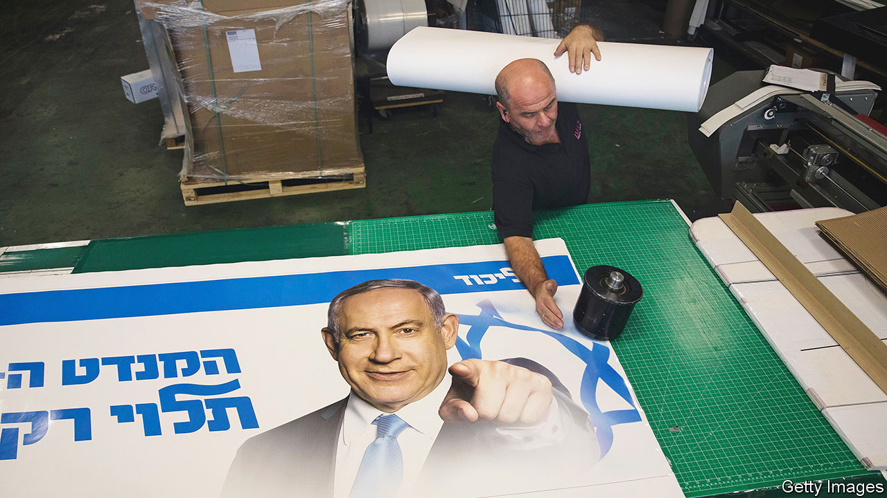

###### Not yet bye-bye for Bibi

# Israel’s Binyamin Netanyahu bids for an election comeback 

##### In a neck-and-neck race, his alliance may have the edge 

 

> Oct 27th 2022 

SIXTEEN MONTHS after , Israel’s longest-serving prime minister, was turfed out of office by an unwieldy coalition led by a former aide, he is on the brink of returning to power. The opinion polls suggest that his Likud party will be the largest after the election on November 1st. The right-wing and religious coalition supporting him seems to be inching towards a majority in the Knesset, Israel’s parliament. 

But it is far from certain. This is Israel’s fifth election in less than four years, after the previous four failed to yield a solid government. There may be yet another stalemate between the pro-Netanyahu bloc and the parties who refuse to join a government under a prime minister who has been indicted for fraud and bribery.

“This time will be different,” promises Boaz Bismuth, a former newspaper editor running as a candidate for Mr Netanyahu’s right-wing party, Likud. “The elegant explanation is that voters realise that Israel’s unprecedented economic prosperity was due to 12 years of Netanyahu in office and want him back. The less elegant explanation is they’ve seen how, in the name of anyone-but-Bibi, his rivals included even the Muslim Brotherhood in government.” 

This refers to the coalition formed last year by Yair Lapid, the incumbent prime minister, who cobbled together a wobbly array of eight parties, including nationalists, centrists, left-wingers and—for the first time in Israel’s history—a conservative Islamist party. 

Mr Lapid was so bent on forming a government that in order to ensure a majority he was prepared to let Naftali Bennett, the leader of a small right-wing party, have the first stint as the coalition’s prime minister. But the government failed to sort out its differences. After just a year in office, on June 20th Mr Bennett announced he was resigning, leaving Mr Lapid as caretaker prime minister until the coming election.

A former columnist and chat-show host now aged 58, Mr Lapid has built up Yesh Atid, the centrist party he founded in 2012, to become the second-largest in the Knesset, rivalling Likud. He offers Israelis the prospect of “normalcy” after years of strife under Mr Netanyahu. “Israelis are sick of waking every day to a prime minister in the headlines,” he says.

Unlike Mr Netanyahu, now 73, he has struggled to control a fractured coalition of small parties that do not easily accept his leadership. His defence minister, Benny Gantz, a 63-year-old former general, leads another centrist party and claims to have a better chance of forming a government after the election. Mr Gantz believes he can entice ultra-Orthodox Jewish parties away from the Netanyahu camp.

Mr Lapid has problems on his left, too. Labour and Meretz, two of his allies, risk falling beneath the threshold of 3.25% of the total vote that is required to win seats. Under Israel’s proportional-representation system, no single party has ever won an outright majority in the Knesset. So it is virtually impossible to become prime minister without horse-trading to form and maintain a coalition. If the small left-wing parties fail to make the cut, Mr Netanyahu could well have his majority.

“Israel needs parties with distinctive ideologies, like Labour,” insists Naama Lazimi, who won the second spot on Labour’s slate of candidates. At 36, she stands for a new generation of Labour politicians fighting to keep the party relevant. Though it founded Israel in 1948 and was in power for half its history, voters have been steadily abandoning it, heading away from the left.

“Israeli politics has been corrupted by this never-ending dispute over Netanyahu,” she says. “It’s why we’ve got Lapid’s mishmash of centrism which means nothing. Someone has to be thinking about the day after Netanyahu, working to create a more equal economy and to make peace with the Palestinians.”

Whereas Mr Netanyahu has shown scant interest in accommodating the Palestinians in the territories occupied by Israel, or even Arab Israelis within the Jewish state, Mr Lapid endorsed the idea of a two-state solution in a recent speech at the UN. With America’s help he has also achieved a deal with Lebanon to demarcate the maritime border between the two countries, allowing a rich gasfield to be exploited. At the same time he buffed up his security credentials in the summer by overseeing a brief offensive against Islamic Jihad in Gaza. This week he praised his armed forces for a raid on the West Bank city of Nablus, where they killed five militants. 

Nonetheless, the Palestinian issue has barely featured in the campaign. Israel’s century-old conflict with the Arabs was once the main division in Israeli politics, but now the camp aligned with Mr Lapid includes right-wingers resolutely against creating a Palestinian state. 

This election campaign has anyway again been short of real arguments over policy. The two blocs have made crude accusations against each other. Mr Lapid’s lot warn of the “end of democracy” if Mr Netanyahu were to return. The right-wing religious camp laments the “end of the Jewish state”, should Mr Lapid’s coalition prevail.

Mr Netanyahu craftily engineered the merging of three small far-right parties into the Religious Zionism list. This includes Jewish Power, an intensely anti-Palestinian and Jewish supremacist party, led by Itamar Ben-Gvir, that was once on the very margin of Israeli politics. To form a coalition Mr Netanyahu may have to meet some of the ultra-nationalists’ demands for control over law enforcement.

Religious Zionism has concocted a plan to change Israel’s legal system by limiting the powers of the Supreme Court, which has been sturdily independent. It also wants to abolish the “breach of trust” clause in criminal law, whereby many officials have been indicted. Mr Netanyahu is facing three such charges in a corruption trial that began two years ago. 

Simcha Rothman, a member of the Knesset from Religious Zionism who wrote the legal-reform plans, hotly denies that the intention is to get Mr Netanyahu off the hook. And religious Zionism, if the opinion polls are right, is on course to become the third-largest party. It appears to be taking votes away from Likud and Mr Netanyahu’s other religious partners. The far-right’s message is apparently resonating with young, first-time voters.

With the two camps almost neck-and-neck, turnout may tip the balance. Arab Israelis, about a fifth of the population, may be crucial. In the last election, in March 2021, turnout nationwide was 67%, but among Arab Israelis it was around 45% and is likely to stay the same. Last time some of the main Arab parties came together in the Joint List. But this time three Arab parties are running separately, each liable to drop below the threshold. If that happens, Mr Netanyahu’s chance of winning a majority will rise. Only a last-minute surge of Arab votes might keep him out. ■

