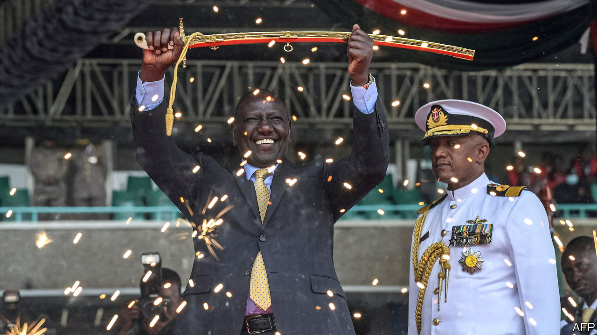

###### See no evil

# Will William Ruto serve the people or himself and his pals? 

##### Kenya’s president promises citizens prosperity for impunity 

 

> Oct 25th 2022 

Cabinet confirmation hearings rarely make for compulsive viewing. But few parliamentary committees are asked to vet nominees with pasts quite so contentious as some of those proposed by , Kenya’s new president (pictured). Take, for instance, Aisha Jumwa, Mr Ruto’s nominee for gender secretary, who has spent the past year juggling simultaneous murder and corruption trials. Or Mithika Linturi, put forward to run Kenya’s agriculture, who was charged last year with attempted rape. (Both deny all charges.)

This should be red meat for any self-respecting watchdog committee. Yet its members have seemed strangely reluctant to munch. Ms Jumwa’s legal troubles elicited only a brief mention when she appeared before them on October 18th. Others who have been in and out of trouble in the past got an even easier ride. The committee did not ask one nominee why he once threatened to sexually assault a female MP with a beer bottle and glossed over British court documents suggesting that another had taken bribes from two British businessmen jailed in 2015. Njuguna Ndung’u, the president’s treasury secretary, happily batted away politely couched questions about the scandals that marred his time as the governor of Kenya’s central bank.

Kenya has a dire history of corruption and impunity. Had Mr Ruto been so minded, he could have appointed ministers with cleaner reputations. He did not. One reason is expediency. He won the  in August by a wafer and against the odds. To defeat the combined forces of his predecessor, Uhuru Kenyatta, and Raila Odinga, Mr Kenyatta’s favoured successor as president, Mr Ruto had to build a large, multi-ethnic coalition. In so doing, he accrued a fat wodge of political debt, some of it from less-than-salubrious types. Several of his cabinet choices smack of payback.

Mr Ruto seems untroubled by his minions’ baggage, perhaps because he carries so much of his own. He was charged by the International Criminal Court in The Hague with orchestrating  after a disputed election in 2007. He pleaded innocent and the trial was halted amid accusations of witness-tampering, though the judges pointedly declined to acquit him. 

The charges evidently did not hurt Mr Ruto when it came to the recent presidential poll. Indeed, most Kikuyu, allegedly the main victims of the killings after the election of 2007, voted enthusiastically for him. He may reckon that if voters were willing to overlook so great a scandal they would be unbothered by smaller ones, too.

Unlike Mr Odinga’s campaign team, the new president’s one pointedly refused to make the fight against corruption a priority. “For chrissakes stop whining,” David Ndii, his chief policy strategist, wrote on Twitter last December in response to concerns about Mr Ruto’s seeming indifference to financial transparency. “If you are looking for an anti-corruption platform don’t support [us].” Instead of “virtue-signalling”, says Mr Ndii, the Ruto administration will deliver competent government, an end to injustice and greater prosperity for those at the bottom.

Hard bargain

Such promises may raise eyebrows, given the wealth at the top. The 22 cabinet nominees who appeared before the committee declared they had a net worth of $125.7m between them. Since the average Kenyan has a yearly income of just $2,000, this disparity might cause resentment. It should rather be a source of inspiration, says Mr Ndii, a sign that in President Ruto’s “hustler nation” every Kenyan will have an “equal opportunity to be a billionaire”.

So a tacit bargain is being offered to the Kenyan people: forgive us our trespasses and we will deliver you from poverty. This is reflected in the Ruto administration’s early policy pronouncements. On October 4th the government lifted a ban on cultivating and importing genetically modified maize, a move that could help lower food-price inflation, which surged to 15.5% in September. Mr Kenyatta’s petrol subsidy, which favoured richer car-owners, was swiftly ditched, but kept in place for diesel and kerosene, fuels used by the poor. Subsidies have been introduced for fertiliser in an effort to lower the price of farm inputs. Meanwhile, the government is set to launch a fund in December to ease access to credit for small businesses.

Other early moves have raised cautious hopes. Mr Ruto has promptly disbanded the Special Service Unit (SSU), a police unit infamous for dispensing summary justice and clogging rivers with the corpses of its victims. The president is also trying to burnish his pro-market credentials with plans to privatise state-owned companies. Seeking to contrast himself with his predecessor, who let public debt swell alarmingly, Mr Ruto has told the treasury to cut $2.5bn in recurrent spending. 

He sounds pragmatic in foreign policy, too. Whereas he was often hostile towards China in his campaign, promising to deport Chinese citizens he claimed were taking Kenyan jobs, his tone in office has become more conciliatory of late. This has not stopped him aligning with the West elsewhere, however. Kenya recently voted in the UN General Assembly to condemn Russia’s annexation of four Ukrainian regions, unlike the 18 African countries including South Africa that abstained. It did the same in the UN Security Council, where it holds a non-permanent seat.

It is too soon to say whether the president is keener to serve Kenya’s people than himself and his cronies. Some suspect, for instance, that he disbanded the SSU only because it abducted two Indian members of his election-campaign team, who disappeared along with their Kenyan driver in July and have not been seen since.

Some signs are worrying, however. Criminal cases against Mr Ruto’s allies are rapidly being abandoned. Mr Linturi’s attempted-rape trial collapsed after his alleged victim withdrew her complaint. The director of public prosecutions announced he was withdrawing corruption charges against Ms Jumwa, while the family of the man she allegedly murdered says it is now pursuing an out-of-court settlement. A corruption case against Rigathi Gachagua, who has not even bothered to attend his trial since he became deputy president, is also likely to be dropped.

Mr Ruto’s aides insist that all these cases were trumped up by his predecessor in order to silence him. Kenyans will be praying so. But impunity today in exchange for the vague promise of prosperity tomorrow is not the deal most were hoping for. ■

