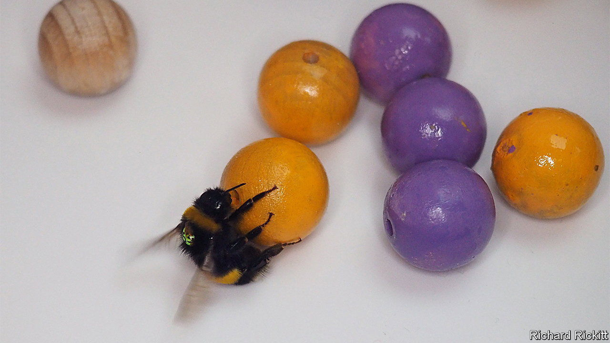

###### Animal behaviour

# Bumblebees like ball games 

##### Playfulness is not restricted to mammals and birds 

 

> Oct 27th 2022 

Animals like to play. Well, some do. Lots of mammals and birds, particularly when young, engage in behaviour that, to use a common check-list: provides no obvious adaptive outcome such as access to food, shelter or a mate; is voluntary, spontaneous and rewarding in and of itself; is repeated, but not stereotypically; and appears to be pleasant and conducted when the animal is relaxed.

But bumblebees? Apparently they play too, according to work just published in  by Hiruni Samadi Galpayage Dona and Lars Chittka of Queen Mary University, in London. Specifically, if given the opportunity, they will play a type of football. Admittedly, their version of this is not a team game. And the balls involved are pretty-much the same size as the insects. But, to a human observer armed with the check-list, they give every impression that they are enjoying the bumblebee equivalent of a kickabout.

The idea of asking whether bumblebees like to play came to Dr Chittka during a previous study in which he trained them to roll wooden balls around in order to gain access to food. He noticed that, during this experiment, they would often roll the balls for no apparent reason. They just seemed to enjoy it. 

A perfect PhD project, then, for an aspiring student. And Ms Galpayage Dona stepped up to the mark. She created an arena, baited it with pollen and sugar solution to lure the bees in, and connected it via a plastic tunnel to a bumblebee nest in Dr Chittka’s laboratory. 

Her playpen contained 18 wooden balls coated with clear plastic, so that they could be cleaned every day of any scent picked up. In one part of the arena, nine of the balls were fixed to the floor. In another, the remainder could be rolled around. Ms Galpayage Dona tagged 45 bees, between one and 23 days old, so that they could be followed as individuals. She then opened the door to the arena for three hours a day for 18 days and recorded on video what happened.


The recordings suggested that the bees did indeed enjoy this experiment. They would start by touching a ball with their forelegs, then grab it with all six legs and rotate it towards themselves while moving across the floor backwards. Then they would dismount. All of the tagged bees rolled a ball at least once during the experiment. Most did so many times. One particular enthusiast managed 117 rolls. Overall, the camera recorded 910 incidents of ball-rolling by tagged insects, discounting those involving unmarked bees.

Re-enforcing the idea that the bees just wanted to play, they quickly learned to ignore the part of the arena where the balls were glued down. Also, as with birds and mammals, young bees played more often than old ones. All they need now, it seems, is some goalposts and a refer(b)ee, and bumblebee social behaviour will take off to the next level.


