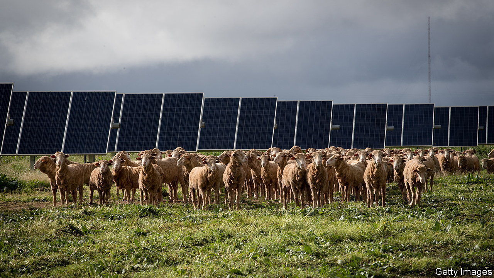
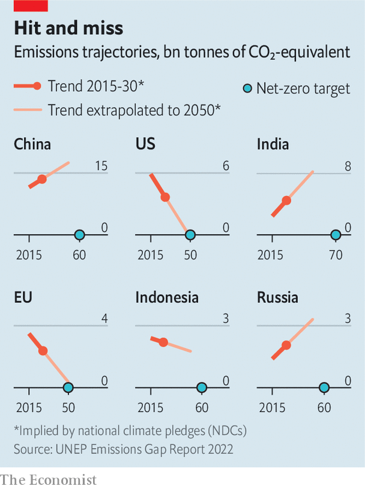

###### Climate change

# Few governments have done much about the climate this year 

##### But war may be helping the shift to renewable energy 

 

> Oct 27th 2022 

On November 6th the world’s leaders will assemble once more to talk about the climate. This time last year all eyes were on Glasgow, in Britain, for the COP26 UN climate summit. Attention now turns to Egypt, host of COP27. 

Progress since Glasgow has been disappointing, as the latest Emissions Gap Report from the UN Environment Programme laments. This considers all new national climate promises and policies since that summit and translates them into future reductions in greenhouse-gas emissions. 

The report finds a mere 0.5bn tonnes have been shaved off last year’s 17bn- to 20bn-tonne gap between where the annual rate of carbon dioxide emissions would need to be in 2030 in order to offer a decent chance of limiting warming to 1.5°C above pre-industrial temperatures, and what is implicit in the political promises on the table. Most of the shavings come from the new Australian government’s more active climate policies. Of other members of the G20 group of countries with substantial economies, only Indonesia and South Korea have increased their climate ambition. Brazil has back-pedalled. 

 


The modellers estimate that if every national climate goal for the end of this decade were met, including those conditional on money promised by rich countries actually turning up, then average global temperatures would rise by 2.4°C by 2100. If mid-century net-zero pledges are met, it could mean just 1.8°C of warming, but the report’s authors warn repeatedly that this is “currently not credible” (see chart). Existing climate policies—real action on the ground, not just promises—equate to 2.8°C of warming by 2100. These findings are consistent with a similar analysis by the UN Framework Convention on Climate Change, the main forum for international climate talks. 

Climate models suggest that, to avoid more than 1.5°C of warming, greenhouse-gas emissions must peak before 2025 and then fall by 43% from 2019 levels by 2030. Systems Change Lab, a conglomerate of environmental organisations and think-tanks, has translated these reductions into 40 indicators, each with a 2030 target. In its report, the State of Climate Action 2022, it finds not a single one of them on track for 1.5°C. Five are heading in the wrong direction entirely. For example, the share of electricity generated by “unabated fossil gas” (natural gas burned without capturing the resulting carbon dioxide) has actually risen in recent years. Similarly, the amount of CO generated for each unit of steel produced has increased, and food production is emitting more than it did five years ago.

If there is a glimmer of hope in all this, it is the International Energy Agency’s estimate that CO emitted by burning fossil fuel will rise by only 1% in 2022, after a much larger post-pandemic surge in 2021. Paradoxically, Russia’s invasion of Ukraine may have helped. “The encouraging news is that solar and wind are filling much of the gap” created when Russia switched off Western gas supplies, said Fatih Birol, the agency’s executive director. The dash for coal, he added, appeared to be “relatively small and temporary”. Even a 1% increase in emissions adds to the greenhouse effect, but were this trend to continue it would be good news indeed. ■


