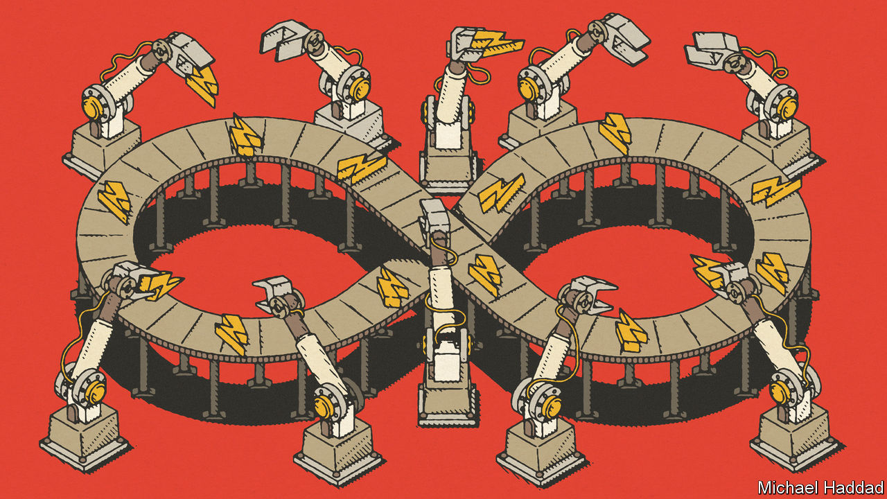
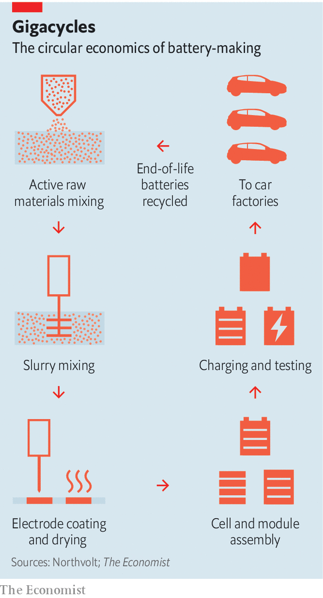

###### Inside the gigafactory

# Gigafactories are recycling old EV batteries into new ones 

##### It is a further step towards circular manufacturing 

 

> Oct 26th 2022 

Though dark satanic mills are long gone from industry, the start of the lithium-ion-battery production line in a factory in Vasteras, west of Stockholm, is particularly squeaky clean. Air-lock doors, a filtered atmosphere and workers dressed head-to-toe in sterile white suits make it look more like a pharma lab than a plant for assembling the single most-expensive component in an electric vehicle (EV). 

So important are batteries to the future of carmaking that every country with an auto industry is rushing to attract plants to make them—“gigafactories”, as they are known in the business. The term was originally coined by Tesla, an American producer of EVs, for a battery factory in Nevada, which it began building in 2014 in collaboration with Panasonic, a Japanese firm. The name relates to an annual production measured in gigawatt-hours (GWh) of storage capacity.

The factory in Vasteras belongs to Northvolt, a Swedish battery-maker set up by a pair of ex-Tesla executives. It is described as an “industrialisation” plant—in effect, a model gigafactory. It is capable of making every part of an EV battery, unlike some others, which buy in components such as electrodes. The factory develops battery cells for new vehicles that are being developed, in turn, by its customers. These include Volvo Cars, BMW and the Volkswagen Group. It then makes the batteries for fleets of prototype vehicles which those producers use for testing. Once the cell designs are fixed, mass production of the batteries is transferred to bigger gigafactories. 

Round and round

Northvolt has one of these, too, in northern Sweden. That has two production lines, each 300 metres long, and the firm is adding three more lines to it. It is also building a second Swedish gigafactory, in Gothenburg, in a joint venture with Volvo, and one in Germany. It is aiming for a combined annual output of 150GWh by 2030. That is enough battery power to make more than 2m EVs. What is even more striking, though, is that by then these factories should be obtaining half their raw materials, including valuable substances such as lithium, cobalt, nickel and manganese, from recycled batteries. If Northvolt succeeds in meeting this ambitious target, that will be a big step towards circular manufacturing, a long-held dream in which firms make new products by recycling their old ones, thus greatly reducing their environmental footprints.

The obsession with cleanliness at the start of the line comes because this is where the chemicals that enable a battery to store energy are mixed into so-called “active” materials. In a lithium-ion battery the slightest impurity can interfere with the flow of the eponymous ions. 

These ions are created at one electrode, the anode, by stripping electrons from lithium atoms. They then shuttle through a liquid electrolyte to a second electrode, the cathode. The electrons, meanwhile, travel towards the cathode along an external circuit, which, in the case of an EV, powers its motor. Ions and electrons are reunited at the cathode and remain there until the battery is plugged into a recharger and the process is reversed.

 


Cathodes, which represent around 40% of the cost of an EV battery, are made from various combinations of chemicals. Cathode chemistry is an important point of differentiation in battery technology. It is therefore tweaked, not just for individual manufacturers, but also to suit specific EV models, ranging from sports cars via family saloons to large SUVs. Popular cathode blends use combinations of nickel, manganese and cobalt. Anodes are usually made from ultra-pure graphite, a form of carbon. Other substances are also added to both sorts of electrode, to stabilise the active materials and to tweak performance. 

Once the ingredients have been mixed, the next stage works like a papermaking plant (see diagram). The active materials are blended into a slurry. The cathode mixture is coated onto a roll of aluminium foil. And the graphite is likewise spread onto a roll of copper. The foils are then oven-dried, pressed and rolled up again.

Robotic hands

Assembly of the battery cells brings a third dimension to the gigafactory, as it is done by robotised machines that look much like those found on an electronics production line. It involves unwinding the electrode foils and cutting them into thin strips. The anodes and cathodes are then made into cells by interleaving them, sandwich-like, with fillings composed of lithium-laced electrolyte and membranes known as separators. These membranes permit lithium ions to pass, but stop the electrodes touching each other and shorting out. 

Such cells are the basic units of which lithium-ion batteries are composed. The next step is packaging them, which can be done in different ways. A widely used format is the “prismatic” cell module. This is made up of a number of battery cells, perhaps a dozen or so depending on the power requirements of the vehicle, assembled inside an aluminium housing. The resulting modules are about the size of a hardback book, with electrical connectors attached. 

The modules then need to be tested by charging and discharging them. This is done cautiously, because the way a battery is “cycled” for the first time can affect its future performance and the length of its working life. Modules deemed good are either dispatched to vehicle manufacturers directly, where they are assembled into the battery packs which are fitted to EVs, or to a Northvolt plant in Gdansk, Poland, which also assembles battery packs, including those used in other industrial applications, such as grid balancing.

Modules that fail their checks go to recycling, where they join what will become an increasing flow of used EV batteries, at first from prototype vehicles and from cars which have been written off in accidents, but eventually, it is assumed and hoped, from the growing number of worn-out batteries that the ageing of the world’s EV fleet will generate—although that could take a decade or so. 

Materials recovered from these batteries are purified and returned to the first stage of production. Ways of doing this are improving all the time, says Emma Nehrenheim, Northvolt’s chief environmental officer, as robots are taught better how to dismantle the batteries and then crush the cells into a crumbled material called “black mass”. That done, useful materials can be leached chemically out of the black mass. 

A combination of recycling and the use of renewable power—in Sweden, Northvolt has access to plentiful hydro and wind energy—means that as batteries themselves get greener, any raw materials still required to make them, along with the associated mining and shipping of those materials, will come to represent a bigger proportion of a battery’s overall carbon footprint, explains Dr Nehrenheim. So companies also have to tackle the volume of emissions in their supply chains.

Not everything recovered is of sufficient quality to produce new batteries, hence there is a search for mining and processing operations with low environmental impact. Recycled graphite, for instance, is not good enough to make new anodes—though it can be used for water filters. Northvolt is therefore exploring an environmentally friendly alternative, in collaboration with Stora Enso, a Finnish wood-products company. The plan is to develop ways of making anode carbon from lignin, a natural polymer found in the cell walls of plants. 

A knottier problem is the questionable nature of the sources of some raw materials. A lot of cobalt, for example, comes from the Democratic Republic of the Congo, where many mining operations use child labour. Northvolt and other battery-makers try to avoid buying materials from these producers by dealing directly with mines rather than third-party suppliers, as this makes it easier to trace the origin of materials and check the standards with which they are produced.

Not so far

Reducing the distance travelled by materials and batteries will also help. Most lithium comes from Australia, Chile and China, although Northvolt has teamed up with Galp, a firm in Lisbon that plans to develop a lithium-production plant in Portugal, which is closer to hand.

Nor is Northvolt alone in seeing advantages in circular manufacturing. The world’s biggest producer of EV batteries is CATL, a firm based in Fujian province, China. Robin Zeng, its chairman, said recently that he believes it is possible to reduce most of the carbon footprint of a battery through the use of renewable power, large-scale recycling of battery materials, energy conservation and improved production processes. The company says its largely hydro-powered gigafactory in Sichuan province is working as a “lighthouse” factory to bring these things to its ten production sites around the world.

CATL is, moreover, seeking to add to that collection. It is building a gigafactory in Germany, has plans for another in Hungary, and is looking for a site for one in North America. And another Chinese firm, Envision, based in Shanghai, is expanding Britain’s only gigafactory, next door to Nissan’s car plant in Sunderland, which it supplies.

Meanwhile, the original gigafactory in Nevada is charting a similar course. Redwood Materials, founded by Jeffrey Straubel, once Tesla’s chief technology officer, is building a giant battery-recycling centre nearby. It is expected to start supplying anode and cathode materials to its neighbour soon. To provide it with a feedstock while the supply of old EV batteries builds up, Redwood has created a collection scheme to recycle batteries from defunct devices such as mobile phones and power tools.

Although there are clear financial and environmental benefits from “greening” batteries by circular manufacturing, it is a road that carmakers and their suppliers may well be forced to take anyway, as legislators are starting to take action. From July 2024 the carbon footprint of batteries in EVs sold in the European Union will need to be declared. And by 2030 those batteries will have to contain minimum levels of recycled material. All in all, then, EV drivers—already seen by many as a smug breed—will soon have reason to feel even smugger about saving the planet. ■


