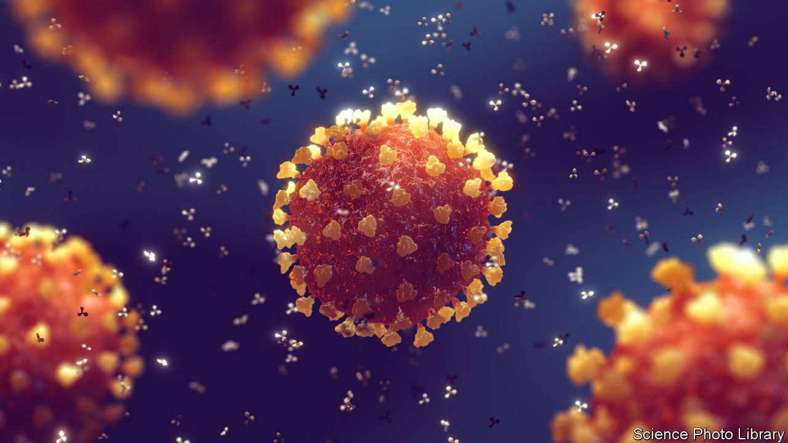

###### The origins of covid-19

# Scientists dispute a suggestion that SARS-CoV-2 was engineered 

##### Thesis. Antithesis. Synthesis? 

 

> Oct 27th 2022 

A string of about 30,000 genetic letters was all it took to start the nightmare of covid-19, the death toll from which is likely to be more than 20m. Exactly how the story began is hotly contested. Some think the infection was a zoonosis—a spillover from wild animals. Its cause, sars-cov-2, resembles a group of coronaviruses found in bats. Others, though, have pointed to the enthusiastic coronavirus engineering going on in laboratories around the world, especially in Wuhan, the Chinese city where the virus was first identified.

Recent work has bolstered the case for it being a zoonosis connected with a particular “wet market” in Wuhan selling wild animals. However, uncertainties around this conclusion allow other theories to flourish. On October 20th an un-peer-reviewed “preprint” was published on a server called , claiming to show that sars-cov-2 is the product of genetic engineering.

Seconds out...

This publication has caused much online debate. The authors were not previously known for this sort of work. Alex Washburne is a mathematical biologist who runs Selva, a microbiome-science startup in New York. Antonius VanDongen is an associate professor of pharmacology at Duke University, in North Carolina. And Valentin Bruttel is a molecular immunologist at the University of Würzburg, Germany. Dr Washburne and Dr VanDongen have argued in the past for an investigation into the lab-leak theory. 

The basis of their preprint is that they identify features, called restriction sites, in the genome of sars-cov-2. These, they suggest, are the product of viral engineering. Restriction sites are particular sequences of genetic letters recognised by proteins called restriction enzymes that, in nature, cut up viral genetic material in bacterial cells. Such enzymes are widely used for genetic manipulation.

The preprint shows that restriction sites for two popular restriction enzymes—BsaI and BsmBI—are strikingly evenly spaced in sars-cov-2’s genome. In fact, the authors say, the spacing of these sites is so unusual that it suggests the work of human hands. In other words, they are claiming that sars-cov-2 is a product of laboratory engineering. 

This is a big assertion, and it is fair to say that after it appeared, a number of scientists were intrigued by the preprint’s findings. Others, though, are now weighing in with serious criticisms.

Among those intrigued is Sylvestre Marillonnet, an expert in synthetic biology at the Leibniz Institute for Plant Biochemistry, in Germany. He agrees that the number and distribution of restriction sites for the enzymes in question does not look quite random, and also that the number of so-called silent mutations found in them suggests that sars-cov-2 might have been engineered. Silent mutations are places where a change in a gene’s genetic letters does not change the resulting protein. This happens naturally, but can result, too, from engineers making alterations to genetic material to achieve that effect. However, Dr Marillonnet also says that there are arguments against the idea. One is the tiny length of one of the six fragments, something that “does not seem logical”.

Francois Balloux, a professor of computational systems biology at University College, London, also said he found the results intriguing, and that they needed to be assessed in good faith. “Contrary to many of my colleagues, I couldn’t identify any fatal flaw in the reasoning and methodology. The distribution of BsaI/BsmBI restriction sites in sars-cov-2 is atypical.” 

In the past few days, scrutiny has intensified, and doubts are starting to accumulate. Justin Kinney, a professor of quantitative biology at Cold Spring Harbor Laboratory, in New York, has taken a closer look at the preprint and says the work is intriguing but some important questions need to be dealt with before it could be said to be convincing. One is the likelihood that researchers would decide to keep the restriction sites in the genome. Jesse Bloom, an evolutionary virologist at the Fred Hutchinson Cancer Centre in Seattle, says BsmBI is usually used in a way in which the restriction sites involved are eventually removed from the virus. There is also the question of the likelihood that these particular enzymes would have been chosen.

The toughest challenges of all, though, are observations by people such as Edward Holmes, an evolutionary biologist and virologist at the University of Sydney, that the restriction sites pointed out in the preprint are found naturally in bat coronaviruses closely related to sars-cov-2. Dr Holmes added that if someone were engineering a virus they would undoubtedly introduce some new ones. 

An alternative proposal is therefore that the sites evolved via natural recombination in the wild, and that their regular spacing really is just a matter of chance. Alex Crits-Christoph, who has just completed a postdoc in microbiology at Johns Hopkins School of Public Health, says there are clues which support a natural origin for these sites. He says the regions on either side of the restriction sites show similarities to some in other viruses—something that points to the natural swapping of chunks of genetic data between viruses. These patterns are “inconsistent with engineering”, he says, and concludes that the preprint is “false”. Dr Washburne concedes that natural recombination “isn’t an implausible scenario”.

Nullius in verba

It is not, therefore, possible to conclude, on the basis of this preprint, that sars-cov-2 was engineered. China denies the virus came from a Chinese lab, and has asked for investigations into whether it may have originated in America. It is also worth remembering that most newly emerging viruses are, indeed, zoonoses. That is not to say that a lab origin is hard to imagine, only that this particular hypothesis has serious questions to answer. 

Any widely supported conclusion that the virus was genetically engineered would have profound ramifications, both political and scientific. It would cast a new light on the behaviour of the Chinese government in the early days of the outbreak—particularly its reluctance to share epidemiological data from those days. It would also raise questions about what was known, when, and by whom about the presumably accidental escape of an engineered virus. But for now, this work on restriction sites is a contested study, and needs to be treated as such. ■


