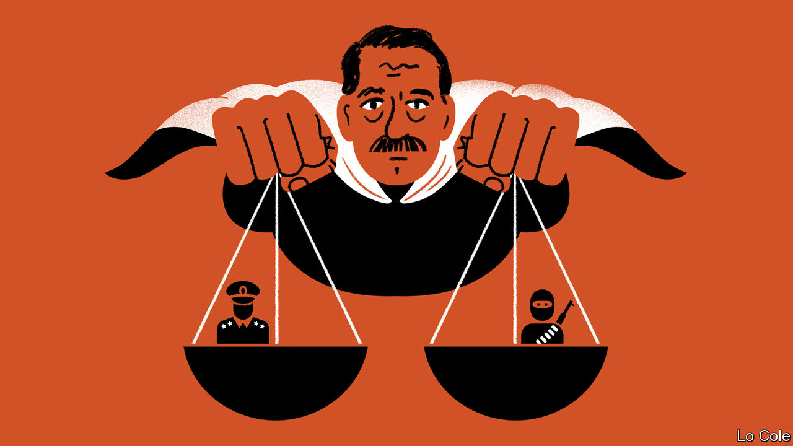

###### Bello

# A film about Argentina’s history sheds light on its politics today 

##### “Argentina, 1985” shows how the Kirchners have twisted events of the recent past 

 

> Oct 27th 2022 

In the three weeks after it was released in cinemas last month, and before it started streaming on Amazon, almost 1m Argentines went to see “Argentina, 1985”, a film about the prosecutions of the generals and admirals who ran what was Latin America’s vilest dictatorship. It harks back to the events of that year in an Argentina of music cassettes, manual typewriters and many, many cigarettes. For much of the audience, it refers to unknown, or half-forgotten, history. In an unstrident way the film is a critique of the version of “historical memory” espoused by Néstor and , the Peronist couple who between them have run Argentina for all but four of the past 20 years.

When the armed forces took power in 1976 Argentina was suffering from , a political killing every five hours and a bomb explosion every three, as the Montoneros, a guerrilla army, and other armed leftists battled right-wing death squads in what was partly a civil war within Peronism. Many Argentines believed that the army would restore order and quickly hand back power. Instead it presided over systematic state terror involving clandestine prisons, kidnapping and torture. It was only economic failure and the fiasco of the invasion of the Falkland (Malvinas) islands that caused the junta to call an election in 1983.

It was won by Raúl Alfonsín of the Radical Civic Union, a liberal of the centre-left. He swiftly implemented a campaign promise to repeal the junta’s self-amnesty. He set up one of the first-ever truth commissions: its report, titled  (“Never Again”), found that at least 8,960 people had “disappeared” in the junta’s dirty war, many of whom had no connection to the guerrillas. Alfonsín was determined that the perpetrators of violence and illegality should stand trial. He changed the law so that if the military courts dragged their feet in judging their peers, a civilian court could judge them.

That duly happened. The film focuses on the work of Julio Strassera, the chief prosecutor in the case. He is portrayed as an ordinary man thrust into an extraordinary role, in a characteristically compelling performance from Ricardo Darín (who starred in the Oscar-winning “The Secret in their Eyes”). Strassera’s young assistant, Luis Moreno Ocampo, would go on to become the first prosecutor at the International Criminal Court. They work in an atmosphere of menace and threats. “We will give the military commanders what they didn’t give their victims: a fair trial,” says Strassera. The prosecutors draw heavily on the work of the truth commission. Witnesses offer harrowing testimony of torture and ill-treatment.

The court sentenced two of the junta members to life imprisonment, three to prison terms and freed four. It was historic, the first occasion in Latin America when dictators had been tried and sentenced by a civilian court. Alfonsín also decreed that the courts should investigate the commanders of the guerrillas, who were responsible for more than 1,000 deaths in the decade to 1979 and whose actions had triggered the military coup. Mario Firmenich, the leader of the Montoneros, was sentenced to life.

The trial of the junta took much courage, since the armed forces were still powerful. As prosecutions continued against other officers, and with the government unpopular because of economic problems, Alfonsín faced several military rebellions. He was obliged to halt further trials. His successor, Carlos Menem, decreed an amnesty that freed the generals and Mr Firmenich.

Trials started again under Néstor Kirchner, when the army had been neutered by the slashing of its budget under Alfonsín and Menem. In 2004 he apologised on behalf of the state “for the shame of having stayed silent about so many atrocities during 20 years of democracy”. The Kirchners’ version of justice is selective: while more than 1,000 elderly military officers have been sentenced, Mr Firmenich lives quietly in Spain, teaching economics. Many people with links to the Montoneros served in the Kirchners’ governments. Cristina Kirchner, now the vice-president, rants against the judiciary for accusing her of corruption (which she denies).

One criticism of “Argentina, 1985” is that Alfonsín figures only briefly, urging Strassera to do his job without fear of political intervention. But the trial speaks for itself. In doing so it shows how much the Kirchners have falsified Argentina’s recent history. And that Alfonsín was a hero of the rule of law in a region where it is still sorely lacking.


