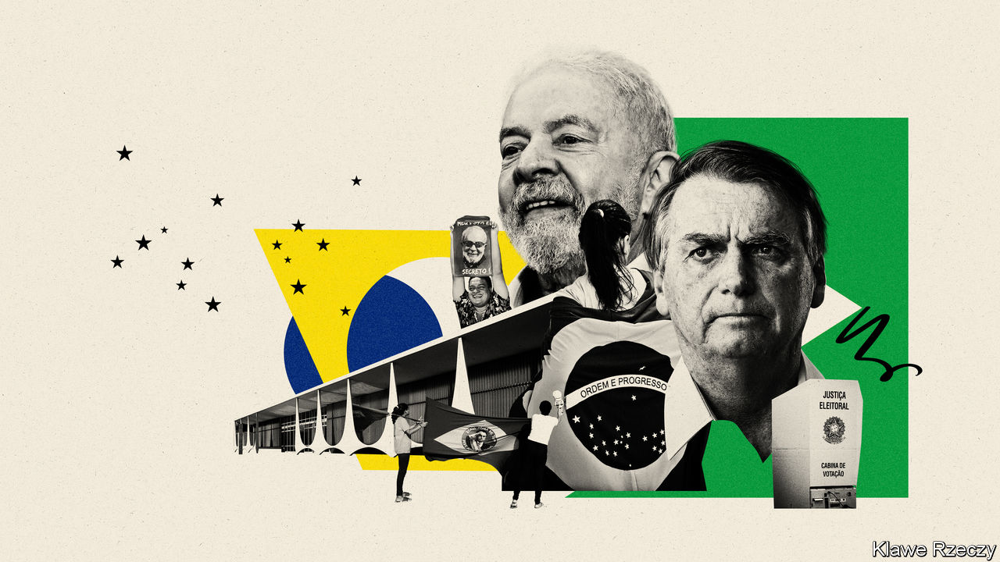
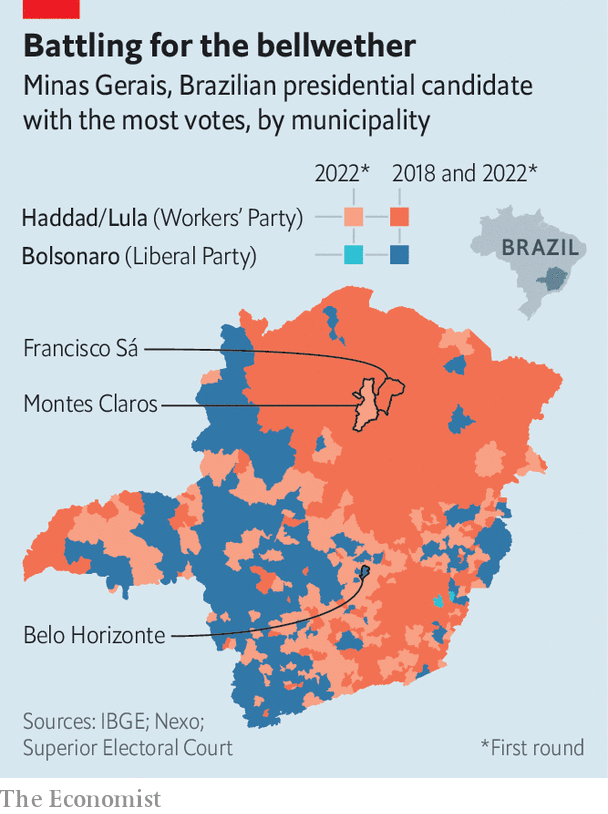

###### A tense final week

# Brazil’s election is tight ahead of a run-off on October 30th 

##### That can be seen most clearly in Minas Gerais, the bellwether state 

 

> Oct 27th 2022 

After the first round of Brazil’s  on October 2nd an audio message circulated on WhatsApp in Francisco Sá, a town of 25,000 in the poor, arid backcountry of Minas Gerais state. In it Mário Osvaldo Casasanta, the town’s mayor, attributes the improving fortunes of the town to , Brazil’s right-wing populist president. Because of federal money, he says, “we have new sidewalks.” Because of monthly payments to poor families, “our shops are packed.” But the town’s future hinges on the result of a run-off on October 30th between Mr Bolsonaro and Luiz Inácio Lula da Silva, a leftist former president. A victory by Lula, as he is known, would bring economic ruin, the mayor claims. “Schools will close. Hospitals will close…I’ll close city hall.” That could put 1,323 people out of a job. 

In the first round of voting, Lula got 48.4% to Mr Bolsonaro’s 43.2%, a difference of around 6m votes. That gives Lula the edge, but polls are tightening now that the nine other candidates are out of the race. ’s  shows Lula and Mr Bolsonaro with 52% and 48%, respectively, a technical tie given the margin of error. To close the gap, Mr Bolsonaro will try to get the votes of the 10m Brazilians who picked other candidates in the first round, along with some of the 5m people who voted blank or annulled their ballots and 33m who did not vote. He is also trying to win over some of the 57m who voted for Lula. A recent poll suggested that 5% are considering switching their votes.

The campaign is centred in Minas. Since Brazil became a republic in 1889 the candidate who has won that state has, with one exception, won the presidency. Home to 10% of the population, it is Brazil’s second-biggest “electoral corral”, explains Marcelo Freitas, a  police officer-turned-congressman, using an antiquated term that likens voters to cows. Roughly the size of France, Minas has regions that represent the country as a whole: a coffee-growing south that borders the rich state of São Paulo; a north that is poor and underdeveloped like Brazil’s north-east; a “triangle” of farming towns in the west near Brazil’s agricultural heartland. Like elsewhere in Brazil, mining is important to the state’s economy (its name means “general mines”). All this means that Minas is a microcosm. Indeed, the state’s first-round result mirrored the national one: 48.3% to 43.6%. 

In northern Minas, poor voters have fond memories of social programmes launched by Lula while in office between 2003 and 2011.  provided a basic income to poor mothers while  brought electricity to rural areas. The former president won all but two municipalities in the region; in Francisco Sá he beat Mr Bolsonaro 72% to 24%. According to Reuters, Mr Bolsonaro’s government has promised some 273bn reais ($51bn) this year to poach poor voters. It has expanded , the successor to , which gives 21m families 600 reais a month. Since the first round it has introduced new debt-forgiveness programmes and credit lines for recipients of , drawing criticism from economists.

 


On top of this is a heavy-handed campaign by Romeu Zema, the right-wing governor of Minas Gerais, and scores of mayors to convince constituents that only Mr Bolsonaro can guarantee such largesse. At a rally on October 18th in Montes Claros, the biggest city in northern Minas, huge television screens flashed images of food baskets and phrases such as “600 REAIS” and “BOLSONARO PAYS MORE”. The president was flanked by Mr Zema, who was re-elected on October 2nd with 56% of the vote, and Humberto Souto, the mayor of Montes Claros, who won in 2020 with 85%. Mr Zema proclaimed that only Mr Bolsonaro could guarantee “employment and a future”. Mr Souto urged residents to vote for Mr Bolsonaro so that Brazil “doesn’t fall into the same disaster as Venezuela”. 

Montes Claros is one of 357 cities that have historically voted for Lula’s Workers’ Party (PT), but voted for Mr Bolsonaro or another candidate in 2018. It was won back by the PT on October 2nd. So were 225 other cities, nearly half of them in Minas. Mr Bolsonaro’s campaign has made flipping them again a priority. In his headquarters Mr Freitas, the congressman, points at a map of the region in which each municipality is marked with a coloured pin. The red ones represent mayors allied with Lula. The green ones “are my mayors”. His access to federal funds for hospitals and roads helped them win races in 2020. In exchange, he says, they will convince constituents to vote for Mr Bolsonaro. 

Such pressure may work with some. Minas was once a gold-mining hub in which slaves and poor workers laboured under the Portuguese. In the 20th century, , or “rule of the colonels”, gave way to clientelism. Laurindo Mekie, a historian at the State University of Montes Claros, dubbed the municipality “the city of favours” because of the way politicians in the mid-20th century traded personal favours for poor people’s votes. Dependency on government benefits today often translates into votes for the mayor’s allies running for state and federal Congress. 

But according to Mr Mekie there exists an “unspoken rule” that, when it comes to the president, voters are free to choose. Most mayors in Minas did not put Mr Bolsonaro’s number, 22, on flyers known as “little saints,” which voters carry on election day to remember their choices for each federal and state office. To do so could be political suicide in Lula-leaning regions. Mr Zema did not declare support for Mr Bolsonaro until after the first round. As a result, millions of  “voted Luzema”, casting ballots for both Lula and Mr Zema despite their ideological differences. 

This split-ticket phenomenon had also marked previous elections. Both Lula and Dilma Rousseff, his successor from the PT, won at the same time as governors from the centre-right Brazilian Party of Social Democracy (PSDB). Before the run-off in 2014, which was decided by 3.5m votes, the PT governor-elect of Minas called each of the state’s 850 mayors to say that his “work would be much easier” if Ms Rousseff won, according to Thomas Traumann, a former adviser to her. Many of those mayors now support Mr Bolsonaro, as fiscal mismanagement at state and federal levels during Ms Rousseff’s government caused dire wage delays for public servants. 

Mr Zema, who took office in 2019, benefited from an improving economy and a 38bn-real settlement with Brazil’s biggest mining company after one of its dams burst, killing 270 people. The windfall was channelled to municipalities, endearing Mr Zema to mayors. Meanwhile,  lawmakers such as Mr Freitas sent millions of reais of infrastructure spending from an opaque slice of the federal budget that Mr Bolsonaro had allowed them to control in exchange for shielding him from impeachment. Montes Claros received the fourth-highest amount of such funding of all municipalities in Minas.

But in a big city clientelism may not be an effective form of pressure. Jeane Cruz Silva, a 49-year-old resident of Vila São Francisco de Assis, a  in Montes Claros, says that nearly everyone she knows plans to vote for Lula. Before his government, “we didn’t have houses, now we do,” she says. “We didn’t have cars, now we do.” She rolls her eyes, in trendy red spectacles, when asked about Mr Souto’s support for Mr Bolsonaro. “I’d give the mayor a score of 100% and I will vote for him again,” she says, but his endorsement is “shameless”. 

Voters in Francisco Sá may be more impressionable. Only 10% of working-age residents have formal jobs, half are poor, and the biggest employer is the city hall, which also oversees lists of the 5,000 families who receive . In public Mr Casasanta, the mayor, praises Mr Bolsonaro for increasing such benefits. But in an interview with  he also blames Lula for introducing them. “The money made the population lazy,” he says, adding that he struggles to find cheap labour for his cattle ranch. But he admits that four years ago a local child died of hunger. 

Ana Maria Jesus, who works at the benefits office, voted for Lula in the first round but decided to switch her vote after Mr Casasanta’s appeal. She doesn’t like Mr Bolsonaro, “but the mayor is our friend and we have to stay on his side for the well-being of our city.” Alécia da Silva, another public servant, said she plans to change her vote from Lula to Mr Bolsonaro because her father, a lorry driver, begged her, and she wants to avoid family division.

Will flipping flop?

But in Canabrava, a hamlet in the arid scrubland 20km (12 miles) from the town centre, a group of unemployed farmworkers are infuriated by Mr Bolsonaro’s claim that  helps poor people more than  did. “What good is more money if a sack of rice costs 70 reais?” says Lourival dos Santos, 64, adding that the mayor, like the president, “only starts caring about poor people whenever there’s an election.” He’s voting for Lula.

Carlos Ranulfo, a political scientist at the Federal University of Minas Gerais, reckons that the efforts of mayors will not be enough to swing the state in Mr Bolsonaro’s favour. But in places such as northern Minas the president’s goal is not to win but to reduce Lula’s lead, points out Bruno Carazza, a  and author of “Dinheiro, Eleições e Poder” (“Money, Elections and Power”), a book on Brazilian politics. Even limited success in flipping votes in Lula-leaning towns would suggest that poor voters could be swayed elsewhere; polls show that Mr Bolsonaro’s approval has risen among recipients of . 

Voting went smoothly in the first round of the election, despite Mr Bolsonaro’s insinuations that there could be fraud. But labour prosecutors are investigating more than 900 claims of companies illegally putting pressure on their employees, more than four times as many as during the previous presidential campaign in 2018. In the state of Bahia, a farm boss was recorded telling other businessmen to follow his example of ordering female workers to hide mobile phones in their bras to illegally photograph their vote for Mr Bolsonaro. He said he had fired workers who said they planned to vote for Lula. 

Similarly, reports across Brazil tell of transport companies that plan to give drivers the election weekend off, but only if they plan to vote for Mr Bolsonaro. Minas has received more complaints of “electoral harassment” than any other state, according to public prosecutors. The problem is so bad that the Senate is in the process of installing a commission of inquiry to investigate it after the election.

Mr Bolsonaro’s campaign has received more than 86m reais in private donations, compared with 1.7m for Lula (who has got more public money because his party is bigger). Much of this has gone towards a fierce online campaign casting Lula as a corrupt, godless communist. After months on the defensive, Lula’s campaign revamped its online propaganda machine. Leading the operation is a federal deputy from Minas Gerais, André Janones, who capitalised on clips of Mr Bolsonaro saying “I’d eat an Indian” and “there was a spark” between him and 14- and 15-year-old Venezuelan girls. In October a Supreme Court judge banned PT television adverts that associated the president with paedophilia and cannibalism.

On the streets, the aggressive tactics have forced the PT to run a more “silent” campaign, says Leninha Alves, a state deputy from Montes Claros. The day of Mr Bolsonaro’s rally, while PT staff handed out flyers, several motorists shouted insults at them. While the PT’s reticence may hurt Lula, “playing dirty” may hurt the president, reckons Paulo Guedes, a federal deputy (not the economy minister of the same name) whose bus was shot at by a  during a caravan in September. Even Mr Bolsonaro’s fans were appalled on October 23rd when an ally of the president, a former congressman, threw grenades at police officers seeking to arrest him after he harangued Supreme Court judges, and compared one to a prostitute.

Polls underestimated support for Mr Bolsonaro in the first round. All now suggest that the result will be close. On October 30th Minas may once again mirror the national result. However, one of two maxims about Brazilian elections is bound to be upturned. Since the country’s return to democracy in 1985, the candidate who was ahead in the first round of the election has always gone on to win the run-off. But a sitting president has never lost. ■

