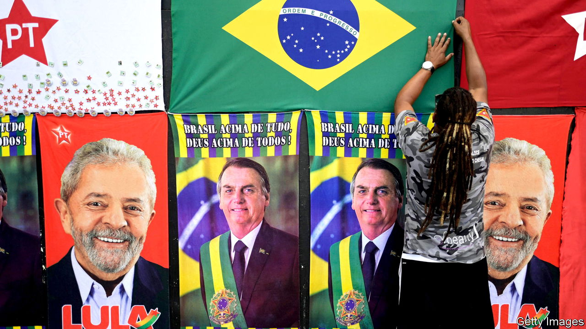

###### The Economist explains

# How might Jair Bolsonaro win Brazil’s election? 

##### The maths still favour Lula, but the economy and hard campaigning will help the incumbent 

 

> Oct 26th 2022 

FOR MOST of this year Brazil’s presidential election looked as though it would be won by Luiz Inácio Lula da Silva, a leftist who was president between 2003 and 2011. Polls had put Lula, as he is commonly known, ahead of Jair Bolsonaro, the right-wing incumbent, by double digits for months. Yet the first round on October 2nd turned out to be far closer than pollsters and many commentators had expected. Mr Bolsonaro took 43.2% to Lula’s 48.4%. That is a difference of around 6m votes in an electorate of 156m people. Ahead of the run-off on October 30th,  shows Lula and Mr Bolsonaro at 52% and 48%, respectively. That is a technical tie given the margin of error. How might Mr Bolsonaro win?

The mathematics are still in Lula’s favour. Some 10m people voted for the other candidates in the first round, while 5m voted blank and 33m abstained. As Bruno Carazza, a columnist, points out on Twitter, although abstentions in the second round of the previous presidential election in 2018 tended to be in poorer neighbourhoods—which, if true again, would hurt Lula—there is still a big hurdle for Mr Bolsonaro to get over. And, having been wrong in the first round, several pollsters may be weighting their polls differently in the second round.

However, it is clear that the populist president is benefiting from both the economic context and from a better-oiled campaign machine. Inflation has been falling, to around 8%. This year Mr Bolsonaro’s government has promised some 273bn reais ($51bn) in an effort to poach poor voters from Lula, according to Reuters. It has expanded, a benefits programme, which gives 21m families 600 reais a month. Since the first round it has introduced new debt-forgiveness programmes and credit lines for recipients of , to criticism from economists. 

Meanwhile, Mr Bolsonaro’s base—which comprises middle-class voters, farmers and evangelicals—remains deeply sceptical of Lula and his Workers’ Party (PT). Mr Bolsonaro’s campaign has received more than 86m reais in private donations, compared with just 1.7m for Lula. Much of this has gone towards a fierce online campaign casting Lula as a corrupt, godless communist. Mr Bolsonaro is keen to remind people of the graft that flourished under the PT’s rule, and that Lula was jailed on convictions of corruption (which were annulled by the Supreme Court in 2021). 

This month Lula published an open letter to evangelicals, who make up around a third of Brazilian voters, to “reaffirm my commitment to freedom of religion in our country”. But for many religious types this will be seen as too little, too late. Lula’s campaign has also gone on the defensive. A Supreme Court judge recently banned PT television adverts that associated Mr Bolsonaro with paedophilia and cannibalism. These smear tactics—mirroring those used first by Mr Bolsonaro’s team—may help Lula win over some undecided voters. But they are also helping fuel an increasingly ugly campaign, which has resulted in more political violence than usual. The electorate is polarising along ideological lines. Whoever wins on October 30th will oversee a divided and fractious country.■

