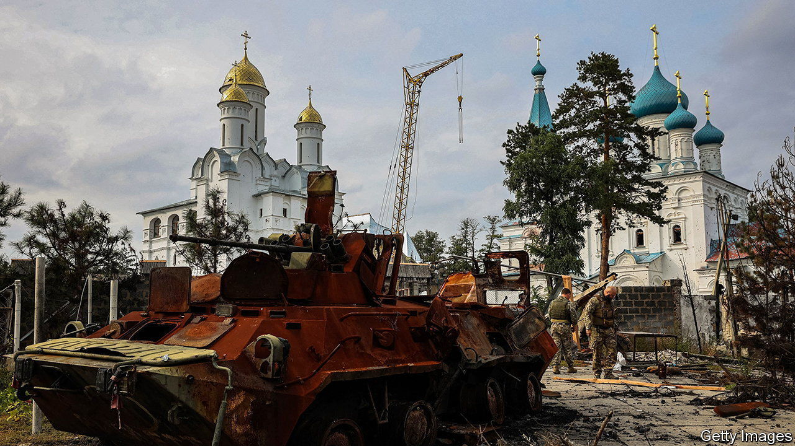

###### The Economist explains

# Why Ukraine’s Orthodox churches are at loggerheads 

##### Its two branches are divided by politics, not faith 

 

> Oct 21st 2022 

IN LATE JULY Anatoliy Dudko was delivering a sermon for a fallen soldier near the city of Vinnytsia, in central Ukraine, when an elderly man in a black frock charged at him. The man attempted to rip off the cross Mr Dudko was wearing before hitting him with his own crucifix. Both men were Orthodox priests, but from different churches: Mr Dudko follows the Orthodox Church of Ukraine (OCU); his attacker the Ukrainian Orthodox Church (UOC). The churches share most rites and beliefs—not to mention near-identical names—but are divided by mutual rancour. Russia’s invasion of Ukraine has driven them further apart. Why?

For decades, the UOC was the only formally recognised branch of Orthodox Christianity in Ukraine. In Soviet times it was a branch of the Russian church, and remained under its jurisdiction after Ukraine’s independence in 1991. Two unrecognised churches also emerged: one had been a church in exile during Soviet times; the other, established in 1992, declared itself an independent Ukrainian church. They merged in 2018 to form the OCU, which was —recognition of independence—by Orthodox Christianity’s highest leader, Bartholomew I of Constantinople, the following year. The Russian Orthodox church immediately declared the OCU schismatic.

That left the country with two officially recognised churches, one linked to Russia and the other to an independent Ukraine. The distinction mattered beyond church politics. Patriarch Kirill, the head of Russia’s orthodox church, is a long-time ally of Vladimir Putin, the president. Both men have invoked the bogus idea that the shared religious heritage of Russia and Ukraine creates a natural sphere of Russian influence—a  for Russia’s aggression over the years. In 2014, after the annexation of Crimea, Ukrainian followers of the Russian-affiliated UOC began leaving the church in droves. The exodus went into overdrive after the invasion in February. Hundreds of parishes have transferred to the OCU.

In late May the UOC, seeking to distance itself from Patriarch Kirill and the Kremlin, proclaimed independence from the Russian Orthodox Church. Archpriest Nikolai Danilevich, a spokesman for the UOC, says the church may apply for formal autocephaly once the war ends. But because it grew out of the Moscow Patriarchate, only the Russian church has the authority to grant such a request. “Their canonical status is dubious,” says Lyudmila Filipovich, a religion expert. “They’re neither with Moscow or with the ecumenical patriarchate.” 

Many Ukrainians believe the UOC’s conversion is merely cosmetic. A survey in July revealed that only 4% felt close to it, down from 18% before Russia’s invasion. Most of its clergy are graduates of seminaries in Moscow and St Petersburg, says Ms Filipovich. She believes the bond with Russia endures. OCU leaders go even further, accusing their rival church of being a fifth column for Russia. The UOC strongly denies those claims. Mr Danilevich points out that members of his own family have died fighting for Ukraine. In reality the UOC’s clergy contains both Ukrainian patriots and much less vocal supporters of the relationship with Moscow. The overwhelming majority are somewhere in the middle. 

In early July a small group of priests from both churches met at the St Sophia cathedral in Kyiv to condemn Russia’s aggression and assert the need for “unity of Ukrainian Orthodoxy”. But distrust runs deep. The contempt their leaders have for each other can be startling. “We view [the OCU] the same way Ukraine views the DNR and the LNR,” says Mr Danilevich, referring to the “people’s republics” controlled by Russian proxies before the war, and now illegally annexed by Russia. “They have to come back.” Archbishop Yevstratiy Zorya of the OCU claims Metropolitan Onufriy, the head of the UOC, and his associates “would have been full of joy if Putin conquered Kyiv”. Reconciliation, let alone a merger, is a remote prospect. ■

