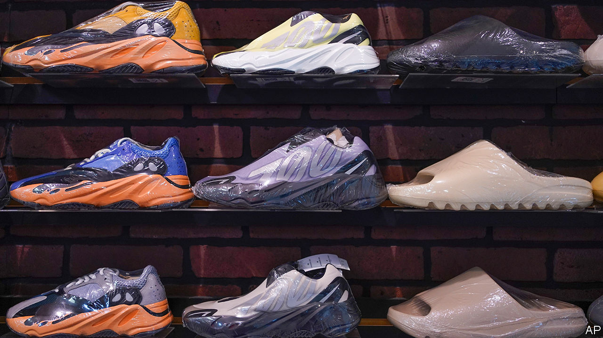
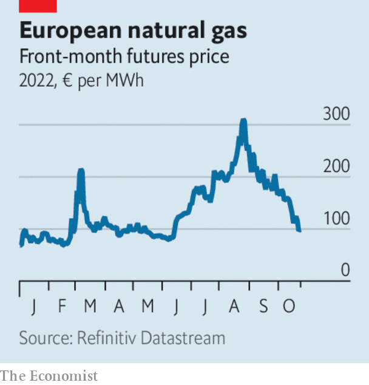

###### Business

# Business 

#####  

 

> Oct 27th 2022 

, a German sportswear-maker, joined Balenciaga, a fashion label owned by Kering, a luxury-goods conglomerate, in cutting ties with Kanye West, a rapper and fashion designer, for his anti-semitic remarks. The decision is set to cut Adidas’s annual profits in half this year. 

 


 prices fell below €100 ($100.8) per megawatt hour for the first time since Russia cut supply in June, as lower demand amid mild weather and large amounts of gas in storage helped to ease concerns about winter shortages. Demand for gas in Italy, a large consumer, sank by a tenth in August and September compared with the same months a year ago.

  following the confirmation of President Xi Jinping’s historic third term as the Communist Party’s leader. The Nasdaq Golden Dragon index, which tracks American-listed shares of Chinese companies, has fallen by more than half in a year. The offshore yuan hit its weakest level against the dollar since 2008, as the fallout spread to currency markets.

Oasis or mirage?

hosted its Future Investment Initiative, an annual conference aimed at investors. Jamie Dimon, the chief executive of JPMorgan Chase, Stephen Schwarzman of Blackstone, a private-equity firm, and David Solomon, boss of Goldman Sachs, were among the speakers at the three-day event in Riyadh. Saudi Arabia is set to have one of the world’s fastest-growing economies in 2022.

In Britain,, which are adjusted for inflation, fell by 2.6% in the year to April, compared with the previous year, their biggest decline in a dozen years, according to the Office for National Statistics (ons). Inflation eroded a 5% gain in nominal wages.

 they were before unfunded tax cuts, now mostly scrapped, caused panic selling and prompted an intervention from the Bank of England in September. The yield on 30-year bonds, also known as gilts, was trading at 3.7% on October 26th, a day after Rishi Sunak became prime minister.

The, Alphabet and Microsoft, announced slower revenue growth as customers cut spending. Meta reported falling sales and rising costs, stoking fears of an economic slump.

reported bumper third-quarter profits as a result of higher interest rates, which tend to boost bank earnings. Barclays, Santander, UniCredit, Standard Chartered, HSBC and UBS all beat analysts’ quarterly estimates. Deutsche Bank announced its highest annual profits in 13 years.

 raised its benchmark interest rate by a smaller-than-expected 0.5 percentage points to 3.75%. The European Central Bank and the Federal Reserve are expected to raise benchmark rates by 0.75 percentage points when they next meet.


, a Dutch health, technology company, will slash 4,000 jobs, around 5% of its workforce, as it attempts to cut costs amid high inflation. The decision follows €1.5bn in losses in the third quarter and legal action over millions of ventilators it had supplied.

Open skies

 reported increases in third-quarter transatlantic revenues compared with 2019, as the strong dollar encouraged Americans to book trips to Europe. Outbound passenger traffic from North America between May and August was nearly three times higher than in the previous four months.

, Europe’s largest energy firm, announced its second-highest quarterly profits ever on the back of higher oil and gas prices. The group reported adjusted earnings of $9.5bn in the third quarter.

 said he intends to close his $44bn acquisition of Twitter, a social-media firm, in a matter of days. Twitter’s share price has risen to $53.35, its highest since Mr Musk made his offer in April.


, a Dutch brewer, reported an 8.9% rise in beer sales during the third quarter, falling short of the average analyst estimate of 11.8%, as higher food and energy prices cut into consumer spending in Europe. The firm’s share price fell by 10% in intraday trading on October 26th, the most since 2003.

 raised prices to offset lower sales volumes as shoppers reined in spending. Unilever, Reckitt Benckiser, Procter &amp; Gamble and Nestlé reported a rise in quarterly earnings.


, a Swiss bank, agreed to pay France €238m to settle claims that it helped clients avoid paying tax on their wealth by encouraging them to open bank accounts in Switzerland between 2005 and 2012. On October 27th the bank announced a restructuring plan. It is looking to raise SFr4bn ($4.1bn) of capital, including from the Saudi National Bank.

