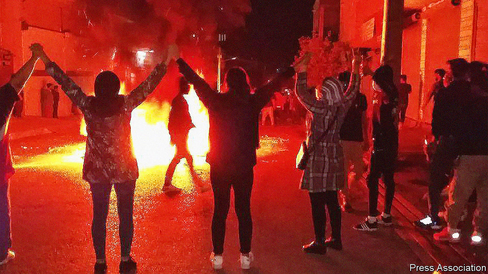
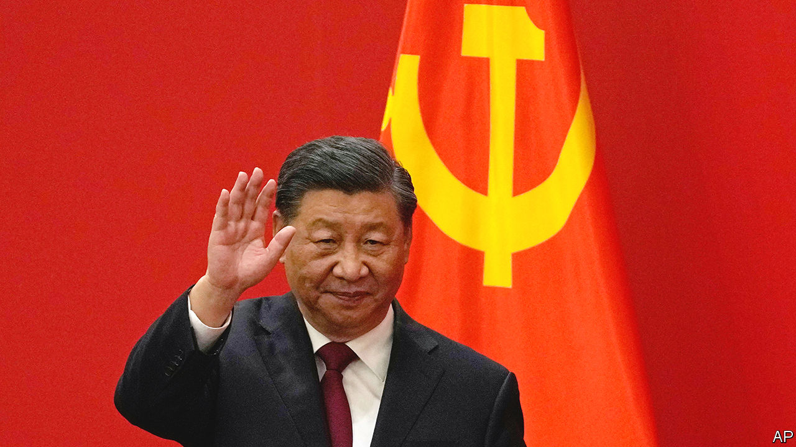

###### The world this week

# Politics 

#####  

 

> Oct 27th 2022 

More than 230 people have been killed and over 12,000 have been arrested, according to tallies by human-rights groups, as protests rage on in . The movement against the ayatollahs’ regime has largely been led by women. In response to the violence, America has lengthened the list of individuals and groups subject to sanctions. The ruling clerics seem uncertain whether to give ground or crack down more fiercely.

Israeli defence forces killed five  in a raid into the West Bank city of Nablus, where an Israeli soldier had been killed earlier this month. A sixth Palestinian was killed in a later incident.

Opinion polls preceding the scheduled for November 1st show no clear favourite. The two leading contenders are blocs led by Yair Lapid, the incumbent prime minister, and Binyamin Netanyahu, a long-serving former prime minister.  that Mr Netanyahu’s alliance has a slight edge. 

Shifting the goalposts

In the lead-up to the football World Cup, which kicks off on November 20th in , the country faces mounting compaints about labour abuses and the persecution of gay people. Watchdogs allege the arbitary arrests of gay activists. Some football stars have said they will be wearing armbands to show support for victims. 

 between the government and the rulers of Tigray, a rebellious northern province, have started after nearly two years of civil war. Millions of civilians in Tigray are under blockade by the government and have not received aid since fighting resumed in August.

At least 50 people were killed and 300 injured when police in  intervened in protests demanding civilian rule. The protests erupted after the junta that seized power in April 2021 broke its promise to hand power to a civilian administration this month.

 became Britain’s third prime minister in two months, taking over from Liz Truss. Ms Truss, who resigned after a disastrous mini-budget spooked financial markets, was the shortest-serving prime minister in history. Mr Sunak was the only candidate for leadership of the ruling Conservative Party to garner enough nominations from Tory MPs enter the race, after efforts by Boris Johnson to mount a comeback .

In an attempt to bring the Tories together, Mr Sunak appointed a cabinet from different wings of the party. Jeremy Hunt was reappointed chancellor; James Cleverly, a backer of Mr Johnson, remained foreign secretary. The reappointment of  as home secretary stoked controversy; she had been forced to resign from the same position days earlier after sending an official document from her personal email.

, the leader of the nationalist Brothers of Italy party, was sworn in as prime minister of Italy. She has promised strong support for Ukraine. Some observers fear a more confrontational relationship with Brussels, though she will want to maintain access to Italy’s €200bn ($201bn) share of the eu’s covid recovery fund, which comes with strings attached.

Without producing evidence, Russia alleged that Ukraine was preparing to set off a  on its own territory. Observers in Ukraine and elsewhere were fearful that this might mean that Russia was itself planning to set one off, hoping to blame Ukraine. Foreign ministers of America, Britain and France were sufficiently alarmed to issue a joint statement warning Russia that it would be held accountable.

 


China’s Communist Party introduced its new leadership after the close of its five-yearly congress.  was given a third five-year term as party chief. Hu Jintao, the former president, was escorted out of the closing session of the congress. State media said he was unwell. Even if only health-related, his departure appeared symbolic, as Mr Xi swept aside politicians linked to his predecessors.

voters saw perhaps the most closely watched debate of the midterm elections. John Fetterman, the Democrat running to be senator, met Mehmet Oz, a celebrity doctor and the Republican nominee. Questions about Mr Fetterman’s fitness for office have been raised after he suffered a stroke in May. His performance did not allay concerns as he struggled to rebut Mr Oz or explain his positions. 

A controversial letter signed by 30 progressive  asking Joe Biden’s administration to pursue negotiations with Russia to end the war in Ukraine was published and then quickly withdrawn by the caucus’s chair, Pramila Jayapal. The letter was criticised for undercutting the American position on Ukraine. Ms Jayapal claimed that the letter had been written months earlier and was released by staff without vetting.

Jair Bolsonaro, the populist incumbent, and Luiz Inácio Lula da Silva, a leftist former president, were polling at 48% and 52%, respectively, in the lead-up to . That is a technical tie, given the margin of error. The last few weeks of the campaign have been marred by violence, polarisation and personal attack heavy political advertisements from both sides.

Pressed for freedom

Roberson Alphonse, a Haitian  survived an attempted assassination in Port-au-Prince, the country’s capital. Although the situation in the country is worsening, it is unlikely that an American-backed security force will be deployed to the island soon. The European Union expressed concern at the “humanitarian catastrophe” unfolding in Haiti. 

Arshad Sharif, a Pakistani journalist, was shot dead at a police checkpoint in Kenya on October 23rd. Mr Ashraf was a supporter of Imran Khan,  former prime minister. At home, Mr Khan is threatening to march with his supporters on Islamabad, the capital, agitating for early elections. This may lead to clashes with the country’s security forces.

Cyclone Sitrang made landfall in  on October 24th. Despite 700,000 people being evacuated, at least 28 were killed. Thousands of homes were destroyed and millions were left without power. Cities, including the capital, Dhaka were flooded.

More than 80 people were killed in military airstrikes during a concert inthe north of Kachin state in . The army, which staged a coup in Februrary 2021, has grown increasingly desperate and brutal in its efforts to maintain control. 

