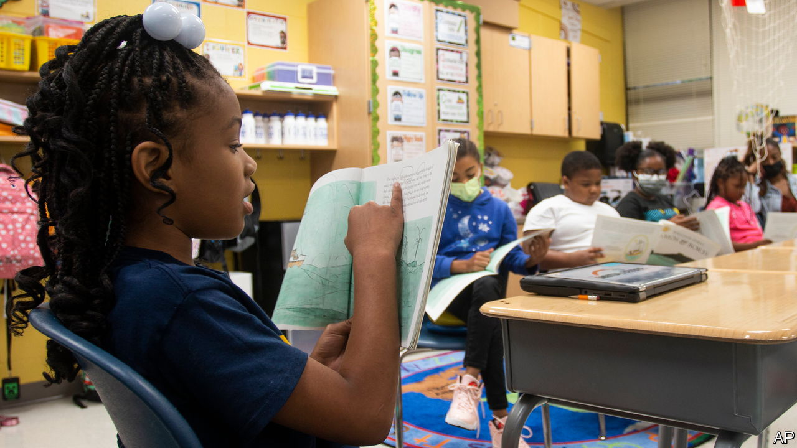
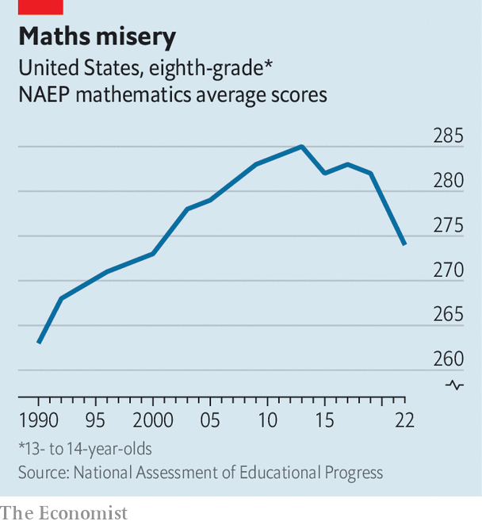

###### Mountains to climb

# America risks fumbling its chance to help schoolchildren catch up 

##### Enormous extra funding is not all being well spent 

 

> Oct 24th 2022 

Having struggled through some of the rich-world’s longest school closures, America’s pupils have fallen far behind. Nationally representative data released by the government on October 24th show that, since the start of the pandemic, scores in reading and maths have dropped back to levels of 20 years ago (see chart). Numeracy has suffered its biggest decline since comparable testing began in the early 1990s. Miguel Cardona, President Joe Biden’s education secretary, told journalists the numbers were “appalling and unacceptable”. How America responds, he said, will affect its “standing in the world”.

 


The depressing findings of this year’s National Assessment of Educational Progress, tests that are sometimes called “the nation’s report card”, outline the grim task facing . Although lawmakers have sent them historic amounts of money, not all of it is being well spent. Over the summer analysts at nwea, a test provider, reported that learning is starting to recover. But they guess it could take three to five years for grades in elementary schools across the country to return to pre-pandemic levels, and longer for older kids. Millions of youngsters will have aged out of —or dropped out—before then.

Financially, at least, America’s schools have been fairly well supported. Some $190bn of federal relief money has flowed to schools since the start of the pandemic, equal to about one-quarter of what America spends on public schooling in a normal year. More than one-third of this was used setting up remote learning, and on safety measures (such as masks and screens) that teachers and many parents deemed essential for classrooms to reopen. 

The pressing question is how school districts should invest a $122bn windfall which Mr Biden signed off in March 2021. It is meant to be spent by the end of 2024. But there are few rules about what it may be used for, notes Vladimir Kogan at Ohio State University. Only 20% of it has to go on schemes that aim to get children’s learning back on track. 

School districts that are taking catch-up seriously have converged on similar strategies. Some 70% of districts have created or expanded summer-school programmes at some point during the past two years, says Heather Schwartz of RAND, a think-tank that has been polling school leaders. They are hiring more counsellors and social workers to help children who have lost interest in their studies. They are often investing in tutoring, by far the surest way of accelerating learning.

Yet some good ideas are going begging. Not many districts have chosen to add hours to the school day or weeks to the school calendar, according to RAND’s study. That is a missed opportunity: in many bits of America the school year is short by international standards. Schools are also swiftly discovering that there are not nearly enough temporary tutors and substitute teachers available for cleverer catch-up schemes to work on the scale that is required. In that context, paying existing staff for more work seems smart.

Some districts have used relief money to put off unpopular decisions, says Marguerite Roza, who studies education finance at Georgetown University. Even before the pandemic many were seeing enrolment decline. Some are now using federal funds to delay inevitable downsizing. At least some schools have created extra staff-training days without lengthening the school calendar. Their pupils are getting even less class time than usual.

Many districts are spending big dollops of their relief money on infrastructure, with the government’s blessing. That includes new and improved air conditioning; sprightlier classrooms and more computers. These kinds of projects have long been demanded by unions and in most cases will benefit children. But they hardly seem good ways of tackling the emergency at hand. They also risk diverting the energy and attention of school administrators who are supposed to be making sure that catch-up schemes pay off.

Educators in some circles still shy away from talk of “learning loss”. They prefer to say that children are suffering “unfinished instruction” or “interrupted learning”; they insist that children learned other types of lessons during the pandemic. Parents are not always pushing them. Only 9% think their child’s learning will not be back on track within a year or two, according to a survey for , a journal. Two-fifths think they never fell behind. Lenient grading during remote learning may have given them false reassurance. Dan Goldhaber at the University of Washington worries that schools have not always been straight with parents about the scale of losses, in part for fear of being blamed.

Politics is making everything more difficult. Disruptions to schooling generally lasted longer in blue (Democratic) areas than in red ones. That has given Democratic supporters an incentive to play down the damage. Republicans, meanwhile, see education as an issue that could win votes at the midterms next month. But instead of focusing on catch-up, firebrands on the right have helped heat up noisy and mostly fruitless debates about how history, sex and race are taught. That has made teaching more complex, just when educators most need support. 

Complacency about catch-up will be costly. Even before the pandemic almost one in three American adults lacked basic numeracy (the average across rich countries is one in five). During covid learning in America appears to have slowed more than it did in places such as England and Spain. Young pupils in Sweden made good progress throughout the tumult; in parts of Japan pupils have already made up losses. Culture wars are raging around America’s classrooms. But the real crisis in schools is getting short shrift. ■


