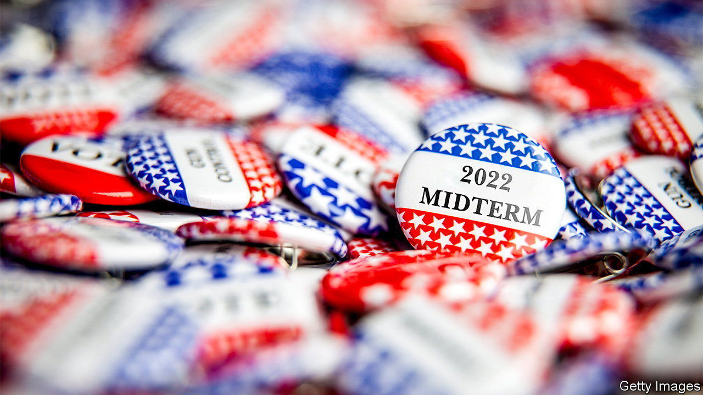
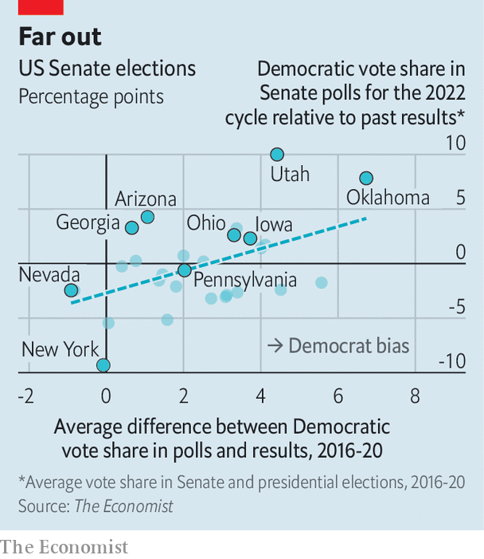

###### Midterm maths: Polling misses

# Democrats are polling best in states where surveys tend to misfire 

##### Polls in right-leaning states have most overestimated support for Democrats recently 

 

> Oct 27th 2022 


Whether Democrats are favoured to win a majority of seats in the Senate depends on whether you . ’s aggregate of publicly available pre-election surveys puts the party ahead in 14 of the 35 Senate seats up for re-election this year. That would give the Democrats 50 senators, including the 36 seats that are not being contested this time. Among the ten most-competitive states, our poll-of-polls suggests Republicans are favoured to gain a Senate seat in Nevada, but lose one in Pennsylvania.

 


But recent history suggests  those numbers. In 2016-20 our aggregate of polls overestimated the share of the vote that Democratic candidates for senator and president ultimately won by an average of 2.2 percentage points across every state polled (see chart). Although pollsters updated their methods to try to iron out such errors, in 2020 the bias grew to 2.5 points. Even in 2018, when the pollsters did well on the whole, they undercounted Republican support in key states such as Ohio and Michigan. 

The numbers now look rosiest for Democrats in the states where polls have recently been least reliable. Take Ohio. Our poll-of-polls, which adjusts for a variety of factors, including whether a firm has been biased towards one party historically or if the survey was conducted for a partisan client, currently pegs support for , a Democratic congressman, at just over 49%. That is three percentage points higher than the average vote share for Democratic candidates in the state’s Senate or presidential elections since 2016. 

A similar pattern is repeated across the country. Democrats are beating expectations by more than two points in Iowa, where polls have overstated Democratic vote shares in recent elections by nearly four points. In Kentucky, where polls tend to overshoot for Democrats by four points, the party is up by two points over past benchmarks. This does not guarantee that polls are artificially good for the Democrats. But the fact that the party appears to be doing best in places where polls routinely overestimate their support is cause for scepticism. 

Another indicator comes from ’s weekly polling with YouGov. On September 26th YouGov adjusted its methodology to balance its sample by party affiliation, in addition to its previous adjustments for demography and the results of the 2020 election. The change ensures that the share of self-proclaimed Republicans and Democrats in the poll does not drift too far from the long-run average. The adjustment has helped Republicans. Before the modification, 44% of registered voters YouGov interviewed said they were going to vote for Democrats in the midterms in their congressional district, and 39% for Republicans. That five-point margin has slipped to an average of just one point after the change in methods: 45% of voters say they will vote for Democrats and 44% for Republicans.

If polls are indeed overestimating the Democrats’ chances of winning, what can be done? Election-forecasting models, such as our own, usually assume that polls will be unbiased across the country, but explore thousands of scenarios for what would happen if they were biased, and by how much. If Democrats beat their polls by three points, how many seats would they win? If they lag by five, how many do Republicans get? But another technique is to assume that the polls will be biased by the magnitude of their recent errors.

Adjusting the polls in this way shows the Democrats are severe underdogs in North Carolina, Ohio and Wisconsin, and in very close races in Pennsylvania, Georgia, New Hampshire and Arizona. There is no way to know if adjusting the polls is the right thing to do. In the past, a polling average which adjusted its vote share for Democrats based on previous misses would not have outperformed a neutral poll-of-polls. Still, the fact that polls overestimated Democrats almost everywhere in 2016 and 2020, and in more-Republican states in 2018, suggests that future errors may be more predictable. If that is the case, Democrats should be worried. ■


