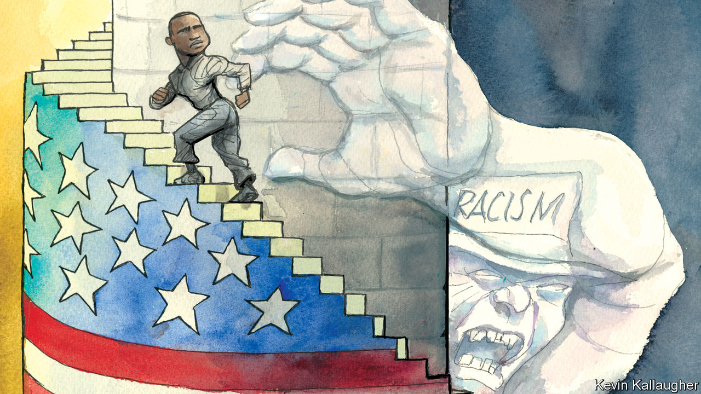

###### Lexington

# In North Carolina, racial politics remain inescapable 

##### What one state Senate race says about America 

 

> Oct 27th 2022 


To understand how power works in North Carolina and, indeed, America—how the interlocking gears of the legal and political systems move society forward or back—consider the career of Toby Fitch, who is campaigning for re-election in November as a state senator from Wilson, North Carolina. 

A child of the Jim Crow south, Mr Fitch, a Democrat, first won election to the state’s House of Representatives in 1984, after years of litigation over the Voting Rights Act of 1965 resulted in a landmark case mandating legislative districts in which black candidates could command majorities. He went on to become the first black majority leader, a step below speaker, earning a reputation, says Mac McCorkle of Duke University, as “a legislative titan”. He then served for 16 years as a judge before taking a seat in 2018 in the Senate, the other chamber of the state’s General Assembly. 

Now, after another important voting-rights case reshaped the redistricting process yet again, and after Republicans, thanks to their majorities in the General Assembly, created the maps, Mr Fitch is running in a new district that probably leans Republican. With his long service, storytelling skill and prodigious memory for face and fact, he has a reservoir of goodwill to draw upon. As he drove round the district recently in his old Dodge Ram pickup, supporters called to him at traffic lights, asking how they could help. “Just be my brother!” he replied to one. 

Mr Fitch, who at 76 walks with two canes, feels he is in the same struggle he has waged since he was a teenager in Wilson in the 1960s, when he raced past an attendant into a whites-only public pool to force its integration, only to be ejected and watch the pool get pumped out and refilled. “We’re fighting for our freedom even now,” he says in his low, insistent voice, “when you talk about the right to participate, and to be intricately involved in the things that make a more perfect union.”

North Carolina is split between the parties, but Democrats, regardless of redistricting, face the same challenge there as nationally: they  and university towns. Republicans, overwhelmingly white and more dispersed, dominate the General Assembly. That is why, to Mr Fitch’s exasperation, North Carolina is one of only 12 states to refuse to expand Medicaid under Obamacare, despite efforts by Governor Roy Cooper, a Democrat. 

If Republicans win a handful more seats in November, they could gain a “supermajority” that would enable them not just to thwart Mr Cooper but to override his veto and make policy. At a time when the United States Supreme Court is returning power to the states on matters from abortion to regulation of industry, long-term efforts to gain control of governments in states such as North Carolina are providing Republicans with new authority, even without majorities in Congress.

Mr Fitch’s opponent is Buck Newton, a thoughtful white conservative who served in the state Senate before making a bid for state attorney-general. Mr Newton senses a Republican wave building over concerns about inflation, crime and addiction to opioids. “They see no answers from the Democrats,” he says, “and I think they see that the Republican Party candidates are trying to focus on the issues that matter.” For his part, Mr Fitch scoffs at the idea that Republicans are committed to helping poor and working-class people. He argues that Republicans are widening racial division. “Anybody who preaches somebody is taking what they have—it causes a revolution,” he says. That, he says, has been the message of Donald Trump, the former president.

Mr Newton was born in 1968 and grew up with integration as a reality and the civil-rights era in the rear-view mirror. Like many of his generation and younger, he is confident of North Carolina’s progress in race relations. A black Republican, Ken Fontenot, is running to represent Wilson in the state House of Representatives. But Mr Fitch knows that the past is not even past. As he drives the streets of Wilson he remembers where children burned to death because a racist fire chief would not respond to a fire in their home. When he paused by what was, in his childhood, the blacks-only pool, he said, almost to himself, “I’m amazed, very much amazed, at how white folks kept us slaves, for so long.”

That banner still waves

America’s history, Mr Fitch knows, is the fuel that helps to turn its political and legal machine. He has no patience for claims that the redistricting process is race-neutral. The court decision that led to his new district constrained mapmakers by insisting they hewed when possible to county lines, rather than carving up counties to partisan advantage. That decision relied upon an amendment to the state constitution emphasising the importance of county lines. To abide by the ruling, the General Assembly had to draw Mr Fitch’s district as it did. But Mr Fitch remembers that the General Assembly that proposed that amendment, ratified in 1968, was all-white; a bias towards county lines hobbled black candidates. “To say it’s race-neutral, when you’re reaching back to the Jim Crow era—it’s absurd,” he says. 

From Reconstruction through to 1900, North Carolina elected 111 black legislators. For the next 68 years, it elected none. As chairman of redistricting during the 1980s, Mr Fitch helped draw the district that elected the state’s first black member of Congress since 1901, Eva Clayton. It was only in 1992 that she won. Cherie Beasley, who is running for Senate, would be the state’s first black senator. In the polls, she trails Ted Budd, a white congressman who refused to certify Mr Trump’s loss.

Outside the county courthouse, where Mr Fitch weighed so many cases, stands a monument dedicated “to the valour of Wilson County soldiers”. Engraved in the marble are two crossed flags—the American flag and the Confederate battle flag. Mr Fitch would like to add an explanatory plaque, but he does not want the monument removed. He wants people to know the truth. ■


