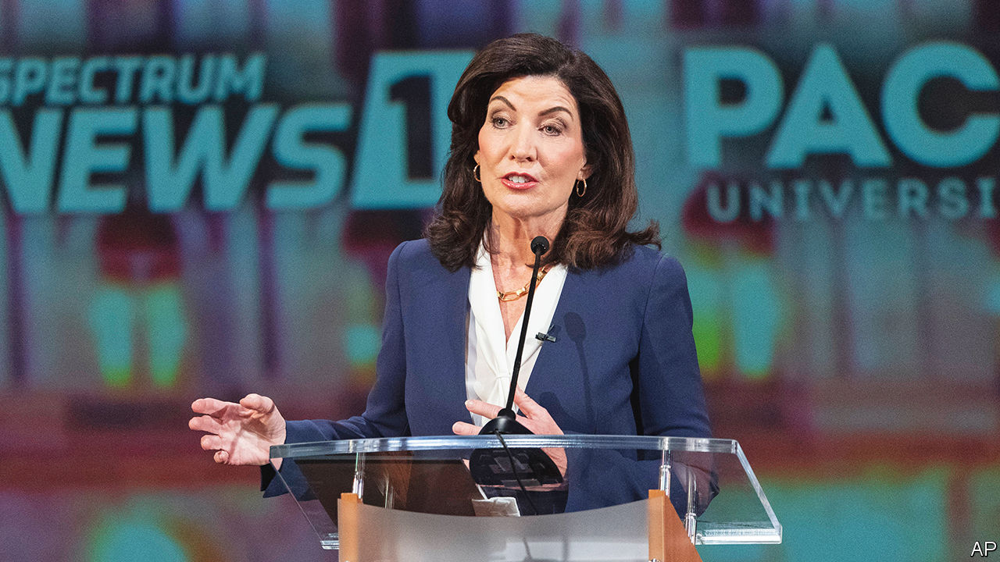

###### Down to the wire

# New York’s Democratic governor faces a stronger challenge than expected 

##### The Republicans’ scare tactics are working 

 

> Oct 27th 2022 


The footage is chilling. Without provocation, a man charges at another man walking along a subway platform, pushing him onto the tracks. Luckily, the victim was not hit by a train, though he was injured by his fall. By October 24th crime in New York City’s mass-transport system was up by 42% this year, with 1,865 incidents, over the same period in 2021. Since January nine people have been murdered in the subway. Lee Zeldin, who is running for governor of New York state, blames the incumbent, his Democratic opponent. “This is the dangerous reality of life in Kathy Hochul’s New York,” he tweeted. 

For months Mr Zeldin, a congressman representing eastern Long Island, has been saying that Ms Hochul is not doing enough about crime. He promises to declare a crime emergency. He wants to remove Manhattan’s progressive district attorney and to suspend cashless bail. Although murders are down by 14% in New York City since last year and crime is more than 70% lower than it was at its peak in the early 1990s, many New Yorkers . 

His message is resonating. Polls show the race is narrowing to single digits. Just a month ago , who became governor after Andrew Cuomo resigned in disgrace in 2021, was nearly 20 points ahead. 

Mr Zeldin’s momentum has rattled her. Until now, “she has run this rose-garden campaign”, says a senior Democratic strategist, sticking to big, official events. Her television ads emphasised Mr Zeldin’s opposition to abortion, his ties to Donald Trump and his vote to overturn the results of the 2020 election. After the Supreme Court’s decision removing the right to abortion, Democrats were “on a sugar high”, says Jessica Taylor of the , a non-partisan newsletter. But people eventually became more concerned about the economy and crime. Democrats, including Ms Hochul, could point to promising statistics and actions, but those do not match what people are feeling. 

The tougher-than-expected challenge has forced Ms Hochul to pivot. A recent ad says she is working for “a safe walk home at night. A subway ride free of fear.” On October 22nd she and Eric Adams, who won the New York City mayoral election by promising to keep the city safe, unveiled a plan to flood the trains and platforms with police and provide more beds for the mentally ill. Nicole Gelinas of the Manhattan Institute, a New York think-tank, is sceptical. “It’s not a well-thought-out plan. You can’t put 1,200 people on overtime around the clock indefinitely.” Polls, not crime statistics, she says, are driving this new push. 

To win, Mr Zeldin needs some Democrats to cross party lines. Although Republicans, such as George Pataki, who won three terms as governor, have been elected in the state, they were usually more moderate than Mr Zeldin. The Pataki model suggests about 30% of New York City’s vote is required. Jessica Proud, a state Republican Party spokesperson, says Mr Zeldin could get 36-37% thanks to his efforts with “non-traditional Republican voters”. The party has made inroads among Asian-Americans, who have been victims of hate crimes over the past two years. Mr Zeldin is also hoping to appeal to Jewish voters. Ms Gelinas points out that Democrats used to be paranoid about the left. “It’s time to be paranoid about the right.” ■


