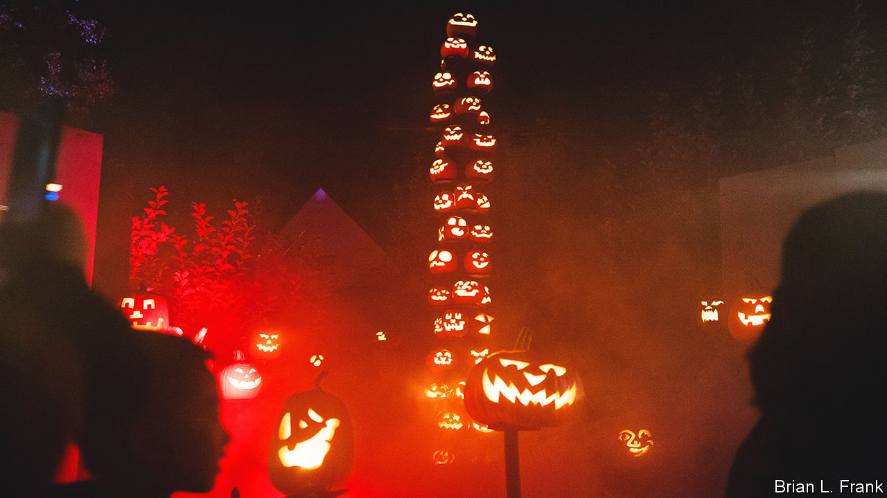

###### Skeletons out of the closet

# Tech titans rival one another in Halloween decor 

##### The wonders of competition in Silicon Valley 

 

> Oct 27th 2022 

Rivalry between Apple and Google has often been . Sometimes it has played out in the courts. But once a year their competition has also been visible on the streets—in the form of Halloween decorations. 

Steve Jobs started it. In the 1990s, when Apple’s co-founder had young children, come October the front garden of his rambling English cottage in a leafy Palo Alto neighbourhood sprouted gruesome decor—not just skeletons and pumpkins but sound effects and special lighting—leading to a cauldron overflowing with dry ice at the front door. Jobs himself could be spotted handing out (now defunct) Odwalla health bars, an annual disappointment for trick-or-treaters who heard rumours of free iPods. The family later upgraded to goody-bags that included Toblerone.

When Larry Page, co-founder of Google (now Alphabet), moved into a home on a cul-de-sac round the corner some years later, he was not to be out-spooked. His displays had themes: a carnival one year, a Little Red Riding Hood forest the next. Jobs died in 2011, but his widow continued to match Mr Page’s shows. Neighbours recall hundreds of carved jack-o-lanterns illuminating the apple orchard outside the Jobs home, and actors dressed as monsters playing hockey in the driveway. 

Others joined in. Not far away Yahoo’s former boss, Marissa Mayer, took to handing out king-size candy bars and stuffed animals. 

The tech titans’ glitz and goodies drew growing crowds and hour-long queues. Locals have mixed feelings that a hometown tradition has become a regional attraction. “People here love community events so much that they risk suffocating them to death,” says Pat Burt, Palo Alto’s mayor, while cycling through the neighbourhood. 

Some neighbours in the vicinity of the Jobs and Page homes lock their doors during the holiday, tired of bulk-buying candy for what they reckon can be thousands of roaming trick-or-treaters. Others a few blocks away have enhanced their own decor, in an effort to lure in those who park in front of their driveways but head straight to the Jobs house. “I tell the kids they can take two candies!” says one resident.

Neither the Page nor the Jobs house was yet decorated when your correspondent visited the neighbourhood this week. But Ms Mayer’s home—with pumpkins forming an archway over her front door, witches’ hats hanging from the trees, and twinkly lights—hinted at what was to come. As usual, the city has issued permits allowing Halloween activities to spill into the streets. The pandemic prompted some trick-or-treaters to stay at home last year and tech moguls to scale down their displays. It seems unlikely, however, that their Halloween excess will remain merely a haunting memory.


