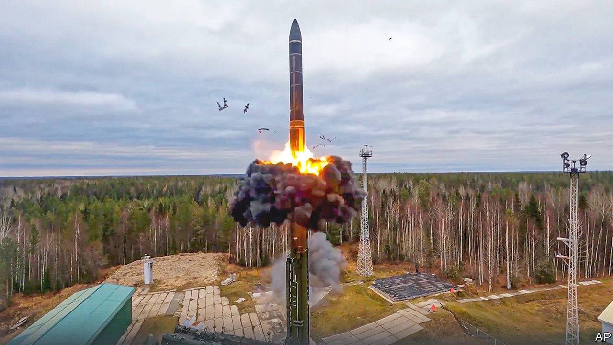

###### Dirty secrets

# The claim of a Ukrainian “dirty bomb” has got America’s attention 

##### Nuclear and other worries in Washington 

 

> Oct 27th 2022 

When Joe Biden evoked “Armageddon” earlier this month, many thought the president overstated the danger of nuclear war with Russia. Yet nervousness about  is now more palpable in Washington. The latest cause is Russia’s charge that Ukraine is planning to set off a “dirty bomb”—a conventional device that spreads radioactive dust—and blame Russia. America, Britain and France dismiss the claim as “transparently false”. The matter is murky; and when it comes to nukes, the fog of war is troubling. 

Adding to the concern, both Russia and NATO are in the midst of . On October 26th Vladimir Putin, Russia’s president, monitored the start of the Grom, or “Thunder”, exercise (pictured), which simulated “a massive nuclear strike in response to an enemy nuclear strike” with all three legs of the triad: land, sea and air. Russia gave notice of the drills under New START, an arms-control treaty. America says it has seen no sign of Russia preparing to use tactical nuclear weapons soon. But officials’ public statements hint at reasons to worry, not least because Russian forces are on the back foot in Ukraine.

In recent days Mr Biden, as well as his senior security and military officials, have spent hours discussing the dirty-bomb claims. Russia’s defence minister, Sergei Shoigu, called his American, British, French and Turkish counterparts on October 23rd. The Russian chief of military staff, Valery Gerasimov, has similarly been in contact with senior Western brass, who in turn have spoken to Ukrainian commanders and each other. The intensity of Russia’s effort is unusual, and may be more than propaganda. 

Western officials offer several hypotheses. One is that Russia itself is planning to detonate a dirty bomb as a “false-flag” incident to justify the use of nuclear weapons, now or in the future. (Mr Biden warns that such a move would be an “incredibly serious mistake”). Other possibilities are that Russia is “playing mind games”, is trying to get the West’s attention for diplomacy, or is just paranoid about Ukraine’s intentions.

Strikingly, some in Washington even speculate Russia may have picked up genuine intelligence that someone in Ukraine is planning a dirty bomb. That the thesis is entertained at all suggests a certain distrust of Ukraine’s actions. A car-bomb in Moscow in August that killed Daria Dugina, a nationalist pundit, has stirred American suspicions that Ukraine does not tell the West everything it is doing. At the least, America thinks keeping open channels of communication to the Kremlin is important in managing nuclear dangers, and Ukraine has none to speak of.

In helping Ukraine’s war effort, the West has sought to  both a Russian victory and nuclear escalation. For instance, it has not sent ATACMS missiles with a range of 190 miles (300km), which would more than triple the reach of the GMLRS guided munitions currently used with the cherished HIMARS launchers. 

Rather than seek a quick victory, the Biden administration is thus committed to backing a long war. This raises the risk that support for Ukraine will weaken—not just among European allies, who face an energy crunch with the approach of winter, but also in America. 

Republicans may win control of one or both chambers of Congress in midterm elections next month. Kevin McCarthy, the Republican leader in the House of Representatives, declared that Congress would not give a “blank cheque” to Ukraine. On the left, meanwhile, a group of 30 representatives signed a letter urging Mr Biden to pursue more intense diplomacy to achieve a ceasefire. These signs of growing  about the cost and risks of the war have brought a backlash against those who would abandon Ukraine. Mitch McConnell, the Republican leader in the Senate, called for more arms to be sent to Ukraine, and faster. The progressives promptly retracted their letter for fear of being lumped in with America-first Republicans. 

The likelihood is that Mr Biden will be able to keep arming and financing Ukraine well into next year, especially if it keeps making progress on the battlefield. But nuclear jitters will persist for as long as the fighting grinds on, and may yet worsen.■


