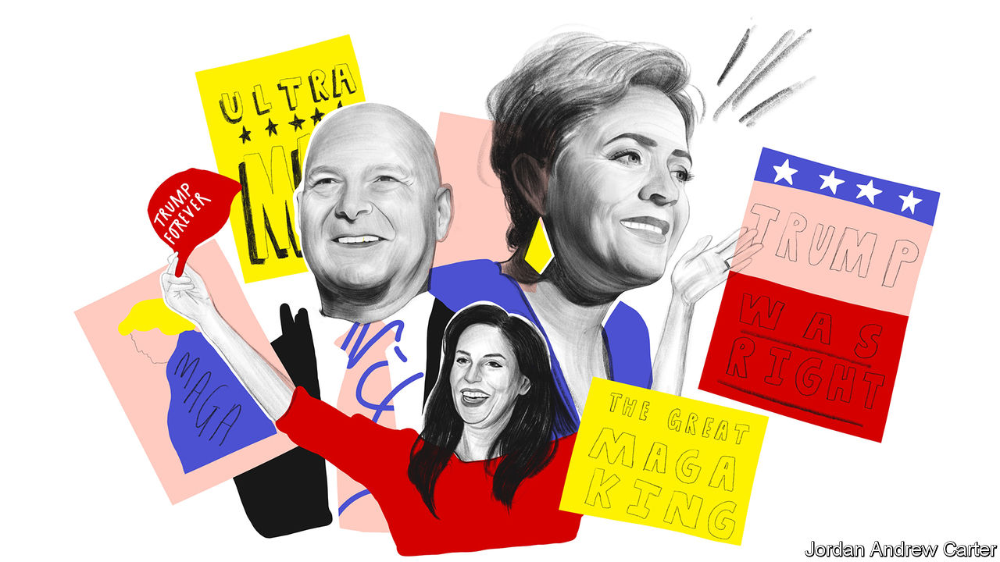

###### Anti-democratic front

# Why the Republicans’ anti-democracy turn has become normalised 

##### Post-Donald Trump’s presidency, the party isn’t post-Trump at all 

 

> Oct 27th 2022 


“IF YOU LEAVE the press area, you will be physically removed,” your correspondent is admonished by a campaign worker as he enters an American Legion hall in the town of Easton, Pennsylvania. Trips to the toilet and to get water are permissible with an escort. Some 200 people are assembled—many sporting red “Make America Great Again” caps, one proudly wearing a shirt saying “ULTRA MAGA”. They are all here for Doug Mastriano, the Republican nominee for governor in the state, and perhaps the most extreme candidate for governor running in this election cycle.

Mr Mastriano, a former army colonel and current state senator, did not just believe that the presidential election of 2020 was stolen from Donald Trump because of voter fraud. He bused dozens of stop-the-steal enthusiasts to the president’s rally in Washington, DC, on January 6th 2021. He was photographed at the Capitol before it was overrun by Trump supporters (though he maintains that he did not enter). And he has appeared at conferences affiliated with QAnon, a far-right conspiracy mythos. 

“We are the seed of the nation, we are the holy experiment,” Mr Mastriano says at his rally, where he pledges that, on day one, he will ban critical race theory in schools, mandatory covid jabs and any form of “gender transition for minors”. The lost status of Christianity is a recurring theme. “We’ve seen now it’s open season, you can mock Christians for their faith and it’s not a problem. What other faiths are doing you can’t touch,” he says. Campaign posters at the event include a quotation from John 8:36: “If the Son therefore shall make you free, ye shall be free indeed.”

To Josh Shapiro, his Democratic opponent and the state attorney-general, a victory for Mr Mastriano would constitute an existential threat to the republic. “I have run against I think seven Republicans in my lifetime,” says Mr Shapiro after a campaign event outside a grocery store in South Philadelphia. “I never worried in any of those races that their victory would mean the end of the institution that I was hoping to serve. Doug Mastriano has shown that he doesn’t value democracy. He doesn’t value personal freedom. And he’s made clear that unless you think like him, unless you look like him, unless you pray like him, unless you vote like him, you don’t count in Pennsylvania.” 

Mr Shapiro’s conviction that Mr Mastriano was so cataclysmically unfit for office also led him to conclude that he would be the easiest opponent. He spent an estimated $855,000 on advertisements to boost Mr Mastriano’s chances during the Republican primary—more than double what Mr Mastriano spent on his own ads. Even though Democrats claim that the risks are existential, they were willing to make rather risky bets. 

If Mr Mastriano were to win, he would be in place to certify the result of the 2024 presidential election, in which Mr Trump is widely expected to run again. Mr Mastriano could well refuse to do so in the case of a narrow Republican loss. That would risk a political crisis even larger than the one experienced in 2020. And the trend is not limited to Pennsylvania. 

In Arizona Republicans have nominated Kari Lake for governor, a pugnacious former television anchorwoman whose campaign’s  has been rejecting the “shoddy, shady, corrupt election”. (Governor Ron DeSantis of Florida, often described as a more moderate successor to Mr Trump, has happily campaigned for both Ms Lake and Mr Mastriano.) In Michigan Tudor Dixon, a conservative commentator, endorsed the myth of the stolen election before her primary—and has now moderated in the general election to a position of ignoring the question when it is posed to her. In Wisconsin Tim Michels refuses to say whether he would certify the result of the 2024 election. 

These are four of the most hotly contested states in the country, where the slim margins of victory for Mr Biden ranged from 0.3 percentage points to 2.8. In 2020 Mr Trump and his allies waged a pressure campaign on the Republican governors of Arizona and Georgia to overturn the results in their states (both men resisted). Should even one member of this anti-democratic front be in charge of state elections, the chances of such a scenario would suddenly become much higher. 

Look farther down the ballot, too, and concerning signs emerge about the new Republican Party. Some of the candidates running to be , who oversee elections in many states, are among the most ardent believers in Mr Trump’s lies. They include Mark Finchem in Arizona, a past member of the Oath Keepers militia and another attendee at the January 6th rally at the Capitol, and Kristina Karamo in Michigan, who rose to fame after claiming she witnessed election fraud in Detroit. 

Republicans in the House of Representatives, a majority of whom voted to overturn some of the 2020 election results, are likely to become even more extreme. Marjorie Taylor Greene, a far-right congresswoman who was stripped of her committee assignments because of her conspiratorial statements about Jews and school shootings, is openly taunting Kevin McCarthy, the presumptive speaker of the House if Republicans win the chamber, about the need to delegate significant power to her and her ilk. In the modern Republican Party, it seems, election denial comes with a political premium, not a penalty.

Despite the best efforts of Democrats, these midterms do not look like being a referendum on the increasingly institutionalised anti-democratic tendencies of the right. With a few exceptions, after winning their primary contests most Republicans have de-emphasised the relitigation of the last election, as they seek to widen their appeal beyond the party base. They have more or less successfully defined the race as a referendum on Mr Biden’s leadership, crime, culture-war excess, education, inflation and immigration. 

After a  for Democrats in the wake of the Supreme Court’s unpopular ruling on abortion, the national environment has recently soured for the party in power, which now fears it may lose even the governorships of Oregon and . It is normal to see a backlash in midterm years. This time, though, it would come with an unfortunate side-effect: the continuing moral rotting of a previously grand old party. ■


