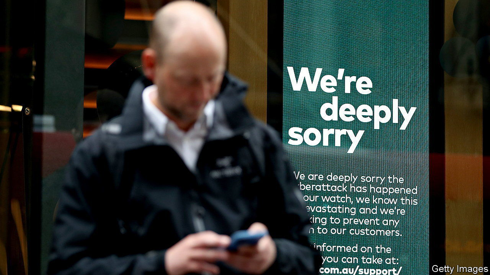

###### Once more unto the breach

# A spate of cyber-attacks is making life miserable for Australians 

##### Excessive data retention and sloppy security make the country look a juicy target 

 

> Nov 3rd 2022 

“I literally have no privacy any more,” groans Anita, a researcher in Western Australia (who, in a bid to regain some, asked  to withhold her surname). Her personal data has been stolen twice. On September 23rd her phone company, Optus, told her that she had been a “victim of a cyber-attack”, exposing her name, contact details, and passport and driving licence numbers. A few weeks later she learnt that her private health insurer, ahm, had been hit in a separate attack. Her phone buzzes more often with spam calls and emails these days. She was recently the target of a phishing attempt. 

Millions of Australians share that misery. A spate of big cyber-attacks has disrupted life down under. The one against Optus, Australia’s second-biggest telecoms company, affected up to 10m of its current and former customers—about 40% of the country’s population. More than a fifth of them had identity numbers stolen. 

Medibank, a health insurer which owns ahm, revealed on October 13th that it had been targeted. The data of all its 4m customers was compromised, including sensitive information about their health claims. The next day Woolworths, a supermarket, reported that its systems had been breached. An attack on MyDeal, an online marketplace that it owns, exposed information on 2.2m customers. A few days later Vinomofo, an online wine-seller, said hackers had accessed data on 500,000 customers from a testing platform. And on October 31st the country’s defence department said a  struck a communications platform it uses.

It may be simply that big hacks are getting harder to hide, says Alastair MacGibbon, Australia’s former national cyber-security adviser. And each breach could entice copycats. But an increasingly plausible explanation is that Australia is the target of a . Russian hackers, he suggests, may be “starting to cause fear, uncertainty and doubt” in countries supporting Ukraine.

Either way, Australians are hacked off at how much data their companies are hoarding. Successive governments have passed laws to beef up “national security” over the past decade or so. The result has been to gather lots of data about everybody, says Vanessa Teague of Australian National University in Canberra. Companies operate under one of the most intrusive data-retention systems in the Western world. Since 2017 telecoms firms have been required to retain customer metadata for two years. Medibank says it is required to hold data about its members for seven years.

Australian companies have eagerly gathered more data on their customers, but have done less to beef up their defences. It is unusual to find a cyber-security expert on an Australian firm’s board, notes Suelette Dreyfus, a data-security researcher at the University of Melbourne. Replacing ageing IT systems has been treated as an inconvenient expense rather than a necessity, she adds. There is little in Australia’s data-protection laws to force more action. Its Privacy Act of 1988 was written “before the internet itself really existed”, says Brendan Walker-Munro of the University of Queensland. The law asks companies to take “such steps as are reasonable” to safeguard data. Little punishment is imposed on those that fail to do so.

The Labor government, elected in May, wants to change that. On October 26th it introduced legislation that would slap much bigger fines on firms struck by serious or repeated data breaches, lifting the penalty from A$2.2m ($1.4m) to A$50m or more. A wider review of Australia’s privacy law is also under way. Firms should be made to “dispose of data safely” after they have verified a customer’s identity, suggests the attorney-general, Mark Dreyfus.

The recent spate of breaches offers companies other reasons to bolster their defences, too. Medibank’s shares plunged 20% after the hack. It estimates the attack will cost it up to A$35m before legal costs or payouts. Optus is facing at least one class-action lawsuit. That is only the beginning of its problems. Fully 10% of its customers have abandoned the company since their data was stolen. Many more intend to follow.■

