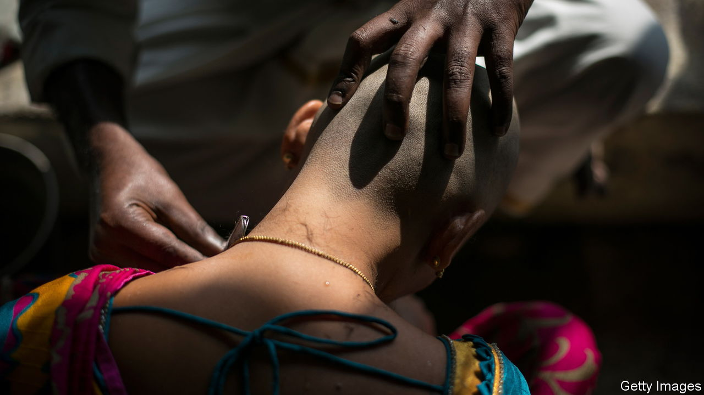

###### The unkindest cut

# India’s hair industry is in a tangle 

##### New regulations are complicating life for small businesses 

 

> Nov 3rd 2022 

Every day between 60,000 and 85,000 pilgrims arrive at Tirumala, a temple in southern India. Many are satisfied just with , or sight, of the sanctum of Lord Venkateswara, an avatar of Vishnu, waiting up to 20 hours for the privilege. But a little under half of them also line up to have their heads shaved by one of more than 1,300 barbers, who work round the clock. Men, women and children alike undergo ritual tonsure, sacrificing their locks as offerings for good health, career progression or other divine favours. The temple’s barbers shave some 1.2m heads every year. 

That adds up to a lot of hair. In 2019 the temple auctioned off a staggering 157 tonnes of the stuff, earning $1.6m. And Tirumala is only one of many temples in India where tonsuring is part of the ritual. Much of this fibrous bounty ends up in West Bengal, an eastern state where the hair industry is concentrated. At Baniban Jagadishpur, a village about 50km (31 miles) from Kolkata, workers untangle, shampoo and sort hair before weaving it into wigs of various sizes. “I have customers who ask me for wigs for just their wedding day to look ten years younger, but end up keeping them on for life,” boasts Sekendar Ali, a wigmaker.

The global market for wigs and extensions was worth $5.8bn in 2021 and is growing at a fast clip, according to Arizton, a market-research outfit. Real human strands, as opposed to synthetic ones, are woven into nearly a third of the world’s hairpieces. Last year  $770m-worth of human hair, twice as much as in 2020. Spared the brunt of harsh chemicals—most Indians cannot afford hair products—it is prized for its quality. “It is malleable and can be curled and straightened at will,” says Mustaq, an exporter in West Bengal.

The trade’s low input costs and high margins attract dodgy characters, too. Smugglers mislabel the goods as cotton to avoid Chinese tariffs. Last year 120 bags of undeclared hair, worth around $243,000 and bound for China, were seized by Indian officials at the border with Myanmar. Another destination for Indian hair is Bangladesh, where criminals run wig sweatshops. 

Earlier this year India placed restrictions on the export of human hair, requiring traders to seek a licence. It is unclear how crooks are affected by the regulations. Still, industry optimists hope the new rules will spur more domestic wigmaking, a higher-value business than exporting the raw stuff. 

That is easier said than done, says Mr Ali. He believes there are not enough factories to process all of the hair available, and that only big firms get a licence to export. “We do not,” he says. The supply glut has trimmed prices. Hair agents are out of work. Sheikh Habib, a small exporter, says his business is suffering. “I had to throw hair into a lake,” he complains. Clamping down on smuggling is understandable. But it is legitimate traders who are having toupee.■

