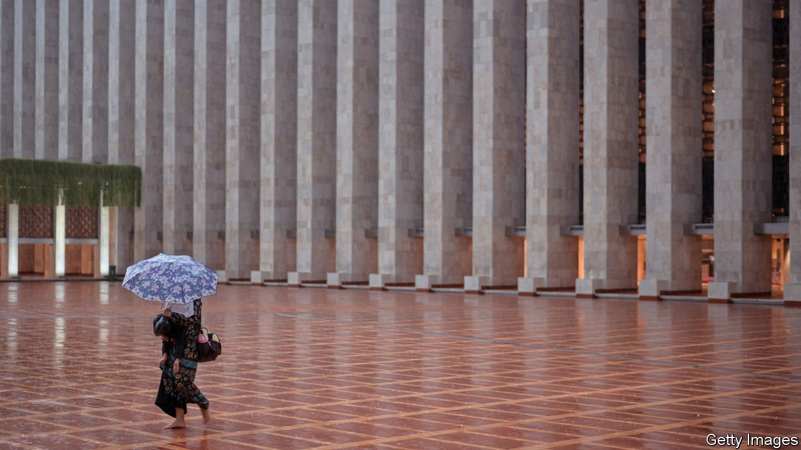
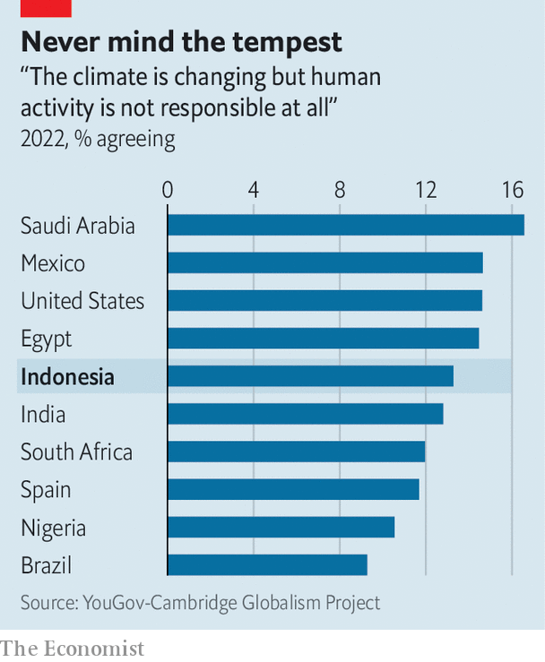

###### The colour of Islam

# Indonesia’s imams are doing their bit for the environment 

##### Clerics enjoy the highest level of trust among the population 

 

> Nov 3rd 2022 

Jakarta is constantly under aquatic assault, from above and below. Last month three pupils died when their school collapsed amid a downpour. In 2020 the  in over a decade killed dozens and displaced nearly 400,000 people. With 13 rivers flowing through it, the Indonesian capital has always flooded. But the frequency and severity of floods is growing. Parts of the city are sinking into the sea at a rate of 25cm (ten inches) each year. 

A similar story is unfolding in other parts of Indonesia. Floods displaced over 600,000 people in the archipelagic country last year. The World Bank warns that up to 4.2m Indonesians could be exposed to permanent flooding by the end of the century. In the drier seasons, droughts cause forest fires, threatening Indonesia’s 94m hectares (230m acres) of forest. 

 


Yet a country so exposed to the dangers of climate change is also a hotbed of climate denialism. A recent YouGov-Cambridge poll found that 13% of Indonesians say climate change is not caused by humans, just a shade less than the proportion in America. Indonesia’s imams, part of the influential Islamic establishment, want to change that. In July the country’s top Islamic representatives gathered at Istiqlal Mosque in Jakarta to establish the Muslim Congress for a Sustainable Indonesia, a forum for co-ordinating Islamic environmental activism among clerics, teachers, academics and politicians. 

Nasaruddin Umar, Istiqlal’s grand imam, declared at the gathering that a mosque should be a place to “green the mind and the heart”. He has started by installing solar panels and water-recycling systems in his own mosque. Another 1,000 mosques will be fitted with solar panels and smart energy meters. Istiqlal is part of a growing movement. In 2018 Nahdlatul Ulama, Indonesia’s largest Islamic organisation, launched a series of sermons on waste and recycling. Muhammadiyah, the second-largest such body, created a programme to teach its imams to become “environmental preachers”. 

The Indonesian Ulema Council (MUI), the top body of religious scholars, is also involved. Over the past decade it has issued a series of , or non-binding legal opinions, to promote green causes. In 2011 it declared environmentally destructive mining operations forbidden under Islamic law. Three years later it banned the killing of endangered species. In 2016 it condemned slash-and-burn farming practices as  (proscribed by Islamic law).

Indonesia is officially a secular country. But its clerics wield serious clout. A survey in 2020 by Katadata Insight Centre, a local research firm, found that Indonesians place the highest level of trust in information from religious institutions. Imams have sought to convert that trust into political power. Ma’ruf Amin, Indonesia’s vice-president, was personally involved in drafting and defending the environmental  as an MUI leader. He still gives green sermons from his political perch. 

Indonesia’s , or Islamic boarding schools, have become testing grounds for what some call the eco-Islam movement. Around 4m pupils study in these schools. Alumni often go on to lead important religious and political institutions. At Darul Ulum, a  in Java, teachers tell stories of the Prophet Muhammad planting trees and protecting wildlife. Students must plant a tree (among other things) to graduate. 

Clerics have also been active in finance. They helped design Indonesia’s “green or green bonds. To comply with  prohibitions on usury, these instruments involve direct ownership of assets rather than interest-bearing debt. Since 2018 Indonesia has issued nearly $3bn of these Islamic bonds, which fund renewable-energy and climate-adaptation projects. 

Indonesia is the world’s fifth-largest carbon emitter, and its economy depends on exporting coal and palm oil, two  industries. The country’s transition to a clean economy will be long and difficult. Its imams are keen to help accelerate that shift.■

