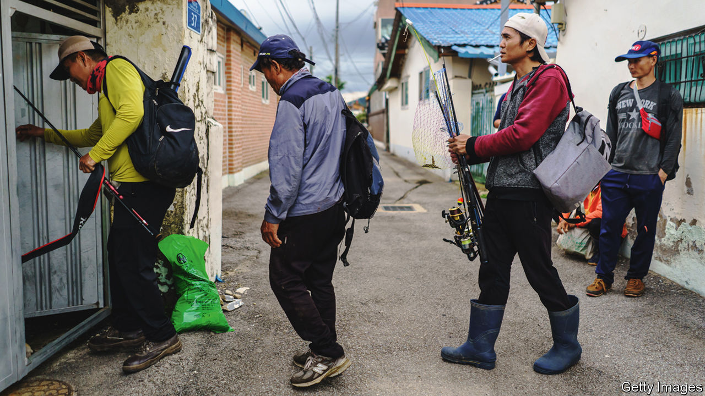
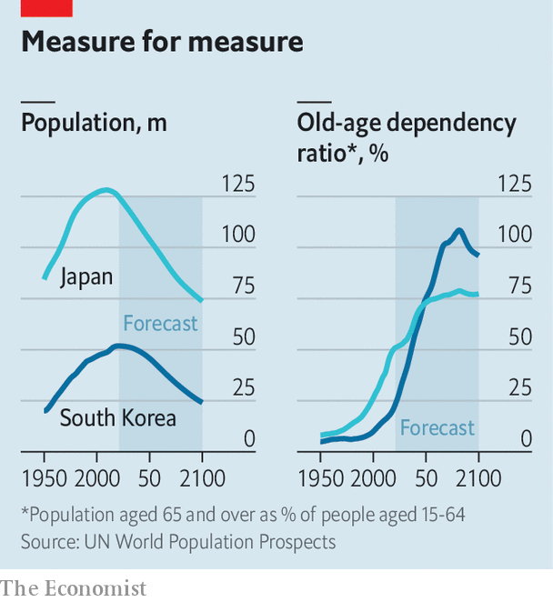

###### Open wide your gates

# Japan and South Korea are allowing in some foreign workers 

##### They will need to be much more liberal to sustain their economies 

 

> Nov 3rd 2022 

THE ubiquitous rule-giving signs of the Icho Danchi district on the outskirts of Yokohama, near Tokyo, speak far more languages than any of its residents could. Motorcycle riding is restricted in Chinese, English, Japanese, Spanish and Vietnamese. Instructions for sorting rubbish, a particularly finicky part of Japanese daily life, are offered in 11, including Portuguese.

With its Vietnamese cafés and Cambodian markets, the area is a microcosm of Japan’s . In 2009 the country had 2.1m foreign residents. By 2019 that number was up to 2.9m. Just across the water, South Korea shares with Japan more than just byzantine waste-management rules. Its foreign population more than doubled from 1.1m to 2.5m over the same period.

The influx to both countries slowed during the pandemic, but it is set to pick up. The number of foreign residents in Japan grew by 200,000 in the first half of this year. Those on work visas made up more than half the increase. The South Korean government announced on October 27th that it would welcome some 110,000 foreign workers in 2023, twice as many as in each of the past eight years. 

 


The new arrivals may help alleviate a short-term need for labourers. But they will do little to tackle the long-term problems both countries face. In the coming decades, Japan and South Korea will need ever more foreigners to till their fields, assemble their widgets and care for their old. And both will need , too. Japan’s population is expected to decline from over 125m now to 104m by 2050. South Korea’s is predicted to fall from 52m to 46m by 2050, and then to 36m by 2070. The ratio of over-64s to the working-age population in both countries is projected to shoot up (see chart). 

Getting more women into the workforce, raising the retirement age and boosting productivity would help. But “we have to accept more foreigners, that is the reality,” says Takahashi Susumu of the Japan Research Institute, a think-tank in Tokyo. A recent study led by Japan’s aid agency concluded that, even assuming big investments in automation, at least 6.7m foreign workers will be needed in 2040 to achieve the government’s modest yearly GDP growth targets of 1-1.5%. A study last year by the Migration Research &amp; Training Centre (MRTC), an institute in Seoul, found that South Korea would need some 4m foreign workers by 2030 to maintain its working-age population.

Drawing those numbers would require not only the political will—itself a tall order—but also efforts by Japan and South Korea to make themselves attractive. Migrants are still considered a temporary resource to plug gaps before being sent back. Mistreatment of guest workers is widespread. Options for staying on are limited. In South Korea temporary workers’ visas can be extended for a maximum of four years and ten months, two months short of the five years that would allow them to apply for permanent residence. 

The chances of serious reform are low. Kishida Fumio, Japan’s prime minister, is flailing in the polls and focused on other priorities, such as defence and energy. His advisers reckon the country is not ready for an open debate on immigration. South Korea’s president, Yoon Suk-yeol, is also preoccupied. His government, too, hides behind a lack of public consensus. 

Mr Kishida, for one, may be misreading the mood. “People are ready, they just need a go-ahead sign,” argues Menju Toshihiro of the Japan Centre for International Exchange, a non-profit organisation. Japanese have come to recognise the necessity of welcoming more foreign workers. A survey conducted in March 2020 by NHK, Japan’s national broadcaster, showed that 70% of Japanese support allowing in more imported labour. 

The case in South Korea is less clear. A survey by the East Asia Institute, a think-tank in Seoul, suggests that South Koreans are becoming less enthusiastic about welcoming foreigners. In 2010 some 60% said they would like the country to become more multicultural. By 2020 that number had dropped to just below 50%, largely as a result of economic insecurity. 

Business leaders have been asking both governments to boost the numbers that can come. Calls for change are also growing among some other groups. In Japan, local leaders in older, greyer regions have become more outspoken: the governors of Gunma and Miyagi, two central prefectures, went to Vietnam recently to recruit workers. Japan’s ministry of justice is expected to review its system for low-skilled workers. South Korea intends to form an immigration bureau responsible for migrant affairs—a role currently shared by 12 different ministries—which will make it easier to design unified policy. But its focus remains on high-skilled workers. 

Both governments . Public consensus should not be an excuse for inaction but rather the aim of governmental consultations. As Kang Dong-kwan of MRTC points out, the question of “what is the population goal?” must come before those of policy design. 

Japan and South Korea will also have to try harder to attract migrants than they might expect. Though there will no doubt be plenty of takers for the lowest-paying jobs, both countries face competition for more skilled workers. South Korea, at least, has the pull of soft power: cultural exports, such as K-pop and K-dramas, have made the country familiar and attractive to foreigners, says Shin Gi-wook, a sociologist at Stanford University in California. But Japan’s relative economic draw is waning. Wages have been largely stagnant for decades, even as they rise in the developing countries that send the most labourers. 

Moreover, both countries’ currencies are weak against the dollar, leaving migrants with less to send home. They also lack a major attraction that other rich countries have—big existing migrant communities.  than in many other places. Learning Korean or Japanese takes more effort and offers fewer opportunities than learning English. Adding to such barriers is the sense among migrants that they are not wanted. As Mr Takahashi points out, “people might start to think ‘why would I bother?’” ■

