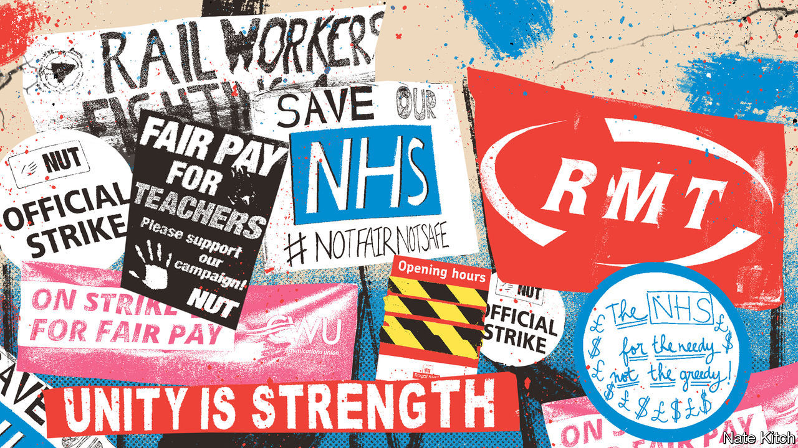

###### Restlessness and discontent

# Britain faces a wave of industrial action this winter 

##### If it spreads to the NHS, things could get very bad 

 

> Nov 3rd 2022 

When rachel (not her real name), a nurse in Leeds, told her father she had voted to strike, he told her she mustn’t: it would be unethical. She responded, she says, “with two words”. A nurse for 27 years, she earns “not well” but better than some. Yet her job, which she used to love, has become intolerable. Every week she works for at least 15 hours more than she is paid for, working through the “massive”  that built up in the National Health Service (NHS) due to the pandemic. 

She has always worked more hours than she is paid, she says, and used to think little of it. But during the pandemic her department was closed and she was redeployed trying to keep covid-19 patients out of hospital. Long days meant she was absent from home when her children were off school. Several members of her team left. They have not yet been replaced—whether that is down to nursing shortages or money-saving, she isn’t sure. Soaring energy bills have her worried for her own finances. “I never, ever thought I would contemplate striking,” she says.

Britain is facing a winter of strikes. They began on the railways: having launched the biggest wave of industrial action in decades this summer, the RMT rail union will hold more strikes on several days in early November. are aggravating, but they are not as disruptive as they would have been before working from home became widespread. And they are nothing compared with the chaos that may follow if large chunks of the public sector decide to go on strike. 

Last month, for the first time in its history, the Royal College of Nursing began balloting its members on whether they wanted to take industrial action (the ballot closed on November 2nd). Unison’s ballot of its 400,000 health-care-worker members closes on November 25th. The Royal College of Midwives will launch one on November 11th. The GMB union is balloting more than 15,000 ambulance workers.

Teachers, too, are considering industrial action. The main teachers’ unions have been followed for the first time in balloting their members by the National Association of Head Teachers. In education, as in health care, workers often mention guilt when talking about striking. Some teachers say they feel less anxious about it if they know their bosses agree with their cause. Last month, the University and College Union said overwhelming support for strike action meant more than 70,000 staff at 150 institutions could soon walk out. In a blow for retailers, Royal Mail workers said on November 1st that they will strike on November 25th (Black Friday) and November 28th (Cyber Monday).

Fears of widespread disruption—and worse—have been heightened by unions’ calls for co-ordinated action. At the annual conference of the Trades Union Congress (TUC) in October, several unions passed a motion calling for synchronised strikes, which can mean holding them on the same day. That partly reflects unions’ reduced power. The proportion of the workforce represented by them has fallen from around 50% in 1979 to 23% today (it is higher in the public sector). “Fewer members can make more noise if they act together,” says Jane Holgate, a professor of employment relations at the University of Leeds. 

Unions’ chief demand is a pay rise to reflect inflation, which matched a 40-year high of 10.1% in September. Network Rail has offered an 8% pay rise over two years, which the RMT has dismissed as a “paltry sum”. The government has offered a rise averaging 4.8% to nurses, which the Royal College of Nursing calls a “disgrace”, and around 5% to teachers.

Better pay offers are less likely now that the government is scrambling to patch up the public finances. But even if they materialise, a single pay round does not explain the deepening discontent. Britons are adjusting to the fact that they are poorer than they thought, because of slow growth and rising bills. The RMT is fighting for job security and working conditions as big cuts to Britain’s railway budget loom. Universities are protesting against cuts to pensions. Individual workers have their own reasons for feeling angry which may not relate directly to pay. Kate Greenstock, a midwife, says she is prepared to join in a “safely handled strike” to protest about an exodus of experienced midwives from the profession in search of less stressful jobs. 

Many of those who are voting to strike this winter still feel battered by the pandemic. While plenty of higher earners worked from home, it was chiefly lower-paid employees who kept travelling into work, often risking their health. To have gone through that and now be unable to pay the bills seems too much for many. 

The effect of widespread strikes, in the NHS at least, could be very bad indeed. Figures published by the health service this summer revealed a nursing shortage of 46,828, meaning nearly 12% of nursing jobs were unfilled. Hospital staff in particular are becoming nervous. A doctor at Guy’s and St Thomas’s in London says the hospital is already cancelling operations. “Striking…I wouldn’t blame them,” he says of nurses. “But it’s very worrying.” 

A winter of discontent would pose hard questions for both of the main political parties. At the TUC conference last month, union bosses demanded that Sir Keir Starmer, the Labour leader, show more support for striking workers. He had infuriated them in the summer by sacking a shadow transport minister who showed up on a picket line with RMT workers. At the conference Sir Keir vowed to tear up the Trade Union Act of 2016, which made it harder to organise industrial action, and said he backed the right to strike “unequivocally”. But he suggested he wouldn’t alter his stance on MPs and picket lines. Public sympathy for strikers can be contingent. 

The government, meanwhile, seems unlikely to say anything that nurses, teachers or others want to hear. To help balance the books, the Treasury is reportedly mulling pay rises of just 2% across the public sector next year. During the Tory leadership campaign in the summer Mr Sunak said he would force transport companies to maintain a minimum level of service during a strike. That would enrage all unions, says Paul Novak, the incoming general secretary of the TUC. “They’d see it as the thin edge of the wedge.”

The health service is likely to prove the biggest headache for the government. Polling suggests that most Britons would back nurses if they went on strike (they are less supportive of other professions, including teachers, walking out). On October 28th, touring Croydon University Hospital, Rishi Sunak crouched down beside an elderly patient, hoping for a cosy on-camera chat. When the new prime minister asked whether staff had looked after her “really nicely” she replied: “They always do. It’s a pity you don’t pay them more.” ■


