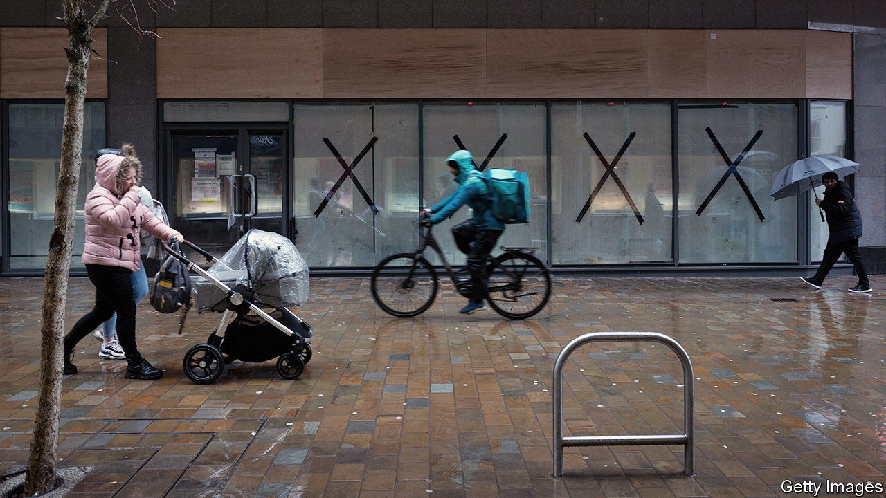
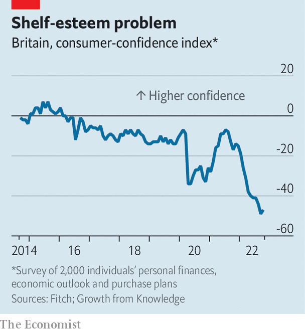

###### UK plc

# Britain’s next recession may have already begun 

##### A painful squeeze is under way for companies and households 

 

> Nov 3rd 2022 

It is tempting to see the madness in Westminster and conclude that hapless politicians are the sole cause of Britain’s economic woes. They are not. As Liz Truss’s government began to self-immolate in late September, corporate Britain was already suffering. According to a poll of economists conducted by Bloomberg, a data provider, the third quarter of 2022 marked the start of Britain’s latest recession.

London-listed firms issued a total of 86 profit warnings, more than in any third quarter since 2008, according to ey, a consultancy. Though consumer-facing businesses were the worst hit, few industries were exempt: victims included Royal Mail, a delivery firm, and Saga, an insurer. More than a third of these alerts came from companies issuing their third consecutive warning, a measure indicative of future distress (ey reckons one in five such firms go on to de-list, mostly due to insolvency). Barclays, Lloyds and NatWest, three British banks, capped the quarter by marking up their provisions for bad loans or booking losses early against those they feared may not be paid back in full.

The main problem for corporate Britain is that pretty much everything is getting more expensive. Nearly three-fifths of the firms identified by ey, and 70% of the consumer-facing companies, blamed lower profits on rising costs. Wholesale energy prices, though below the astronomical levels they hit in the summer, remain eye-watering compared with where they were at the start of the year. 

That is the result of both the war in Ukraine and a much weaker pound. The price of natural gas entering Britain’s grid has risen from £17 ($23) to £33 per million British thermal units. A barrel of Brent crude, a benchmark for oil prices, has risen from £57 to £83 in the same period. , too: average pay in the third quarter of 2022 was 5.4% higher than in the same quarter the previous year.

As a result of such rises,  stood at 10.1% in September. For some essentials it is much higher: the British Retail Consortium, a trade body, estimates that food-price inflation is 11.6%. That means the Bank of England, tasked with bringing inflation down, must make borrowing costlier in an effort to dampen demand. As  went to press on November 3rd, the bank’s monetary-policy committee was expected to raise its interest rate from 2.25% to 3%. That would be the biggest jump since 1989, well before the bank gained its independence. More tightening lies ahead: the markets expect the bank’s interest rate to rise to a little under 5% by the end of 2023.

This expectation has already caused mortgages to become substantially pricier, further raising the cost of living for many and reducing what they can spend on the high street. According to Moneyfacts, a data provider, the average two-year and five-year fixed rates for new mortgages were 6.5% and 6.3% respectively at the end of October. That is more than double the rates of a year ago. The Resolution Foundation, a think-tank, estimates that by the end of 2024 the annual mortgage bill for one in five households will have increased by £5,100. (For households in London, where prices are higher, that rises to £8,000.)

 


In sunnier times, firms might have been able to protect their margins by passing more of the price rises on to their customers. But the three-way squeeze on households—from higher energy, food and borrowing costs—makes this much harder. Consumer confidence has crashed (see chart). Jari Stehn of Goldman Sachs, a bank, notes that though many households built up excess savings during the pandemic, there is scant evidence so far that they will spend them in a way that would offset a recession.

There are a few silver linings. Colin Ellis of Moody’s, a rating agency, points out that the default rate for British firms is lower than the global average; he does not expect a “full-blown default cycle” as in 2009. Emmanuel Cau of Barclays, a bank, notes that many companies are starting from a position of strength, with high profitability and much less of the excessive spending that marked the run-up to that downturn. Britain’s FTSE 100 index of leading shares, which is heavy on energy giants benefiting from rising prices and banks enjoying higher interest rates, may even get a boost. But for the most part UK plc is heading into a grim winter—and perhaps beyond. ■


