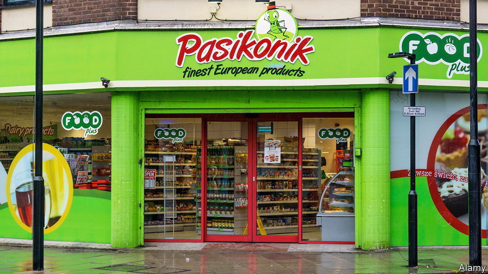
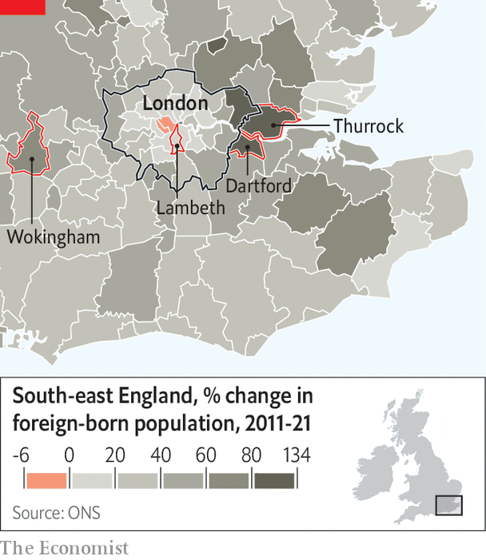

###### Patterns of immigration

# In Britain, immigrants are moving beyond the big cities 

##### This is a problem for a government that flirts with nativism 

 

> Nov 3rd 2022 

The british government is having a nativist moment. Suella Braverman, the home secretary, talks of the “invasion of our southern coast” by  in . Last month she fretted about the number of foreign students. Such talk is inflammatory and, in the case of asylum-seekers, immoral. It could also prove politically unwise. 

New data from the  released on November 2nd show that the immigrant population continues to grow. Last year 16.8% of people in England and Wales had been born outside Britain, up from 13.4% in 2011 and 8.9% in 2001. Net immigration powered population growth, accounting for 2m of the overall 3.5m increase since 2011. 

A few groups swelled dramatically. The census counted 539,000 Romanians, up from just 80,000 in 2011; together with Bulgarians, they gained the right of free movement in 2014 when Britain was still a member of the eu. The number of Italian-born people doubled from 135,000 to 277,000. Indians held onto their position as the largest immigrant group. They now number 920,000.

 


The most intriguing change is geographical. Over the past decade the immigrant populations of London suburbs and commuter towns shot up. Dartford and Thurrock have about twice as many people born outside Britain as they did in 2011; Wokingham, a richer area west of London, saw growth of 76% (see map). Meanwhile the old immigrant strongholds hardly changed. Lambeth, an inner-London borough where many Caribbean migrants settled in the second half of the 20th century, saw its immigrant population rise by just 4%. In the Midlands the city of Birmingham changed less than more rural places like Rugby and West Northamptonshire. 

This government should worry about that. In recent years the Conservative Party has tended to court voters in suburbs, towns and villages while ignoring (and sometimes traducing) the inhabitants of big cities. North London is a favourite target. That works fine when big cities seem different from everywhere else. But when it comes to immigrants, increasingly they do not. ■


