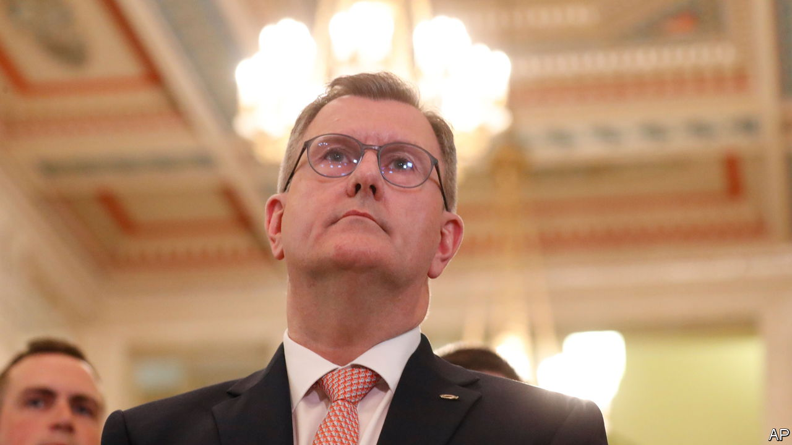

###### Donaldson’s dilemma

# The Good Friday Agreement rests on the DUP’s ability to compromise 

##### What will the party do if Britain and the EU ever reach a deal over the Northern Ireland protocol? 

 

> Oct 31st 2022 

The biggest decision of Sir Jeffrey Donaldson’s career is still over the horizon. But it is approaching. If and when it comes, his choice has the potential to scuttle the , the deal struck in 1998 to end 30 years of bloody sectarian strife in Northern Ireland.

Sir Jeffrey is the leader of the Democratic Unionist Party (DUP), the largest pro-British party in the province. He pulled the DUP out of the  in February, in protest at the , a part of the Brexit divorce deal which kept the Irish land border open by creating a new trade border in the Irish Sea. Unionists detest the red tape which makes it easier to buy ham or trees from Bratislava than from Birmingham. Their deeper worry is that Northern Ireland is being pushed farther away from Great Britain and closer to the Irish Republic. 

Inclusivity is at the core of Stormont, home of the devolved administration. If either of the biggest unionist or biggest nationalist parties walks away, the whole system stops. In May Sinn Féin, a nationalist party which favours Irish reunification and still defends IRA atrocities, became the biggest party in the Northern Ireland Assembly for the first time. But without the DUP’s participation nothing happened. The province has not had a working government for nine months; new elections, which may take place this year, are unlikely to end the impasse. 

Pretty much everyone agrees that the protocol needs an overhaul. The DUP’s terms for returning to government will be met only if the sea border goes and other terms, such as EU courts overseeing EU laws in Northern Ireland, are removed. Such a capitulation by the EU is nigh-on unthinkable. But the bloc has already agreed to soften the application of the protocol. As the economic damage caused by Brexit becomes ever clearer, the pressure on the British government to forge a more constructive relationship with the EU also grows. Even if a deal doesn’t happen under , the new Tory prime minister, a future Labour government would surely be more conciliatory. 

It is at this point, if negotiators in Brussels and London agree on a deal that improves the protocol but does not rip it up, that Sir Jeffrey would be forced to make his big decision. Rejecting a deal would mean no discernible path to devolved government for a very protracted period, perhaps a decade or more. That would remove one of the foundations of the Good Friday Agreement. Many pragmatic voters who now hold the constitutional balance of power could turn towards Irish unity. “The DUP seems set on turning this place into an ungoverned and ungovernable mess,” said Matthew O’Toole, the leader of the Social and Democratic Labour Party, a moderate nationalist party, on October 27th. “That is a tragedy for everyone who lives here, but it is a huge strategic error for unionism.” 

Recent history suggests the DUP will play to its base. Support for the DUP’s hardline stance has risen among committed unionist voters since May. Alex Kane, a journalist who has known him for decades, says that if Sir Jeffrey returned to government with much of the protocol intact, it would create “a huge and destabilising divide” between the party and a section of “increasingly belligerent” unionism. 

Jon Tonge, co-author of an academic book examining the modern DUP, expects he would bend if a deal involved negligible checks on goods travelling only between Northern Ireland and the mainland. “That will be a hard sell internally for the DUP leader but he will present it as a triumph for his party in protecting the integrity of the UK internal market, which will be free from direct EU interference.”

Sir Jeffrey has mellowed into an establishment figure. He was knighted in 2016 and flies around the world to tell peace conferences how Northern Ireland’s violence was ended. Declassified government files from the time of the Good Friday Agreement show that civil servants privately believed he was one of the most liberal unionists but was hardening his stance for votes. That tension remains. How it is resolved could yet have momentous consequences.■


