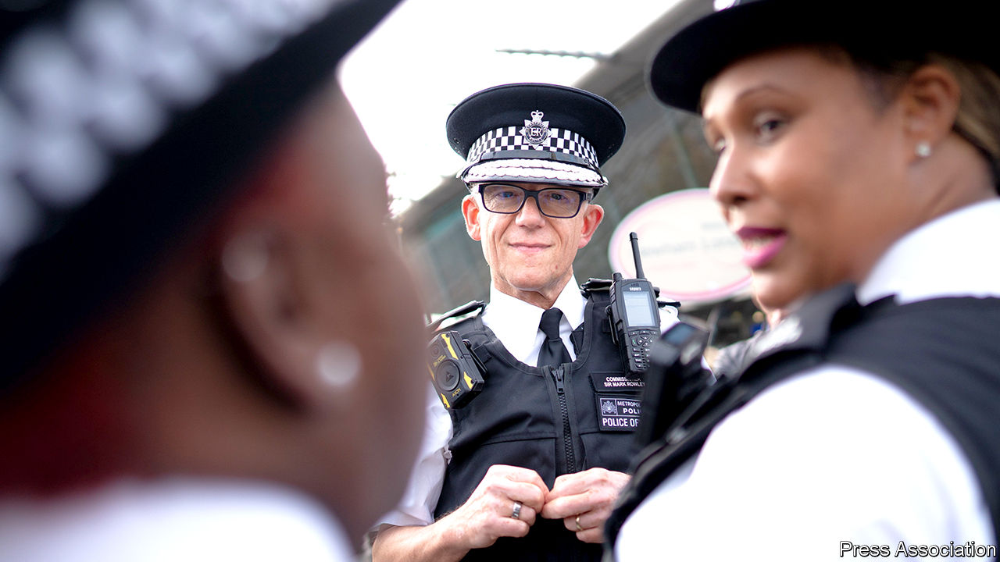

###### Good cop

# The daunting task facing the new head of the Metropolitan Police 

##### A new report underlines the scale of Mark Rowley’s challenge 

 

> Nov 3rd 2022 

Mark rowley was flicking through career leaflets at his Birmingham grammar school when he decided on his future. First he would study maths at university (he did so at Cambridge). Then he would become a copper. Back then, many still considered the Metropolitan Police Service to be the greatest force in the world. Nearly 40 years later, Sir Mark (who was knighted in 2018 for his exertions as the Met’s head of counter-terrorism) is its boss. But its reputation is woefully tarnished.

In the past couple of years Britain’s largest police force has been hit by a series of scandals. The most dreadful was the kidnap, rape and murder in 2021 of a young woman, , by a serving police officer. This summer a watchdog put the Met in  meaning it must come up with a plan for extensive reform. That task falls to 58-year-old Sir Mark, whom ex-colleagues describe as a relentlessly clear thinker. He’s “got an intellect that requires proof”, says Nick Aldsworth, a former Met officer who worked with him in counter-terrorism. “You won’t break him by attacking him, only by showing, using facts, that his policies are flawed.” 

Unlike his predecessor, Dame Cressida Dick, the Met’s new commissioner has run a police force before. His stint as chief constable of Surrey Police in 2009-11 showed him how difficult management can be: a £15m ($17.2m) system to log crime information, which he approved, was later found “not fit for purpose” and scrapped. But it also provided a big boast for his cv: under his leadership, levels of public confidence in the force rose to the highest in Britain.

Public confidence is an imperfect measure. In any given year most people don’t experience crime, so their impression of how the police are doing is largely garnered from the media. It is nonetheless crucial. When Sir Mark started his new job, in September, he said he wanted to restore “policing by consent”, a principle of Robert Peel, who founded the Met in 1829.

Overhauling the Met is a vast task; it may prove impossible without slimming it down. Yet the initial findings of a review by Lady Louise Casey into how the force handles misconduct allegations have shown Sir Mark where to start. Prompted by the revelation that complaints about Wayne Couzens, the policeman who murdered Ms Everard, had not been investigated, her review revealed the Met to be in worse shape than many had imagined.

Since 2013, she found, less than 1% of officers accused of at least two breaches of standards had been sacked. Misconduct cases took too long to resolve; supervisors warned against making allegations. Those concerning sexual misconduct “and other discriminatory behaviours” were especially likely to be dismissed. The review found evidence of “racial disparity” throughout the system. Black and Asian officers were 81% and 55% more likely than white officers to have cases brought against them.

Clearly, the Met needs to sack a lot of police officers. Sir Mark would like to do so, he said in an open letter to Lady Casey. But he was hamstrung by a requirement, introduced in 2015 by Theresa May, then home secretary, that most misconduct hearings be led by an independent chair. (This policy reflects concerns that officers accused of serious transgressions have escaped too lightly from internal police reviews.) In his letter Sir Mark said he had sought support from the home secretary, Suella Braverman, to make changes allowing the Met to do its own firing.

Punishing misconduct within the force once the system has been tightened up should be relatively straightforward. A thornier task is tackling the culture of the Met, where the line between banter and misogyny or racism can be difficult to draw. (It’s not just the Met: another report, published on November 2nd and covering forces in England and Wales, found that sexism and predatory behaviour is rife; vetting standards for new recruits are lax.)

In a video address to officers last month, Sir Mark set out some principles. Policing was not “conducive to the restrictive language of a convent”, he said. But those who “legitimise sexual violence in ‘so-called banter’” and “display negative attitudes towards people because of their gender, race, religion, sexuality, disability” do not belong in the Met. He directed officers to consider the feelings of those at whose expense jokes are made. “This isn’t about virtue signalling,” he said.

After briefly retiring in 2018, having applied for the top job and lost out to Dame Cressida, Sir Mark wrote a thriller. Its protagonist, a female detective working in counter-terrorism, gives short shrift to colleagues who “make inappropriate jokes or try to undermine her”. In real life, the boss has to intervene. ■


