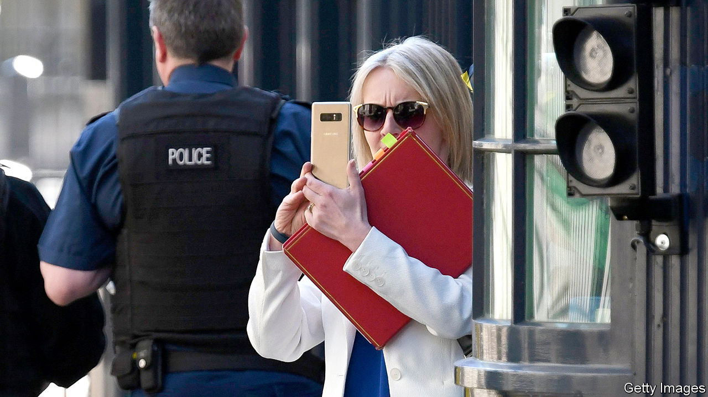

###### The home office

# Why government ministers don’t stick to security rules 

##### For the same reasons as the rest of us 

 

> Nov 1st 2022 

Conversation is the lifeblood of politics. Modern communication technologies make it easy to carry on multiple conversations. But convenience comes at a cost to cyber-security, as two recent episodes from the top of the British government show. 

The first involves . On October 30th the  reported that Ms Truss’s personal phone had been hacked during her tenure as foreign secretary; it said that unknown attackers made off with up to a year’s worth of messages, including discussions about arms for Ukraine and gossip about Boris Johnson. The government has neither confirmed nor denied the claims.

A similar attack on a government-issued phone would have been more difficult. But those phones are cumbersome to use. They come with long passwords that must be entered every time they are picked up; you cannot install apps you need to use without the permission of the IT department; their chat apps tend to be configured with tedious two-factor authentication. And, importantly, the daily chatter with political colleagues is not on that phone. It’s a pain to have two devices. 

The second incident involves Suella Braverman. She  as home secretary in Ms Truss’s short-lived government on October 19th, after it emerged that she had used her personal email address to handle draft documents on immigration policy. Official guidelines advise against using personal IT for government business where it is not reasonable to do so. ( is now back in the same job, reappointed by Rishi Sunak, and no less controversial.) 

Again, convenience explains a lot. According to Ms Braverman’s own account, published on October 31st, she found herself in a car without her work phone, and so resorted to her personal email address to forward the documents. On other occasions she forwarded official documents to her personal device so that she could refer to them while doing video calls on her official phone. 

There are heavy-duty ways to mitigate security risks. The Americans coined the term “SCIF“ (sensitive compartmented information facility) for rooms that are designed to be impenetrable to electronic snooping. The room in which the British cabinet meets is a SCIF; government ministers could even have SCIFs in their homes, if space allowed. 

The real problem is behavioural, as anyone in an IT team can attest. Security protocols are tedious. Powerful folk tend to think that their time outweighs whatever risk the nerds fret about. They are wrong. Using their work phones for work is both the least and the most important thing that officials can do. ■


