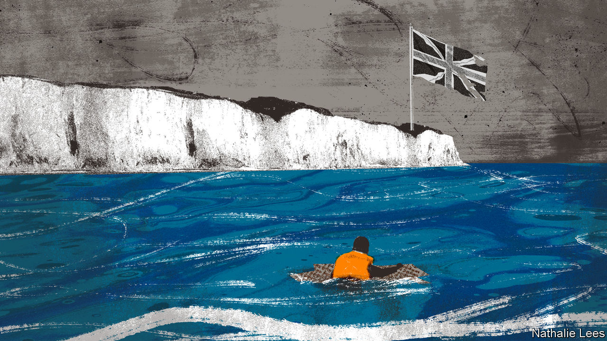

###### Bagehot

# Why small boats are a big problem for Britain 

##### A crisis in the Channel disturbs every part of the political spectrum 

 

> Nov 2nd 2022 

On Saturday October 29th, 990 people set off in 24 dinghies from continental Europe to make the short, dangerous voyage across the English Channel to beaches on Britain’s Kent coast. The day after, another 468 arrived, crammed onto eight boats. That same day a terrorist, who had gorged on far-right memes about the country being overrun by immigrants, threw a series of petrol bombs at a migrant-processing centre in Dover. In Parliament on the day after that, Suella Braverman, the home secretary, labelled the people arriving on British shores an “invasion”, triggering outrage from critics and support from backbench Conservative mps waving dictionary definitions of the term. 

These were perhaps the most depressing few days in a crisis that has evolved from a curiosity into a political nightmare. Since the start of the year, 38,000 people have made the trip across the world’s busiest shipping lane, the maritime equivalent of sprinting across a motorway.  pose an intractable problem for every part of the political spectrum. They reveal a miserable tale of incompetence, cruelty and complacency. 

The crisis is most humiliating for the government. Politicians such as Ms Braverman have repeatedly pledged an era of stronger borders, lower immigration and more sovereignty. They have achieved the opposite. As a member of the eu, Britain had the right to deport asylum-seekers if they had previously been registered in another of the bloc’s member states. But Britain left the scheme when it left the club. Instead it tried to recreate a harebrained version, paying Rwanda to accept asylum-seekers on its behalf. The courts have so far stymied this idea. In short, the government replaced a scheme that was practical, moral and legal with one that is impractical, immoral and probably illegal. 

In a slapstick version of geopolitics, the Conservative Party’s attempt to boost British sovereignty has instead left the country entirely reliant on its neighbour. When it comes to small boats, Britain is the . France has to be sweet-talked, cajoled and bribed into helping solve the problem of breaking up sophisticated smuggling networks and, ultimately, of keeping in France people who do not want to remain in France. Rather than being a sovereign, Britain is a supplicant.

The small-boats crisis caps off a decade of failure by the Conservatives when it comes to the numbers of immigrants, too. At each of the past four elections, the Tories have promised lower immigration. At each election, a plurality of voters has backed them. Yet immigration has not fallen. Instead, the Tories have ended up mimicking New Labour. Under Sir Tony Blair, Labour combined a liberal immigration policy, welcoming people from EU member states in central Europe and beyond, with performative cruelty designed to deter asylum-seekers. This government has done something similar, liberalising the rules for skilled migrants while cramming 23-year-olds from Afghanistan into crowded facilities. 

The government’s decisions are increasingly treated in the same way as the weather. Rather than an active choice, they are cast as a fact of life.  is no exception. That it took 449 days to process an asylum claim in 2020, compared with the 233 days it took in 2017, is discussed in the same way people complain about a tree in their garden being blown over. Britain once aimed to handle such decisions in six months. It scrapped the target in 2019. Since then the backlog has ballooned from under 40,000 to over 100,000. How unfortunate. Oh well. 

If small boats demonstrate the incompetence and cruelty of the right, they also show up the complacency of the left. For a country of 67m, runs the argument, some 40,000 people turning up on its shores should be little problem. It is a small number in the scheme of things. Except this same line was deployed, almost exactly, when only a few hundred people made the trip in 2018. That year, the arrival of under 100 people in a few days forced the home secretary at the time back from holiday. It was possible to dismiss the reaction then as hysteria. Now? Not so much.

Back then most people were—in a phrase that causes liberals to wince—genuine asylum-seekers. Until this year, about two-thirds of those who arrived on small boats qualified for asylum. But this ratio may be shifting. Dan O’Mahoney, the grandly titled Clandestine Channel Threat Commander responsible for monitoring small boats, estimates that about half of the arrivals now are truly seeking refuge. It is a waste of talent to prevent real asylum-seekers from working while their claims are processed; by the same token it is necessary to skim off those who abuse the rules. 

Muddled masses 

Proposed solutions to the crisis abound. Some think-tanks emphasise co-operative ideas. Britain could forge a new agreement with the eu, which would include some sort of deal on responsibility for asylum-seekers. A proper system of identity cards in Britain would meanwhile reduce the allure of the country’s black market for labour, and so stem the flow. Hardliners propose tougher options, in which arrivals are imprisoned on cruise ships, breaking asylum law in the process. 

Each resembles the old joke about an economist stuck on a desert island with a tin of food but no can-opener. Their solution? “First, assume a can-opener…” Every solution is impractical in its own way. Britain is unwilling to embrace genuinely liberal solutions to mitigate suffering, nor is it inclined to reshape its relationship with Brussels. The government is thwarted from ditching its international obligations, as the failure of the Rwanda scheme attests. The result is paralysis, misery and, inevitably, death. 

As winter looms the seas will turn choppier. Sometimes 60 people are crammed into a boat designed for a fifth of that number. Last November 27 people drowned in a single incident. Another such tragedy is bound to happen. It will discomfort every wing of British politics. But it will be far worse for those on the boats. ■


