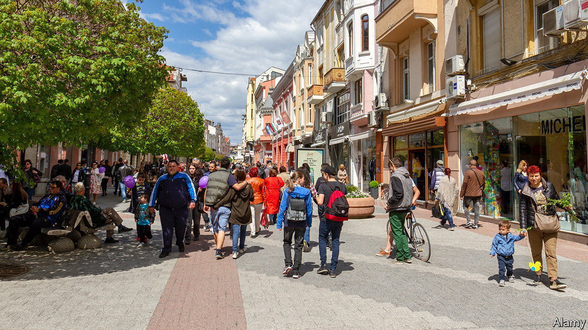

###### Go east

# Young Britons head to eastern Europe to train as doctors 

##### Bulgaria and Georgia are the most popular destinations 

 

> Nov 3rd 2022 

If things had gone to plan, Hani Sahloul, a 21-year-old from Nottingham, would now be studying to be a doctor in Britain. But like most applicants who want to take medicine as an undergraduate degree, he did not quite make the grade. Many of his peers are likely to have given up on their dreams or switched to comparable subjects like biomedical sciences, nursing or pharmacy. Not Mr Sahloul. In 2019 he enrolled at Dnipro Medical Institute in Ukraine, unaware that, less than three years later, he would be fleeing an invasion.

Mr Sahloul’s circumstances may be unusual but his decision to study in eastern Europe is increasingly common. Although Britain has long had a shortage of doctors, it shortsightedly refuses to train more medical students. In 2021 only around 12,000 Britons, out of 102,000 native applicants, were accepted to study medicine or dentistry at a British university (even this was a higher figure than usual because a cap on the number of medical places was lifted during the pandemic). Of those applicants denied a place, around 2,000 headed east to begin similar degrees, according to figures compiled by Study Medicine Europe, an agency.

Two countries in the region absorb most of the incomers. Bulgaria is one, owing, initially at least, to less stringent university-entrance requirements. In 2014 no medical graduate from Bulgaria who practised medicine in Britain was British; by 2021 two-thirds of them were. Since entrance exams were introduced in 2017, and following Britain’s departure from the EU, rival destinations have emerged. In particular, Georgia, with its low crime rate and affordable cost of living, has been “the surprise” beneficiary, says Aris Grigoriou of Study Medicine Europe. This is where Mr Sahloul moved to from Ukraine.

It is easy to see the logic behind studying in eastern Europe. For a fee of around €8,000 ($7,900, or about £6,900) per year, students can receive a decent education in English for less than they would have paid for a British medical degree. (Though with no student loans available, most have to rely on the bank of mum and dad to fund their studies.) Their qualifications will be recognised by the General Medical Council, the body with which all doctors working in Britain must register. Already over 2,900 British nationals who qualified in central or eastern Europe are on the medical register. Many more are in the pipeline: in 2022 more British medical and dental students enrolled at Plovdiv University in Bulgaria than in Plymouth.

Gaining a clutch of junior doctors without having to subsidise any of their studies might seem like a nice solution for Britain. In practice it can be hard for new graduates to find work if and when they return home. Although many are successful, “a lot of them go off to Australia, because they can’t get a job here,” says Anwar Khan, a general practitioner who has mentored Britons studying in Bulgaria. Nor is this a systematic solution to the problem of  Better to train the doctors that the National Health Service than to cross fingers and hope some of them make their own way to eastern Europe and back. ■


