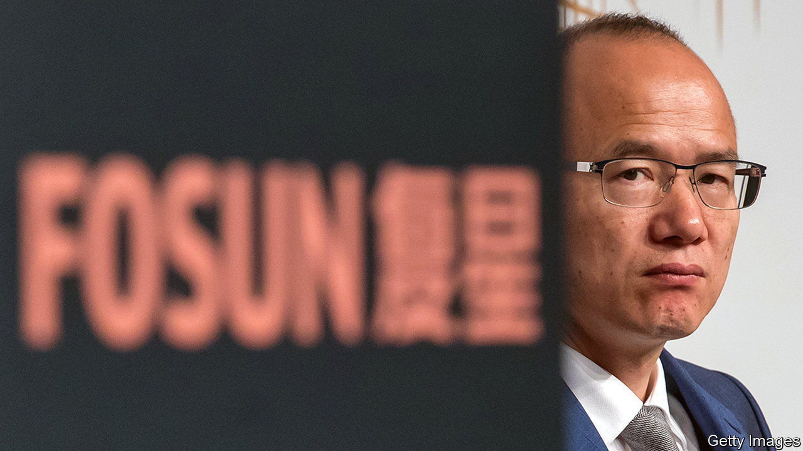

###### When the circus leaves town

# Fosun’s big asset sale marks the end of an era in Chinese business 

##### The sprawling group is offloading many of its prize investments 

 

> Nov 3rd 2022 

In the past few years Guo Guangchang, chairman of Fosun, a Chinese conglomerate, has watched as the Communist Party has taken down his rivals. Two executives at hna, an indebted airline that once held a big stake in Deutsche Bank, have been arrested. The founder of Anbang, an acquisitive insurer, has received a lengthy prison sentence for financial crimes. So has the founder of Tomorrow Group, a banking-and-insurance empire.

Mr Guo does not appear in imminent danger of sharing their fate. But his company is in trouble. On October 25th Moody’s, a ratings agency, downgraded Fosun’s debt deeper into junk territory. Chinese banks have been asking the firm to provide more collateral for loans. To meet its obligations Fosun has already divested $5bn-worth of assets this year, according to data from Refinitiv, a research firm. By 2023 it could shed $11bn-worth. That is quite the reversal for the asset-hungry group. It also marks the end of a freewheeling era in Chinese business, which is turning inwards under President Xi Jinping. 

 


Fosun has sought to offer Chinese people a three-pronged lifestyle experience that targeted their “happiness, wealth and health”. Customers could look to it to manage their money, plan their holidays and sell them medicines. To that end, it amassed, among other assets, a listed drugmaking division; financial-services firms in Europe; a large portfolio of fashion brands (such as St John Knits, an American women’s label, and Sergio Rossi, an Italian cobbler); a 20% stake in Cirque Du Soleil, a Canadian circus; and controlling stakes in Club Med, a French resort chain, and Wolverhampton Wanderers, an English football club. The perceived success of this strategy has led admirers in Chinese business circles to liken Mr Guo to Warren Buffett, America’s revered asset-accumulator. 

The reality of this success is debatable. In 2015 Mr Guo vanished for a few weeks amid a police probe, only to emerge pledging to buy fewer assets and focus on managing the ones he already has. Over the next two years Fosun divested assets worth around $9bn. The discipline did not last; in 2017 it splurged nearly $7bn on new investments. Soon afterwards some of its bets began to sour. In 2019 Thomas Cook, a British travel company part-owned by Fosun, filed for bankruptcy. The following year its 20% stake in Cirque Du Soleil was wiped out under similar circumstances. 

Throughout, debt has loomed large. In annual investor meetings Fosun executives have routinely pledged to bring leverage down. To little effect, it seems. And things may have got dicier of late, as the company has tapped more short-term debt, which now makes up 53% of its total borrowings of $16bn, up from 46% in 2021. Rolling it over has become harder in the past year, as many Chinese property developers have defaulted on offshore bonds, which has cooled investors’ enthusiasm for Chinese firms’ debt more broadly.

An even bigger problem than its debt may be Fosun’s business model. It was based on a vision of the future where both China’s businesses and its people travelled and spent freely around the globe. But China’s zero-covid policy has trapped most Chinese at home for nearly three years and dented consumer confidence. And under the increasingly authoritarian Mr Xi, Chinese companies are viewed with growing caginess in the West. In this new world, Fosun looks like a relic of a happier time. ■


