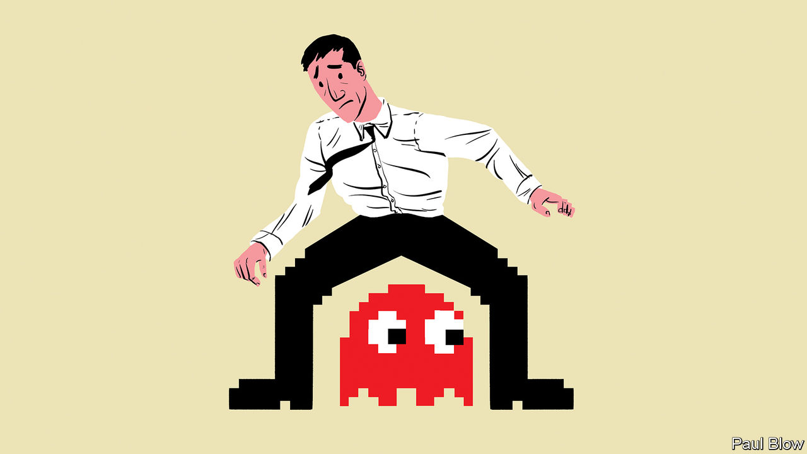

###### Bartleby

# How to think about gamification 

##### The world of badges, streaks and leaderboards 

 

> Nov 3rd 2022 

The MoPei phone-swing device is ingeniously depressing. It is a cradle for smartphones that rocks back and forth when it is plugged in, and it is designed to cheat fitness apps into believing that you are on the move. If you have a step counter, this phone shaker can gull it into thinking you have taken 8,700 paces in an hour. “Ideal for those people who don’t have the time or energy to get your recommended steps in,” boasts the product blurb. 

Such cheating is pointless but not uncommon. Blog posts run through ways to trick a Fitbit into recording exercise, from strapping it to your children to swinging it on a piece of string. Strava is an app for runners and cyclists to record their times; becoming the fastest rider on a course segment is a lot easier if you use a motorbike. Players of Pokemon Go, a smartphone game, are supposed to walk a certain distance in order to hatch virtual eggs; taping your phone to a Roomba, an automated vacuum cleaner, is the couch potato’s alternative. 

This behaviour is a predictable side-effect of a ubiquitous digital phenomenon: gamification. Adding game-like elements to non-game activities is part and parcel of app design. Streaks encourage users to log into products each day. Achievement points reward them for completing tasks. League tables add the spice of competition. 

Such features are powerful, even if their effects often fade over time. Just as gamification can lead some people to cheat, it can help others stay motivated in pursuit of a goal they find difficult to stick to. When Duolingo, a language-learning app, went public in 2021, its prospectus was clear about the importance of game-like features in keeping its users engaged. Streaks, virtual currencies, leaderboards and a hectoring cartoon owl called Duo are all designed to encourage people to keep learning. On October 26th the firm launched a new mathematics app that relies on similar techniques.

But as “You’ve Been Played”, a thought-provoking new book by Adrian Hon, a game designer, makes clear, firms should be very careful about how they gamify experiences. Mr Hon argues against slapping the generic paraphernalia of rewards, points and badges onto activities without thinking hard about the context. Get gamification wrong, and you can annoy three types of stakeholder. 

One is the customer. The obvious dangers—badgering people with endless notifications about streaks, say, or demotivating them by showing how low down a leaderboard they sit—are not the only ones. Gamification can work with the grain of a product, or against it. Apps that are designed to encourage people to save money can happily use gamified features like totalisers and money jars to track progress: the technique fits the product snugly. But some activities really don’t need added “fun”. One reading app offers to unlock animations if users hit certain reading landmarks; if you present reading as a chore, a kind of mental flossing, you are telling readers they have the cultural hinterland of a tapir. 

The second stakeholder, and a new one to worry about, is the regulator. Gamification is meant to encourage people to do more of something. If that something is learning Japanese, great. If that something is eating lard, less great. Worries about how gamified financial-trading apps might lead investors to undertake more transactions than is good for them have prompted the Securities and Exchange Commission (SEC), a markets regulator, to look at what it terms “digital engagement practices”. Firms are already changing their behaviour as scrutiny intensifies. Last year Robinhood, one of the apps now in the SEC’s sights, felt compelled to get rid of a confetti animation which showed when a customer made their first trade. 

The third group is employees. Turning repetitive work into video games is a technique that Amazon has reportedly used in its warehouses, by representing workers’ progress at picking and boxing items in a racing-car format. Firms that sell employee-engagement software offer the usual armoury of points, leaderboards and virtual currencies. 

These ideas are likely to backfire. Forced rankings incentivise some people and stress others out. GitHub, an open-source coding platform, withdrew its streak feature after concerns were raised that it was prompting programmers to work every weekend. And as Mr Hon observes, games are a lot less enjoyable if you have no choice over whether to take part. Manufacturing fun can work, but only if it is taken seriously. ■


