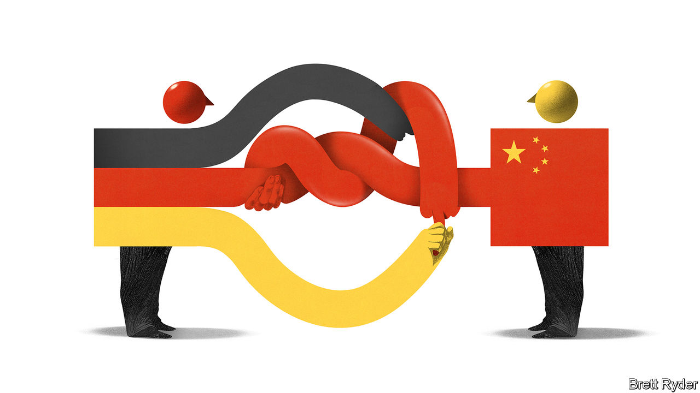

###### Schumpeter

# Olaf Scholz leads a blue-chip business delegation to China 

##### German industry has been strangely reluctant to reduce its dependence 

 

> Nov 2nd 2022 

Rarely in recent years has a routine inaugural trip of a head of government been watched with such keen interest at home and abroad. When Germany’s Social Democrat chancellor, Olaf Scholz, travels to Beijing for a one-day visit on November 3rd, he will be the first Western leader to do so since the start of the covid-19 pandemic. Emmanuel Macron, France’s president, was keen to travel together with Mr Scholz, though preferably not right after China’s leader, Xi Jinping, got himself anointed as Communist Party chief for a norm-busting third term. Mr Scholz said . He is instead taking along 12 CEOs of German blue-chip firms, including the bosses of Merck, a drug company, Siemens, an engineering behemoth, and Volkswagen, Europe’s biggest carmaker.

Over the past two decades the interests of German business have shaped Germany’s China policy to the exclusion of other concerns. Mr Scholz’s corporate retinue suggests that this is still the case, despite Russia’s invasion of Ukraine, which starkly illustrated the dangers of economic dependence (in Germany’s case for Russian fossil fuels) on an autocracy driven by an aggressive ideology. A new consensus in European capitals is that Europe must rethink its business ties to China. Many Germans accept this, too. “The Chinese political system has changed massively in recent years and thus our China policy must also change,” declared Annalena Baerbock, Mr Scholz’s foreign minister from the Greens party, on November 1st, during a trip to central Asia. Deutschland ag, though, is reluctant to open its eyes to the new reality.

The deep commercial links between the two countries certainly complicate matters. Last year China was Germany’s top trading partner for the sixth consecutive year, with combined exports and imports of more than €245bn ($255bn). That is five times the figure in 2005. Germany relies on China for the import of solar panels, computer chips, rare earths and other critical minerals. Sino-German trade also supports more than 1m German jobs directly; millions more are indirectly connected to it. 

Sino-dependency is not a uniquely German affliction. America, too, trades a lot with its geopolitical rival. One important difference is that powerful German industries are unusually exposed to the Chinese market. Of Germany’s ten most valuable listed companies, nine derive at least one-tenth of their revenues from China, according to ’s rough estimates, compared with two of America’s ten biggest firms. In 2021 two in five cars sold globally by Volkswagen Group were bought by Chinese motorists. 

Many of these rolled off the German carmaker’s Chinese production lines. This is Germany’s second unique circumstance: it has ploughed plenty of money into Chinese factories. Whereas new American foreign direct investments in China accounted for only 2% of America’s total in 2021, for Germany the figure was 14%. Four firms—three carmakers, bmw, Mercedes-Benz and Volkswagen, and basf, a chemicals giant—accounted for one-third of all eu investments in China in the past four years, according to the Rhodium Group, a research firm. And German firms are doubling down: in the first half of this year they invested €10bn in China, more than ever before. basf is in the process of putting another $10bn into its Chinese operations.

Worries about undermining those business relationship have led to some controversial policy choices at home. In late October Mr Scholz decided to ignore the warnings of six of his ministers, as well as the heads of the domestic and foreign intelligence agencies, and let Cosco, a Chinese state-run shipping company, buy a stake in one of four container terminals in the port of Hamburg. Like his predecessor, Angela Merkel, he has also refused to take sides in the debate over whether Huawei, a Chinese telecoms giant, should be allowed to bid for contracts to build Germany’s 5g networks, perhaps heeding the threat by the Chinese ambassador to Germany in 2019 of “consequences” for German carmakers if Huawei were excluded from the auctions.

This kid-glove approach to China is out of step with his Western counterparts. In America China-bashing is a rare bipartisan pursuit. President Joe Biden, a Democrat, has been expanding the scope of restrictions on the export of advanced technologies to China introduced by his Republican predecessor and potential future rival, Donald Trump, most recently last month. America also bans Huawei. So do several of Germany’s fellow eu members. As the geopolitical rift between China and the West widens, many Western firms are trying to reduce their exposure to Chinese supply chains and consumers. Apple is shifting some production from China to India and Vietnam, for example. Germany, by contrast, is going “full steam ahead in the wrong direction”, as Jürgen Matthes of the German Economic Institute, a think-tank, puts it.

The long guten Tag

Some German business leaders publicly pooh-pooh such talk. Martin Brudermüller, chief executive of basf and another of Mr Scholz’s travel companions this week, recently bemoaned all the “China-bashing”. Deep down, though, they must know better. Any lingering hope of “change through trade”, the characteristically German belief that closer commercial ties with liberal democracies will spur political transformation in China just as they did to a degree in the Soviet bloc, has died with Vladimir Putin’s invasion of Ukraine and Mr Xi’s authoritarian turn. Indeed, many German companies tacitly acknowledge the heightened China risk by maintaining two independent production systems—one on the Chinese mainland, the other in the rest of the world. 

That is not enough. Expecting geopolitical tensions between the West and China to go away is naive at best. So is expecting an autocrat like Mr Xi, who makes no bones about wanting to indigenise Chinese industry, to respect all commercial commitments to foreigners. Not cutting all business ties with China is understandable, and perfectly sensible. Deepening them looks reckless. ■


