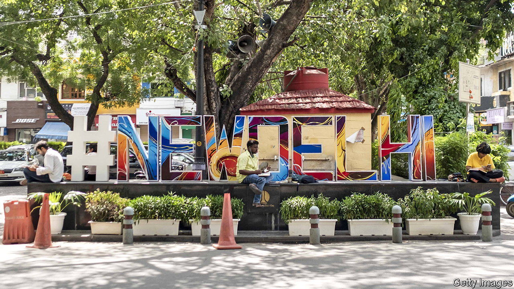
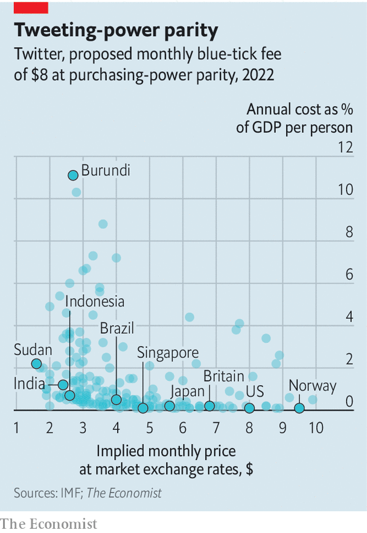

###### The blue-tick index

# Twitter wants to charge users based on purchasing-power parity 

##### That still looks expensive in many poorer countries 

 

> Nov 3rd 2022 

 


Elon Musk plans to charge Twitter users $8 a month for a “verified” account, and to adjust the fee based on “purchasing-power parity”. How might that work? Think about what $8 can buy in America. Then imagine how much similar items would cost in, say, India—roughly 187 rupees on average, according to the imf. That is what Twitter might charge in that country. Converted at market exchange rates, 187 rupees is less than $2.40, making verification look relatively cheap in India. Compared with India’s income per person, however, it still looks relatively dear.■


