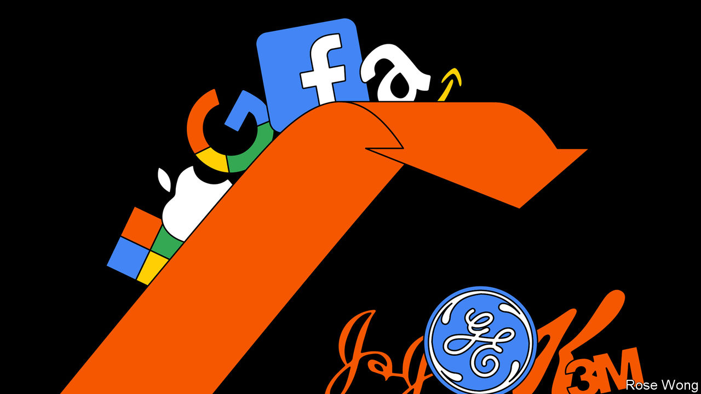
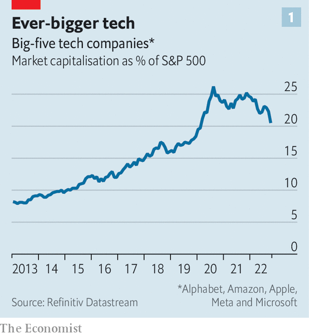
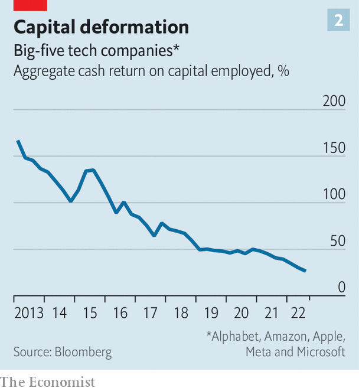

###### Conglomeritis spreads

# What big tech and buy-out barons have in common with GE 

##### Unaccountable bosses, declining returns on capital and fed-up investors 

 

> Nov 3rd 2022 

Conglomerates could hardly be less fashionable. The diversified industrial empires of old are taught as case-studies in underperformance, misaligned management incentives and poor capital allocation. Bosses fear that a “conglomerate discount”—the difference between the market value of a firm and the hypothetical value of its constituent parts—will invite activist investors to agitate for divestments. Focus is now the idée fixe of industrial organisation.

Few were surprised when General Electric (GE), a poster-child for expansion-induced destruction of shareholder wealth, announced plans to break in three in November 2021. This unravelling, which is likely to be completed in 2024, is far from novel. Johnson &amp; Johnson, 3M and Kellogg are all in the middle of breaking up. Germany’s Thyssenkrupp and Siemens have both recently completed hulking divestitures. Toshiba, a Japanese industrial giant, narrowly avoided a breakup earlier this year. The conglomerate has proved more resilient in the developing world. But even there some empires are under attack. In China, for example, , an acquisitive globetrotting group, is hawking off assets in order to tackle its crippling debt pile.

 


Even as some old strains of conglomeritis are in remission, however, new ones have emerged. Public and private markets have put their faith—and capital—in sprawling empires built around the twin engines that have propelled the modern economy over the past few decades: digital technology and cheap debt. A fifth of the market value of the S&amp;P 500 index of big American firms sits in five giant technology companies—Alphabet, Amazon, Apple, Meta and Microsoft—which have spent a part of their profits chasing diversification (see chart 1). Simultaneously, low interest rates and an explosion in the assets managed by private-equity firms such as Apollo, Blackstone and kkr have created vast and diversified investment portfolios of controlling interests in firms: buy-out barons spent more than $1.1trn globally in 2021 alone. 

Tech ceos bristle at any mention of the c-word. Their diversification is fuelled by the logic and profitability of the digital economy, they insist, not by the desire to manage a balanced portfolio of distinct subsidiaries as in old-school conglomerates. Engineering clout and access to data provide economies of scale and scope in product development; demand-side synergies emerge from bundling and “digital ecosystems”. Bosses at ITT, once among the largest diversified American conglomerates, encouraged employees and suppliers to rent cars from Avis, one of its divisions. The links between products at big-tech firms are far stronger: Apple’s watches and earphones, as well as its tv series and playlists, are part of the iPhone ecosystem; shopping for kale and kombucha at Whole Foods is cheaper if you join Prime, Amazon’s membership programme.

Look closer, though, and similarities abound. Huge profits from tech firms’ core businesses have funded a giant land-grab. Amazon’s dominant position in cloud computing, initially intended to support its e-commerce marketplace, now contributes the lion’s share of profits and bankrolls big bets in entertainment (like the $8.5bn acquisition of MGM, owner of the James Bond franchise), health (a $3.9bn deal to buy One Medical, a provider of primary care) and space (Amazon plans to invest more than $10bn in its Kuiper satellites). Alphabet’s lucrative search-ad and YouTube businesses subsidise a loss-making cloud operation and a moonshot unit, which together lost more than $2bn in the most recent quarter. The result is that big tech firms now compete across multiple industries, largely with each other.

Private-equity firms, too, have come to resemble the sprawling groups they once dismantled. Low interest rates created alternative-investment behemoths managing trillions of dollars in privately held equity, credit, property and infrastructure assets. Attempts to raise sources of permanent capital invite comparisons to Berkshire Hathaway, Warren Buffett’s $640bn diversified holding company. The financial groups’ buy-out arms are vast pools of capital invested across multiple sectors: the portfolio companies of Apollo employ more than twice as many workers as ge. 

Now the magic is fading for the new conglomerates. It is financial engineering, not operating know-how, which has juiced private-equity returns. According to a study by Bain, a consultancy, expanding margins accounted for only 6% of private-equity value-creation during the past five years. Leveraged buy-outs struck at high valuations will hurt returns for some big funds. In the absence of cheap money, dealmakers will either sit on their piles of dry-powder or try their luck as judicious conglomerate-managers capable of striking bargains and nurturing businesses. Most will struggle with this transition.

The true extent of private-equity firms’ problems may remain cloudy for a while. But the reckoning will come, because their funds are by design time-limited. Eventually, the funds’ managers will be forced to sell the assets and return cash to investors. Underperformers will find themselves unable to raise new funds. 

 


Big-tech bosses face no such automatic disciplining mechanism. So long as the companies’ core businesses printed money, investors humoured their side hussles and tolerated declining returns on capital at some firms. In aggregate for the big five this has fallen by more than half over the past five years (see chart 2).

As tech firms’ profit engines come under pressure—advertising and cloud-computing profits are facing cyclical headwinds and increased competition—investors are questioning the logic of the firms’ portfolios, says Emilie Feldman of the Wharton School of the University of Pennsylvania. The shares of Alphabet, Amazon and Meta have all lost more than 10% of their value since the companies’ latest quarterly reports in late October. Mark Zuckerberg, founder and chief executive of Meta, got an earful from investors about money-losing moonshots and bloated, costly workforces. His opposite numbers at Alphabet and Amazon, Sundar Pichai and Andy Jassy, could face similar treatment soon enough.

As hired guns, Messrs Pichai and Jassy wield little formal power over their boards. That may yet make them receptive to calls for greater focus. Mr Zuckerberg, who lords it over Meta thanks to dual-class shares, seems deaf to investors’ wails. He wants to keep spending perhaps $15bn a year to expand his digital domain to the metaverse. As symptoms of conglomeritis go, none is more classic than an unaccountable boss with empire-building ambitions. ■


