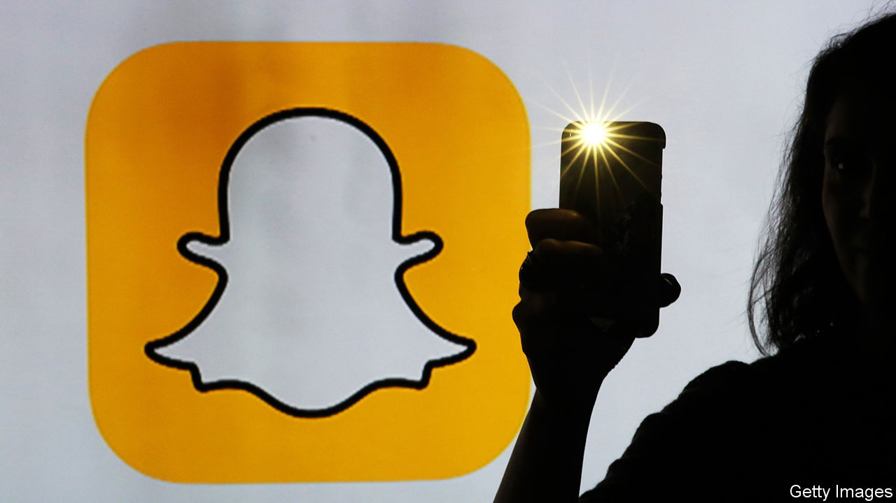
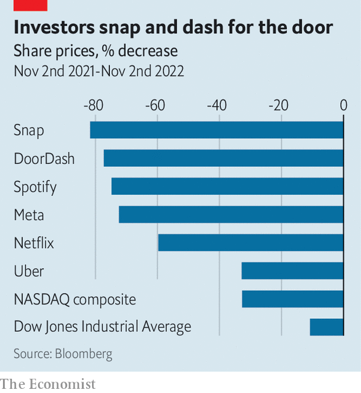

###### Bad tech

# What went wrong with Snap, Netflix and Uber? 

##### Despite superficial differences, digital darlings’ business models rest on the same shaky pillars 

 

> Oct 31st 2022 

When evan spiegel, boss of Snap, wrote in a leaked memo that the social-media firm had been “punched in the face hard by 2022’s new economic reality”, he might as well have been describing America’s digital darlings as a whole. After a multi-year bull run, the sector is suffering a sharp correction. The NASDAQ index, home to many consumer-internet companies, has fallen by over 30% in the past 12 months; the Dow Jones Industrial Average, made up of less techie firms, is down by around 10%. Crunchbase, a data provider, estimates that American tech has already shed more than 45,000 jobs this year.

Macroeconomics is partly to blame. Soaring inflation and rising mortgage repayments are leading consumers to cut back on discretionary spending—and most digital offerings are discretionary. Even the industry’s trillion-dollar giants have not been spared, despite continuing to rake in handsome profits. Alphabet, Amazon, Apple and Microsoft have collectively lost $2trn in market value in the past year. 

 


If you think big tech has it bad, spare a thought for the not-so-big tech. In particular, three business models embraced by firms born after the dotcom crash of 2001—and subsequently by investors—are losing steam: the movers (which shuttle people or things around cities), the streamers (which offer music and tv online) and the creepers (which make money by watching their users and selling eerily well-targeted ads). Over the past year the firms that epitomise these business models—Uber and DoorDash; Netflix and Spotify; and Snap and Meta (which has tumbled spectacularly out of the trillion-dollar club)—have shed two-thirds of their market capitalisation on average (see chart). 

Things could get worse. On November 1st Uber reported strong growth but, despite being the global leader in ride-hailing, another quarter of net losses. In its 13-year life it has so far torched $25bn of cash, equivalent to roughly half its current market value. DoorDash, the leader in food delivery, remains lossmaking. So do Spotify (despite rising revenue) and Snap (on top of sharply slowing sales). Netflix—a child of the 1990s but a streamer only since 2007—turns a profit but its revenue grew by just 6% year on year in the third quarter, compared with a historical average of more than 20%. Meta’s revenues have now shrunk for two consecutive quarters. 

On the surface, the movers, streamers and creepers—and their problems—look distinct. On closer inspection, however, their businesses all turn out to face the same main pitfalls: a misplaced faith in network effects, low barriers to entry and a dependence on someone else’s platform. 

Start with network effects, or “flywheels” in Silicon Valley speak—the idea that a product’s value to a user rises with the number of users. Once the user base passes a certain threshold, the argument goes, the flywheel powers a self-perpetuating cycle of growth. This explains why so many startups seek growth at all cost, spending millions acquiring ever more customers to get the flywheel spinning. 

Network effects are real. But they also have their limits. Uber believed that its headstart in ride-hailing gave it a ticket to riches, as more riders and drivers would mean less idle time for both, drawing ever more users into an unstoppable vortex. Instead, it encountered high unit costs and diminishing returns to scale: reducing average wait times from two minutes to one would require twice as many drivers, even though most riders would barely notice the difference. DoorDash’s hungry consumers likewise only require so many alternative Indian restaurants to choose from. And what network effects the movers enjoy are local; a user in New York cares little about the popularity of the app in Los Angeles.

Spotify and Netflix also try to capitalise on network effects, as data on the listening and viewing habits of similar users promised to deliver an unbeatable product. Belief that Netflix’s trove of user information would give it a winning edge in creating content has been shattered by flops like “True Memoirs of an International Assassin”, which scored a rare 0% audience rating on Rotten Tomatoes, a review website. For the creepers—whose social networks are a network-effects business —the worry is what happens if the flywheels start spinning in reverse. Meta had a scare in the fourth quarter of 2021, when it lost 1m users. That loss did not turn into a stampede; the company has added users since. Next time it may not be so lucky.

The second problem—low barriers to entry—is another supposed boon turned bane. Advances in technology, from smartphones to cloud computing, allowed all manner of startups, including the movers, streamers and creepers, to build consumer software cheaply and quickly. But that also meant that copycats soon emerged, and easy money allowed them to offer generous discounts to quickly build the minimum necessary scale. 

Although at home Uber faces only one real ride-hailing rival, Lyft, its global expansion soon ran up against local rivals such as Didi in China or Grab and Gojek in South-East Asia. Meanwhile, the combination of relatively simple products and free-of-charge user experience means a new twist on social media can be enough for a new challenger to gain momentum: just try prying a teenager from TikTok. 

The barriers to entry for the streamers are higher—Netflix and Spotify spend a lot of money making or licensing content. But they are not insurmountable for deep-pocketed rivals. To fend off the challenge from Disney, which is spending a total of $30bn a year on content, Netflix must keep splurging, too, to the tune of around $17bn a year. Like customer-acquisition costs for the movers, content costs eat into streamers’ profits. Disney’s streaming services lost $1.1bn in the second quarter of this year and the company has said that its Disney+ platform expects to lose money until 2024. Heavy investment explains why Netflix’s free cashflow (the money companies generate after subtracting capital investments) is equal to only 6% of revenue.

The third flaw common to the three wobbly business models is their reliance on distribution platforms that are not their own. Uber and DoorDash pay a handsome fee to advertise on Apple’s iPhone and Alphabet’s Android app stores. Spotify forks over a 15% commission on subscriptions purchased on iPhones—a tax so annoying that it has filed a complaint against Apple over it. Netflix avoids the commission by forcing users to subscribe through their web browser, shifting the irritation to the customer—and quite possibly missing out on subscriptions.

Worst affected by the lack of their own rails are the creepers. Their dependence on the iPhone-Android duopoly is an existential threat. Apple’s newish requirement that users give iPhone apps permission to track their activity across other apps and websites, a move replicated by Alphabet, may this year cost Meta $10bn in forgone revenue. Parler, a creeper favoured by the far right, was temporarily suspended by both Apple and Android. If American national-security hawks worried about TikTok’s Chinese ownership get their way and force Apple and Alphabet to expel it from their app stores, the rising star of social media could find itself similarly thwacked.

The different business models do not face an equal balance of challenges. The movers would be in better nick if the industry had meaningful barriers to entry. The streamers might have been able to bat away new entrants if network effects had been stronger. And the creepers were in reasonable shape until Apple and Alphabet spoiled their party. One shaky pillar is problematic enough. Three of them is a disaster waiting to happen. ■


