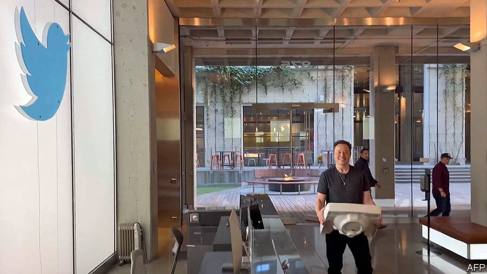

###### Singing for its supper

# Will people pay $8 a month for Twitter? 

##### Elon Musk swaps ads for subscriptions 

 

> Nov 3rd 2022 

Twitter is no longer a public company, but it is being run in a more public way than ever before. Elon Musk, who took the social network private on October 27th at a cost of $44bn and immediately installed himself as its temporary chief executive, has been developing his plans for the firm through the medium of tweets at all times of day and night.

Mr Musk, who said he was buying Twitter to protect free speech in “the de facto public town square”, tweeted on his first full day in charge that the company would set up a “content moderation council”. Outsourcing moderation dilemmas to an independent board, as Facebook has since 2020, would be no bad thing. One of the chief concerns about Mr Musk’s ownership of Twitter is that the platform could be leant on by anyone with leverage over his other, larger businesses. Tesla, Mr Musk’s carmaker (and main source of wealth), has a factory in Shanghai and last year made a quarter of its revenue in China, whose public squares are hardly free.

Yet the focus of Mr Musk’s first week in charge was not moderation but money. His acquisition was funded with about $13bn of debt. Interest rates are rising and the ad market, which provides nearly all of Twitter’s revenue, is falling. Some advertisers are especially nervous of the new Musk-owned Twitter: ipg Mediabrands, a giant media buyer, recommended on October 31st that clients pause their spending on Twitter while the dust settled.

To cut costs Mr Musk appears to have started a round of lay-offs, which is probably overdue. Last year Twitter had 1.5 employees for every $1m in revenue, compared with 0.6 at Meta, Facebook’s owner. At the same time he hopes to bring in more users with features including the resurrection of Vine, a decade-old app that beat TikTok to the short-video craze but which Twitter allowed to wither.

 


The most radical plan, though, is to boost revenues by weaning Twitter partially off ads and onto subscriptions. Users will be able to pay $8 a month (or another amount depending on their whereabouts, see chart) to see half as many ads, post long audio and video clips and get priority for their own tweets in other people’s replies and search results.

Mr Musk characterised this as a democratic alternative to the “lords &amp; peasants system”, in which Twitter awards blue badges verifying the identity of “notable” tweeters. Increasing the number of verified users may help reduce spam. But prioritising tweets that are paid for, over ones that are good, may worsen the user experience. And charging audiences risks driving them to other social platforms that are free. As Stephen King, a blue-badged novelist, tweeted in an exchange with Mr Musk: “Fuck that, they should pay me.”

Subscriptions may kick off another argument. Among users who subscribe via the Twitter app, a cut of ongoing monthly fees will go to the app store in question: 15% in the case of Google and up to 30% in the case of Apple. Companies that rely on subscriptions, like Spotify, or in-app purchases, like Epic Games, have long complained about this app-store tax. In Mr Musk, Apple and Google face another opponent—one who is armed with the world’s loudest megaphone.■


