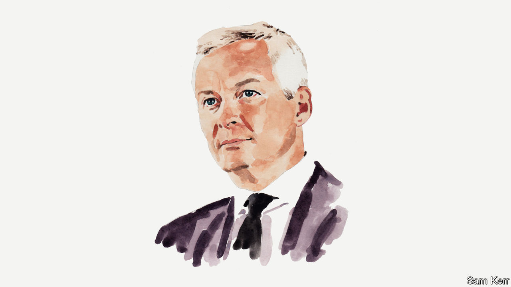

###### Finance and economics

# France’s finance minister on how to fight inflation and preserve stability 

##### A single monetary policy in the eurozone cannot cohabit with diverging fiscal policies, says Bruno Le Maire 

 

> Oct 28th 2022 

SINCE THE end of 2021, European countries have been facing inflation. Mostly it has been driven by surging energy prices. This challenge had long been unfamiliar to citizens, economists and finance ministers. It is new for us and a matter of great concern. Inflation is an insidious poison. It can trigger economic recession or social unrest, or even spark a political crisis. 

Combating inflation is therefore a priority for central banks and governments. The 2% target should be reached as soon as possible in the euro area. To that end, a comprehensive strategy tackling both fiscal and energy issues is critical. 

First, fiscal and monetary policies should be consistent. Central banks’ restrictive policies are ineffective if public finances continue to expand. That is why the burden of higher energy prices must be shared among households, businesses and governments. France has put in place an “energy shield” for households, which will cap price rises at 15% in early 2023. To fund the shield, France has introduced a mechanism to capture the excess profits of electricity producers, which is expected to bring in €26bn ($25.9bn) next year and partly fund the energy shield. 

Companies must pay their fair share by meeting workers’ legitimate demands for better wages. However, such increases must be consistent with productivity gains to avoid the vicious circles we experienced in France in the 1970s. This is the aim of the French government’s policy, which also includes structural reforms on unemployment and pensions. We will continue with an ambitious programme of labour-market reform to enhance qualification levels and increase participation rates. 

Money is no longer interest-free in the new financial landscape. Rates on French ten-year government bonds, negative 18 months ago, have risen to more than 2.5%, which leads to billions of euros of additional fiscal expenditure. If European governments fail to anticipate higher debt-servicing costs, an inflationary crisis can suddenly become a financial one. Recent turbulence in British bond markets demonstrates the impact of a rapid rate surge. 

Consistent and co-ordinated action at a European level should complement our respective national agendas. The euro area comprises a single central bank, but several governments. A single monetary policy cannot cohabit with diverging fiscal policies. Otherwise we run the risk of fragmenting and weakening the single currency. 

Our strategy’s second cornerstone is energy independence, because it will facilitate a cut in energy prices. The current crisis is resulting in a massive transfer of wealth from the European Union to hydrocarbon-producing countries. High prices for energy also undermine efforts to build up a strong industrial market. 

That is why France should promptly restart all its nuclear reactors to produce more electricity; diversify its energy supply sources with jointly negotiated prices with our European partners; and advocate reform of the European energy market with the aim of decoupling gas and electricity prices. In addition to these measures, all member states are committed to reducing their energy consumption. 

In the longer term, we intend to reduce our reliance on fossil fuels by electrifying our energy supply with new nuclear reactors and renewable energy sources. This approach has been adopted by France under the leadership of Emmanuel Macron, and also by Britain. The latter has decided to develop its nuclear-power capacity in partnership with France. Britain and the EU will comprise the first carbon-neutral continent. 

Last, the world must resist the temptation to build barriers to trade and exchanges. In times of economic hardship, this prospect seems all the more likely. Tariffs are always introduced with the best intentions but they often degenerate into trade wars. The Inflation Reduction Act adopted by America, signed into law in August, is a matter of deep concern. It provides massive subsidies to American industries, such as for making batteries for electric vehicles, and could be in breach of WTO rules. 

This high-risk situation could strain relations among three of the largest trading blocs: Europe, the Americas and China. But this need not be inevitable. Inflationary crises have always resulted in global geopolitical remapping, and so we should ensure that this time it is in line with our shared interests.■

_______________


