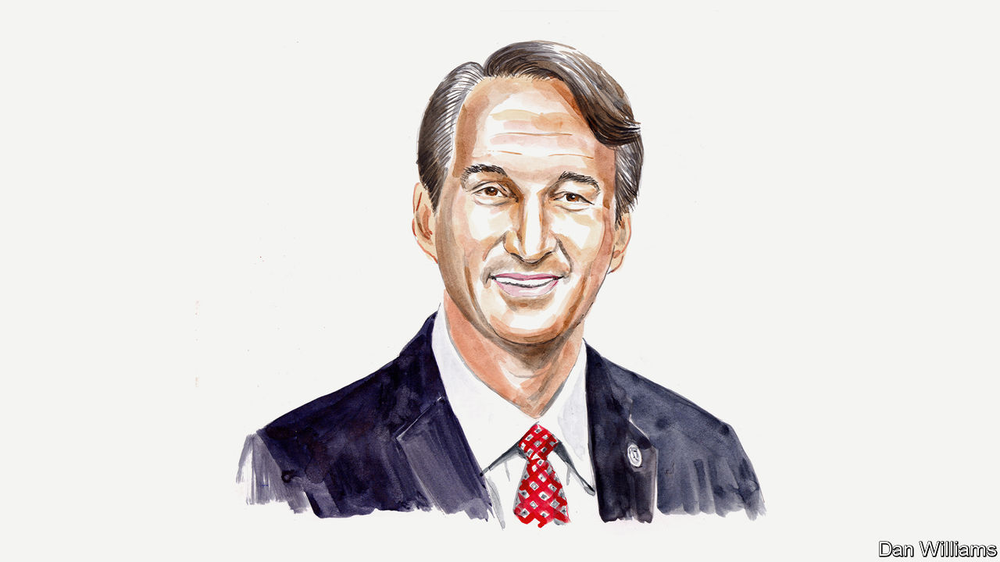

###### America’s 2022 midterms

# Republicans should focus on kitchen-table issues, argues Governor Glenn Youngkin 

##### He says Virginia is a case study when it comes to schools and jobs 

 

> Oct 26th 2022 


IT HAS BEEN said that all great change starts at the kitchen table. It is a place where families discuss their most profound worries about schools, caring for an elderly parent, recession and the silent thief—inflation—stealing their hard-earned paycheques. 

Driven by a desire to restore academic excellence, bolster safe communities and lower the cost of living, the people of Virginia showed up to elect new leadership last November. They voted for a government that serves as a catalyst, not an obstacle, for opportunity. They voted for leadership that tackles the kitchen-table concerns of working families throughout Virginia. 

On the campaign trail, I’d speak at a school or at a business, and someone would grab me by the arm and pull me aside for a private moment. Quietly and out of earshot, I would hear a Virginian say, “I’m a Democrat, but I’m here anyway. I’ve never voted for a Republican before, but I want you to know what’s happening at my daughter’s school...” 

Since January, our administration has chartered a bold course to champion common-sense solutions for kitchen-table concerns. Whereas past administrations simply hoped that Virginia would prosper, we recognise that hope is not a strategy. Instead, we reined in excessive big-government edicts that have fractured the freedoms intended for us by our founding fathers. 

We’ve made steps to lower the cost of living and ease the economic burdens on Virginian families by providing nearly $4bn in tax relief, almost doubling the standard deduction, providing the largest tax rebate in the state’s history and eliminating the regressive state grocery tax. 

We’re also delivering on our promise to restore academic excellence by working to fix our academic standards, providing the largest education budget in Virginia’s history and signing key measures into law, such as the Virginia Literacy Act. We have emphasised excellence in our schools and safety in our communities by investing in facilities and raising pay for teachers and law enforcement alike. We are running a state government that works for, not against, Virginians. 

We came into office ready to lead and serve on day one. As articulated in our state code, parents have a fundamental right to make decisions with regards to a child’s upbringing, education and care. Families need choice. We have restored their ability to choose whether their child wears a mask in the classroom. We have reaffirmed their right to be informed before their child is exposed to sexually explicit materials. We have delivered on our promise to empower parents because we know that children belong to families, not bureaucrats and school boards. The elected officials that sit on Virginia’s school boards should bring parents into discussions, not shut them out. Although many of these officials weren’t up for election last year, they are now. 

Parents matter in Virginia, and they care about the quality of schools as well as the content of lessons. So do we. As promised the night I was elected, the state has passed its largest education budget ever with $3.2bn in additional school funding, pay rises and bonuses for teachers and a historic investment to create new Lab schools. We have formed partnerships with universities, colleges and businesses to establish these schools. They encourage innovation, maintain high expectations and provide choice within our public-school system. They will ensure that thousands of young Virginians realise their potential and develop expertise in science, technology, engineering, mathematics, languages and the arts, and acquire skills critical for our growing manufacturing, energy and construction industries. 

In order to get Virginia back to work, we have made a commitment to re-energise the engine of our economy. Since my administration took office, we’ve sent the message around the world that Virginia is once again open for business. We’ve recruited iconic American aerospace companies such as Boeing and Raytheon, to move their headquarters to Virginia out of high-crime cities like Chicago, in the case of Boeing, and high-tax states like Massachusetts, in the case of Raytheon. I was pleased to welcome LEGO to Virginia, which will now be home to the company’s first American manufacturing facility. The toy firm is investing $1bn and creating nearly 1,700 jobs. 

Every day we are working hard to build a more prosperous Virginia, with greater opportunity for future generations. There are tough issues that we face here in Virginia and around the country: open borders, a fentanyl epidemic, inflation and recession, bureaucrats standing between children and their parents, and violent crime. 

Today, too many see a system where one side must win and the other lose. I believe that is zero-sum thinking. My administration is focused on bringing people together and delivering results for all Virginians. With a Republican-led House of Delegates and a Democratic majority in our state senate, every legislative goal we’ve accomplished came to my desk with bipartisan support. 

What we’ve found is that voters of all political stripes desperately want to restore common sense to government—whether in education, the economy, public safety or basic government services. This means basic good governance and stewardship of the public trust, buoyed by listening closely to the people most affected by policymaking: the voters themselves. 

From day one, our goal has been to make Virginia the best place to live, work and raise a family. We are keeping our promise to make the Commonwealth worthy of the ambitions of its people.■


