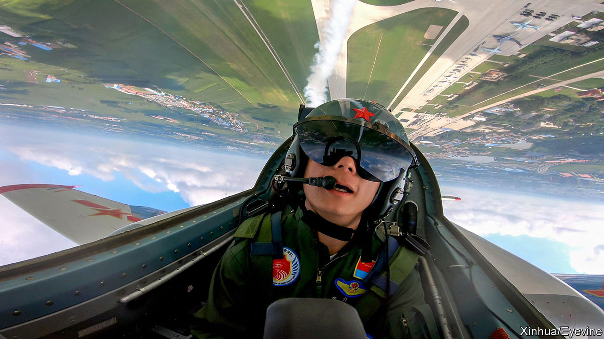

###### Top guns for hire

# Former military pilots from the West are being lured to China 

##### Are they giving the Chinese air force a leg up? 

 

> Nov 3rd 2022 

IN APRIL A Chinese fighter jet crashed in a rural part of eastern China. The two pilots safely ejected and were quickly surrounded by locals, who recorded the encounter. “Who is that?” asked a villager, pointing to one of the pilots, a white man with red hair who spoke in English. “This is our instructor,” said the other pilot in Chinese. “Don’t take photos.”

In recent weeks it has become clearer why foreign pilots might be found in a Chinese jet. On October 18th Britain’s defence ministry announced that it was trying to stop China from luring ex-military pilots to train its air force. An official said that a private firm called the Test Flying Academy of South Africa (TFASA) had hired up to 30 former Royal Air Force pilots to work in China on salaries of around $270,000 a year.

China’s efforts do not end there. Australia’s shadow defence minister said at least two Australian fighter pilots had also been approached and had declined. New Zealand’s defence ministry said four of its former personnel have been employed by TFASA. In France  reported that “several” French pilots have been training China’s air force. Then there is Daniel Duggan, an American ex-fighter pilot and owner of an aviation consultancy in China, who was recently arrested in Australia at the fbi’s request. The charges against him are sealed.

A spokesman for TFASA insists that Western governments knew what their former employees were up to. Pilots consulted Britain’s defence ministry about the work, he says. The academy, he claims, teaches only basic flight training, such as how to keep a plane level. “There’s nothing that you couldn’t get from a normal flight-school syllabus.” 

Western officials disagree. They acknowledge that their former pilots are not thought to have broken any laws. But they say that China’s aim is to understand the tactics of the Western jets and helicopters it might one day face in, say, a war over Taiwan. They also argue that foreign expertise might help China’s People’s Liberation Army (PLA) close the gap with rivals, given its lack of combat experience over the past 40 years.

The sense of scandal around such training efforts is a reflection of how quickly the West’s relationship with China has deteriorated. Until recently, formal military exchanges were common. PLA officers attended Britain’s military academy, Sandhurst, and its staff colleges. (The PLA students were often assumed to be intelligence officers and kept away from anything sensitive.)

Britain was hardly alone. New Zealand’s defence ministry signed an agreement to train the PLA as recently as 2019, says Anne-Marie Brady of the University of Canterbury. Australia hosted Chinese officers at its military institutions until a few years ago, recalls a former official. America invited the PLA to naval exercises off Hawaii in 2014 and 2016. The idea was that engagement between Chinese and Western officers would build trust and understanding. That, says Ms Brady, was “wishful thinking”. ■


