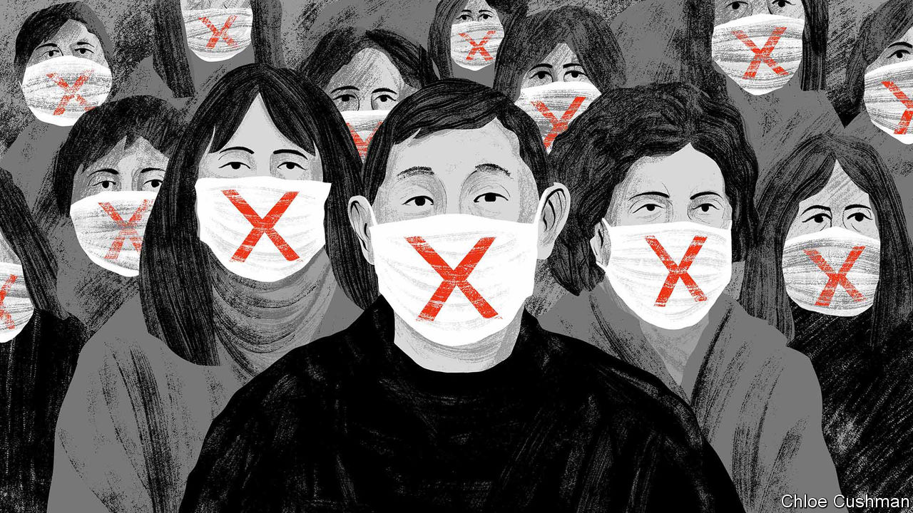

###### Chaguan

# The Chinese city that covid forgot 

##### Chinese experiences of the zero-covid policy vary greatly. That helps Communist Party bosses 

 

> Nov 3rd 2022 

If China, in some parallel universe, allowed voting on its “zero-covid policy”, the “change course” camp would be gaining ground. Battling new variants of covid-19 ahead of an expected winter surge in infections, officials have imposed partial lockdowns in cities from Xining in the west to Fuzhou in the south. Restaurants have closed, schools have gone online, access to food shops has been limited and millions of people have been plunged into some form of confinement, many for a second or third time.

“Closed-loop” policies that seal factory workers in production sites and fenced-in dormitories have come under public scrutiny, too. Videos on social media have shown workers climbing fences and fleeing on foot down busy roads to escape a virus outbreak at the world’s largest iPhone factory, operated by Foxconn, a Taiwanese electronics giant, near the central city of Zhengzhou. Amid an outcry from Chinese netizens, Foxconn offered bonuses to workers who stay at their posts. Zhengzhou authorities declared the latest covid variants mild and not to be feared. 

Alas, such assurances are at odds with a grim, wartime mood that grips other parts of China. Smartphone images have gone viral of white-overalled pandemic guards beating citizens who defy controls in order to buy food or medicine for their families. Guards have also prevented the gravely ill from reaching hospitals. A toddler died of carbon-monoxide poisoning in the north-western city of Lanzhou after being held up at quarantine checkpoints.

Censors have more luck smothering bad news from remote regions. Tibet’s capital, Lhasa, has endured more than two and a half months under lockdown, triggering rare street protests. Xinjiang, a harshly policed north-western region, has been battling an outbreak since the summer, leaving residents hungry and desperate. With both regions in effect closed to outsiders and most travel out of Xinjiang banned since early October, their miseries are not widely known in China. That is certainly true among Chinese who trust news coverage by state television. In the past week the main evening TV news programme, , has shown viewers graphic images of death, speeding ambulances and patients in intensive care. Not one of those gloomy scenes came from China. They were from a bridge collapse in India, a Halloween stampede in South Korea and the covid pandemic in America: all part of tireless efforts to portray China as a haven of order in a frightening world.  covers covid in China only tersely, with a simple graphic showing case numbers each night.

As more Chinese grow weary of the zero-covid policy and as the economy slows, some investors and other outsiders seem confident that China must soon join the rest of the world and prepare to live with the virus. Share prices of Chinese companies staged a multi-billion dollar rally on November 1st on the strength of an evidence-free rumour about a new pandemic-policy committee. Such wishful thinking puts too little weight on the disorder that would follow, were covid left to rip through an inadequately vaccinated country with no herd immunity and weak hospitals. It also exaggerates the importance, to party bosses, of urbanites grumbling on social media. Zero-covid is a numbers game. If all places were as unhappy as Zhengzhou, party chiefs would pay heed. But China has more than 100 cities with at least a million residents. At any given time, most are not under a harsh lockdown.

Seeking the clearest possible contrast with his home in covid-obsessed Beijing, Chaguan travelled 1,300km (800 miles) south to Jingdezhen. This sleepy city of 1.6m people in the forested hills of Jiangxi province may hold China’s record for pandemic luck, finding no cases for the past 33 months. Jingdezhen is strict about testing new arrivals at its airport and railway station. But once a visitor is inside the city, the pandemic feels far away. Jaw agape, your columnist joined hundreds of maskless locals thronging People’s Square on a weekend evening as they danced in formation, watched over scooter-riding children or twirled a dragon-headed streamer: scenes of freedom unimaginable elsewhere in China.

The good and bad of life in a backwater 

Jingdezhen made ceramics for emperors. Now locals suggest they are protected from covid by being off the beaten track. The city draws few migrant workers. Residents see a trade-off in that isolation. Business is bad, says a woman selling porcelain at a street market: the pandemic keeps tourists from travelling. She has seen videos of America looking normal on social media, so knows that covid deaths have fallen there. But she does not question the government’s policies. “We Chinese follow instructions from above,” she says. “Whatever they ask of us is for our own good, no?”

For over a decade Jingdezhen’s porcelain studios, low rents and rural charm have attracted young artists and those keen to “lie flat” and enjoy a quiet life. Some decline to take covid very seriously. The barista in a hipster café jokes, “Jingdezhen is so poor, even the virus can’t be bothered to come here.” Another café-owner, sporting a tweed jacket and indigo-dyed cravat, insists that Chinese in locked-down cities have enough to eat and drink, and may even enjoy a break at home. “What is there to feel sorry about?” he asks.

Not all are so glib. In a nearby studio, a young ceramicist who trained in Europe is “very sympathetic” to Chinese enduring lockdowns. He moved to Jingdezhen from Shanghai after that city’s long quarantine this spring. Now he worries about smaller, little-known cities or regions with few young people. Their suffering goes unreported on social media. He suggests that many Chinese lead atomised lives: “A lot of things are unfathomable to them if they didn’t happen to them personally.”

Party bosses should be relieved to hear such fatalism. After all, they work hard to stop ordinary Chinese from knowing too much about conditions elsewhere in the country. The unhappy can vote with their feet, like those choosing to ride out the pandemic in tranquil Jingdezhen. No other plebiscite will be offered to them. ■


