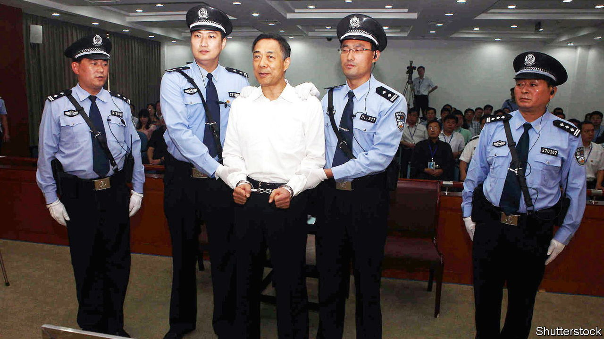
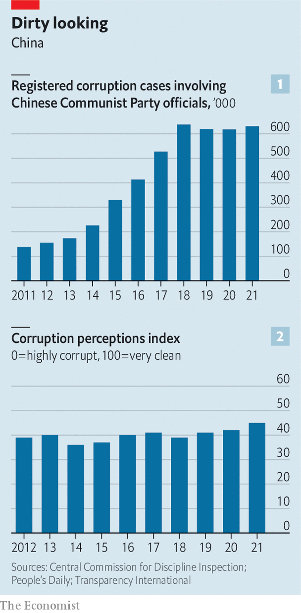

###### Xi’s forever war

# The never-ending campaign against graft in China 

##### New foot-soldiers are on the way 

 

> Nov 3rd 2022 

While he was holed up in caves in Yan’an in 1938, Mao Zedong gave a series of speeches that would form one of his best-known works. In “On Protracted War” he argued that China, which had been invaded by Japan, should not expect a quick victory. It had to dig in for a long struggle.

Xi Jinping, China’s current ruler, is also fighting what he calls a “protracted war”. But the enemy in this struggle is official corruption. During Mr Xi’s first decade in power millions of cadres were investigated for graft, from low-ranking “flies” to high-ranking “tigers”, as the Communist Party calls them (see chart 1).

As he begins his third five-year term as party chief, there are no signs that Mr Xi’s anti-corruption campaign is letting up. Quite the opposite. A new generation of foot-soldiers is being trained on university campuses. In February the ministry of education added “discipline inspection and supervision”—that is, stopping corruption and other infractions—to its list of undergraduate majors. 

 


Inner Mongolia University was the first in China to set up such a programme. In September a cohort of 45 students began studying for a degree in discipline inspection and supervision. They will learn about the law and regulations. Inspectors must know, for example, how many dishes public servants are allowed to order at a meal. Students will also read up on Marxism and learn what it means to be a loyal party member. Over a dozen other universities are planning similar programmes. 

The idea is to set students up for careers in the party’s anti-corruption ecosystem, atop of which sits the feared Central Commission for Discipline Inspection (CCDI). Inspectors are sent to party bodies and state-owned companies to investigate corruption and disloyalty, or to hold criticism sessions with the goal of making officials “red-faced and sweating”, according to party regulations. When the disease of corruption has “reached the bone marrow”, offenders are cast out of the party and handed over to the police.

In “Zero Tolerance”, a documentary series released this year by state television, contrite high-ranking officials opened up about their former luxurious lifestyles. Investigators from the CCDI explained how they caught offenders. The party was once wary of airing its dirty laundry in this manner. In the decade before 2014, there was an unofficial ban on corruption-related television shows. Now the party seems to think that series such as “Zero Tolerance”, along with new dramas about corruption investigations, will have a deterrent effect.

Mr Xi often refers to the “three nots” of corruption: officials should “not dare to be corrupt, not be able to be corrupt and not want to be corrupt”. The CCDI describes its work as “forging souls”. But there is a political element to the anti-graft campaign. In his first term Mr Xi used it to purge rivals, such as Bo Xilai (pictured). The CCDI enforces loyalty as well as clean governance. “This is one of the most important ways in which Xi has centralised power,” says Yuhua Wang of Harvard University. “Every official understands that if they voice any opposition, they would face the risk of being punished in the name of corruption.”

Nervous officials seem to be leading more decorous lives than in the past. The expensive watches they once sported are gone. High-end restaurants suffered after the party imposed strict limits on cadres’ banquets. Last month an official in Inner Mongolia aroused public ire when she went on television wearing a fancy scarf and earrings. The local anti-corruption authorities are reportedly investigating her. 

Surveys suggest that the Chinese public support Mr Xi’s campaign. But China’s scores on the corruption-perceptions index published by Transparency International, an anti-graft watchdog based in Berlin, have not improved much (see chart 2). The number of corruption cases involving officials has remained above 600,000 for four years running.

Mao’s warning about a protracted war proved correct: it would be another seven years before the Japanese left China. Mr Xi’s war has already lasted longer and “is likely to continue for as long as he is in power,” says Christopher Carothers of the University of Pennsylvania. That could be a while. Studying for a degree in anti-corruption is a sensible career move. ■


