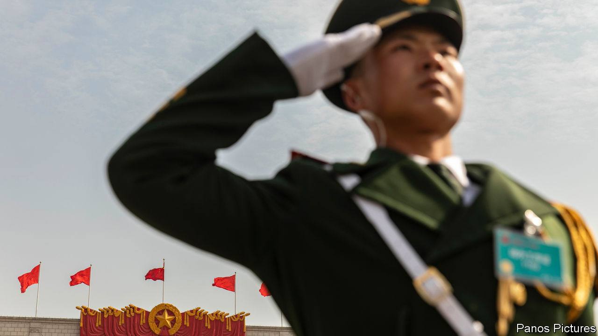

###### Preparing for a fight

# Xi Jinping wants ready soldiers and loyal generals 

##### His new military commission looks to many like a Taiwan war council 

 

> Nov 3rd 2022 

In the early hours of April 28th 1984, a young Chinese officer led an infantry regiment in an attack on Vietnamese forces embedded in the mountains on China’s southern border. The battle of Laoshan was among the bloodiest of the skirmishes that sputtered on for a decade after China’s four-week war with Vietnam in 1979—the most recent that Chinese forces have waged. Like the war, the battle ended with no clear victor. But it forged the reputation of the regimental commander, who almost four decades later has emerged as the most trusted military adviser to China’s supreme leader, Xi Jinping. 

General Zhang Youxia cemented that status with his reappointment as vice-chairman of the Communist Party’s Central Military Commission after a  (held every five years) that ended on October 22nd. Many had expected him to retire. At 72 he is the oldest person given the post for some three decades. But his reappointment reflects two clear priorities that Mr Xi has for his armed forces: combat readiness and unwavering loyalty. 

Mr Xi emphasised those priorities in a report to the congress that warned of “dangerous storms” ahead and took thinly veiled swipes at America over its support for Taiwan, the self-governing island that China claims. Citing “gross provocations” involving “external interference” in Taiwan affairs, Mr Xi urged the People’s Liberation Army (PLA) to speed up modernisation and meet near-term targets by its 100th anniversary in 2027. He has mentioned that goal before, but its inclusion at the congress reinforced a view among American officials that Mr Xi has ordered the PLA to develop the capability to  by then (although opinion is split over when he might attempt that, if at all). 

He also included fresh language pledging to develop “unmanned, intelligent combat capabilities” and to strengthen China’s nuclear forces. He made new commitments to bolster his own authority as chairman of the military commission and to encourage PLA personnel to study more history, while re-emphasising the need for “political loyalty” in the armed forces.

General Zhang is uniquely qualified to help achieve those goals. He is, for a start, one of the few PLA commanders with actual combat experience. Although the Maoist mass-assault tactics used against Vietnam are hardly relevant to modern combat, his experience still gives him standing with fellow officers, as well as with Mr Xi. General Zhang also spent half of the past decade overseeing the critical field of weapons purchases and development. Most importantly, though, he is an old family friend of Mr Xi’s. Their fathers were both revolutionary commanders who fought together in China’s north-west. After the Communist victory in 1949, they moved in the same elite circles in Beijing.

Having a trusted and respected general at his side is essential for Mr Xi, who needs the unquestioning support of the PLA as he embarks on a norm-busting third term as party leader with . An heir-apparent used to be identified partly through appointment as the military commission’s only civilian vice-chairman, like Mr Xi was in 2010. But the new commission has no civilians, apart from Mr Xi. That gives General Zhang an unusual level of personal authority as the most senior of the two uniformed vice-chairmen who will run the PLA when Mr Xi is busy (he often is, having taken charge of so much). China’s leader “requires generals who are both politically reliable and have hard operational experience”, says James Char of Singapore’s Nanyang Technological University. “I think Zhang Youxia is really the man whom Xi Jinping relies on to run the military on his behalf.” 

His fellow vice-chairman, 65-year-old General He Weidong, is another surprise. He was appointed to that post and to the 24-member Politburo after the congress, despite not having previously been a member of the military commission or of the party’s Central Committee (a body comprising about 370 high-ranking officials and grandees). He too hails from a revolutionary family and has a personal connection to Mr Xi, having served in the province of Fujian for much of the 17 years that Mr Xi was a senior official there. But his appointment is thought to be connected more to his recent experience overseeing operations relating to Taiwan and India. 

For two years until January 2022, General He led the Eastern Theatre Command, which is responsible for Taiwan and has been at the forefront of efforts to enable joint operations between the services. In that period he oversaw an escalation of military flights around Taiwan, as well as drills practising island seizures. More recently he has worked in the military commission’s Joint Operations Command Centre. Some experts believe he oversaw the big drills around Taiwan that followed a visit there in August by Nancy Pelosi, the speaker of America’s House of Representatives. General He also led the Western Theatre Command’s ground forces in 2017 during one of a series of border clashes with India that have since escalated, making that a  as well.

Further appointments to the military commission reflect similar priorities, but one stands out: General Li Shangfu (yet another son of a revolutionary commander). He has an extensive background in aerospace technology. He worked for 31 years at China’s main satellite-launch centre, including ten as its director, and succeeded General Zhang in leading the department responsible for military equipment.

The new military commission looks to many like a “Taiwan war council”, says Joel Wuthnow, a PLA expert at America’s National Defence University. “To me, it’s just as interesting that you have two people who don’t so much know operations but they know equipment inside and out. That’s going to be a pretty big deal as they pivot towards self-sufficiency and as the US is tightening the screws on advanced tech going into China.”

General Li’s appointment also raises new complications for America. He is expected to become defence minister, handling military relations with other countries. China suspended high-level military talks with America after Ms Pelosi’s visit to Taiwan. If the dialogue is to resume, they will now also have to find a way around the sanctions that America placed on General Li in 2018 for his involvement in buying Russian arms. 

Mr Xi may hope that General Li’s expertise will help in negotiating more purchases from Russia and in selling Chinese weapons to countries such as Pakistan. But the appointment also reinforces the signals from Mr Xi’s other choices. In short, China is bracing for confrontation. ■


