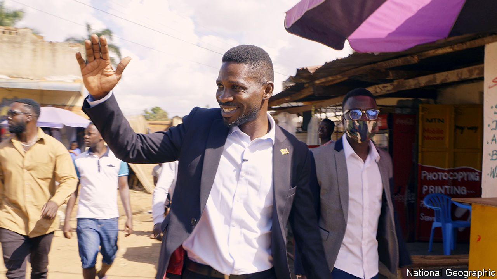

###### Film and politics

# A documentary follows Bobi Wine on the campaign trail in 2017-21 

##### Moses Bwayo’s and Christopher Sharp’s film also demonstrates the brutality of the Ugandan state 

 

> Nov 3rd 2022 

He always thought the camera would protect him. It did, once. Moses Bwayo was filming Bobi Wine, the Ugandan opposition leader, on the streets of Kampala when he saw a man in police uniform pointing a gun at him. It had a long, narrow barrel—the kind that fires ammunition rather than tear gas. He moved his camera in front of his eyes just in time; the rubber bullet struck his cheek. For so long, the lens had been his window on the world. Now it may have saved his sight.

But physical protection was the only kind the camera afforded; the rest of the time it made him a target. Mr Bwayo started filming Mr Wine in 2017 after the 35-year-old  (whose real name is Robert Kyagulanyi) swaggered into parliament after a by-election. His camera was still rolling four years later, when Mr Wine . The result is “Bobi Wine: The People’s President”, a feature-length documentary which was shown at the London Film Festival last month and will be released by National Geographic next year. Making it has pushed Mr Bwayo into exile.

The Ugandan state is a military dictatorship doing a clumsy impression of a democracy. There are regular elections and , but the president, Yoweri Museveni, who has ruled since 1986, clings to power using violence, money and fraud. Mr Bwayo’s documentary, co-directed with Christopher Sharp, a British film-maker, ably captures the capricious brutality of the regime. 

Shot in a fly-on-the-wall style, interspersed with news clips and the occasional talking head, the film follows Mr Wine and his family as he hurtles towards the election. He is arrested and tortured; his supporters are shot dead on the streets. There is never any prospect of Mr Wine being declared the winner of the ballot, however popular he may be. Instead, the story is pulled along by the charisma of the singer and his wife, Barbie. This is a personal journey as much as a political one.

The same could be said of Mr Bwayo’s own trajectory. He never set out to be a political film-maker. As a child, his first love was the kung-fu flicks that played in a  (video hall) at the local market. Later his horizons widened. In Kampala he trained at a film school and attended a programme founded by Mira Nair, an Oscar-nominated director. He took inspiration from the socially conscious cinema of African directors, including Ousmane Sembène from Senegal and Souleymane Cissé from Mali. 

Following Mr Wine put Mr Bwayo in the cross-hairs of the state. Strangers started calling him at odd hours, saying: “We have a project for you.” Unknown men pursued his wife through a shopping mall. Sometimes an army pickup parked outside his house. He was arrested while filming in 2020 and, along with a group of opposition activists, spent several nights in a congested, flea-ridden cell. Security officers looked through his phone messages and confiscated his equipment. “Who is funding Bobi Wine?” they asked.

As the election neared, the threats towards the media intensified. “We shall beat you for your own sake,” the police chief told journalists. Ashraf Kasirye, a cameraman who was live-streaming a campaign event for an online outlet, was hospitalised after police shot him in the head with a projectile, fracturing his skull. The same day Ali Mivule, a television reporter, was hit in the leg by a tear-gas canister; he says that a policeman shouted “collateral damage” before taking aim.

Mr Bwayo is a soft-spoken man who cut an unassuming figure in the maelstrom of the election campaign. On polling day in January 2021 he talked with your correspondent, who was the co-chair of an association of international journalists that Mr Bwayo had joined. The atmosphere was tense and the hours ahead uncertain, but he said he needed to finish the job. He stayed at Mr Wine’s house that night to film. The next day soldiers surrounded the compound, forbidding entry or exit, and did not withdraw for 11 days.

“Bobi Wine: The People’s President” is a shocking, tender work. There is much it does not say. It offers little sense of Mr Wine’s strategic decisions as a politician, or his mistakes. Though Mr Museveni is one of three central characters in the film, his presence looms offstage, glimpsed only in clips from television interviews. All the same, the film-makers manage to make an essential point: that he will stop at nothing to .

Mr Bwayo knows that only too well—he and his wife have moved to America for safety. Yet he has no regrets about his work. “There are many people who have lost their lives and some of these people, I knew them. There’s people who have disappeared,” he says. “This is why we have made this film.” ■

